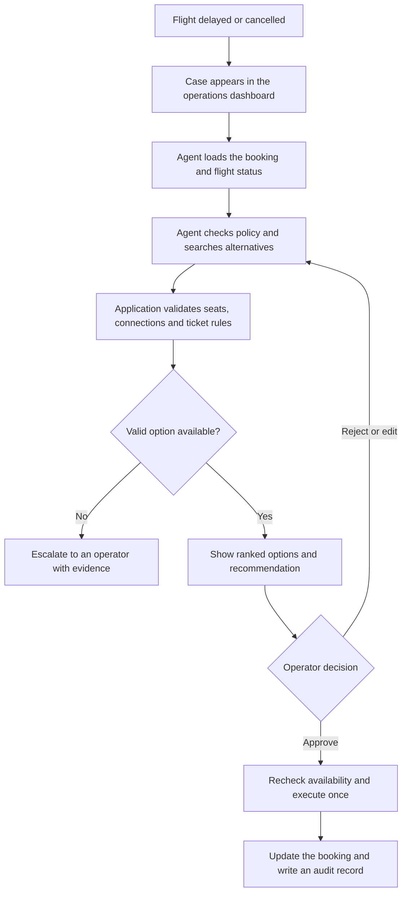

# TravelOps Recovery Agent

A learning-first, production-minded agentic AI project for resolving synthetic airline disruptions. The application will collect booking and flight information, search and validate recovery options, explain its recommendation, and prepare a rebooking that only a human operator can approve and execute.

The project is built in small, shippable phases. A phase is complete only when the repository is runnable, its tests pass, and the concepts introduced in that phase can be explained clearly.

## The problem

Airline operations staff often switch between booking, flight-status, policy, and availability systems to resolve a disrupted journey. That makes the process slow, difficult to audit, and vulnerable to missed constraints.

TravelOps puts the investigation in one visual workflow. The agent coordinates read-only tools and prepares a recommendation; deterministic application code validates availability, connection times, permissions, and write operations; the operator remains responsible for approval.

## How it will work

## What this project is designed to teach

- The difference between deterministic workflows and agent-controlled decisions
- Typed tool design and structured model outputs
- A small agent loop before using an orchestration framework
- LangGraph state, nodes, edges, routing, interrupts, and checkpoints
- Durable execution that survives process and browser restarts
- Streaming agent progress to a React interface
- Human approval for consequential actions
- Idempotency, authorization, retries, and safe failure handling
- Task-level evaluation, tracing, latency, token, and cost measurement
- Shipping a tested full-stack AI application with Docker and CI

## Planned stack

| Concern | Initial choice |
| --- | --- |
| Backend | Python, FastAPI, Pydantic |
| Agent orchestration | LangGraph with minimal LangChain Core integration |
| Persistence | PostgreSQL, SQLAlchemy, Alembic |
| Frontend | React, TypeScript, Vite |
| Live updates | Server-Sent Events initially |
| Quality | pytest, Ruff, mypy, frontend tests |
| Delivery | Docker Compose and GitHub Actions |

Exact model and deployment providers are intentionally deferred until the application has a provider-independent model boundary.

## Learning roadmap

| Phase | Shippable result |
| --- | --- |
| 0 | Reproducible Python project with quality gates |
| 1 | Typed API, configuration, health endpoint, and logging |
| 2 | Synthetic airline domain and disruption-case simulator |
| 3 | PostgreSQL persistence and tested service boundaries |
| 4 | Typed read-only operational tools |
| 5 | Visual operator dashboard without an LLM dependency |
| 6 | Small manual model-and-tool loop |
| 7 | Explicit LangGraph workflow with inspectable state |
| 8 | Durable checkpoints and live UI progress |
| 9 | Validated recommendations and evidence |
| 10 | Prepare, approve, and execute rebooking safely |
| 11 | Failure testing, security, evaluation, and first portfolio release |
| 12 | Context engineering and controlled tool exposure |
| 13 | Explicit planning, progress tracking, and replanning |
| 14 | Parallel investigation with deadlines and partial results |
| 15 | Scoped memory and preference management |
| 16 | Model routing and cost-quality budgets |
| 17 | Trajectory evaluation and regression gates |
| 18 | Evidence-grounded policy RAG as an agent tool |
| 19 | Measured single-agent versus multi-agent experiment |
| 20 | MCP server and reusable operational capabilities |

The core-release contract and gates are in [docs/plan.md](docs/plan.md). The advanced track is in [docs/roadmap.md](docs/roadmap.md), and a shorter index of every phase is in [docs/project-phases.md](docs/project-phases.md).

## Project documents

- [Build plan](docs/plan.md) — learning contract, scope, architecture, and phase gates
- [Advanced roadmap](docs/roadmap.md) — Phases 12–20 and their experiment gates
- [Project phases](docs/project-phases.md) — quick phase-by-phase reference
- [Architecture](docs/architecture.md) — system boundaries and responsibility split
- [UI specification](docs/ui.md) — operator screens, interaction model, live events, and UI learning track
- [Decisions](docs/decisions.md) — design choices and their reasons
- [Progress](docs/progress.md) — current phase, evidence, and session handoffs
- [Phase notes](docs/notes/README.md) — learning-note format

## Current status

Phase 1 is complete: the project now has a typed FastAPI application, validated settings, liveness and OpenAPI endpoints, request correlation, structured logging, and passing quality gates. Phase 2 has not started.
