# Architecture boundaries

This document records the intended responsibility boundaries. It will become more concrete as phases replace assumptions with working code.

## Runtime view

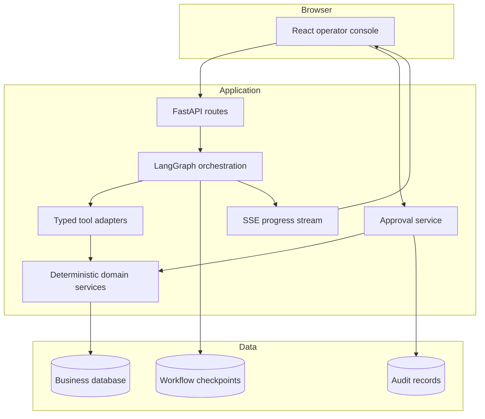

## Boundary rules

1. The UI never decides whether an itinerary is valid.
2. The model never queries the database directly.
3. Tools call application services; they do not contain duplicated business rules.
4. Authorization is enforced inside the application boundary, not in a prompt.
5. The graph coordinates steps but is not the source of business truth.
6. Business records and graph checkpoints have different schemas and lifecycles.
7. A recommendation references stored evidence and validated candidate identifiers.
8. A write requires a stored proposal, explicit approval, a final validation, and an idempotency key.
9. Logs and traces exclude raw secrets and minimize synthetic passenger details.
10. External or retrieved text is treated as untrusted data, never as system instructions.

## Phase 4 operational read path

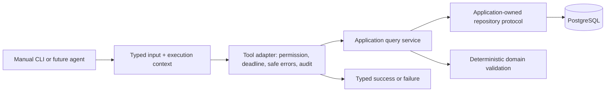

The registry publishes schemas but does not execute tools. The CLI is an outer
composition root that constructs persistence and injects an application service
into adapters. Adapters never receive an engine, session, repository, SQL string,
or write capability. `GET /health` remains the only current HTTP route involved;
tools are not API endpoints.

The detailed screen model, event contract, approval experience, accessibility requirements, and frontend testing strategy are in [ui.md](ui.md).

## Phase 5 manual dashboard path

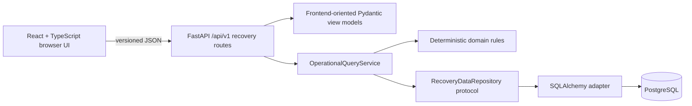

Phase 5 routes are browser APIs, not Phase 4 tools. They compose the same
application services for a different caller and return UI-specific views. React
never imports tool contracts, repository types or persistence records. Search
and validation use POST for typed query bodies but perform no business write.
The URL identifies the case; refresh reloads authoritative facts from the API.

## Phase 6 manual agent path

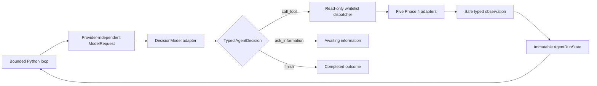

`DecisionModel` is application-owned, so recorded fixtures and an Ollama HTTP
adapter can be exchanged without changing loop behavior. The model receives
only conversation messages, safe observations and copied Phase 4 name,
description and input-schema data. It never receives an engine, session,
repository, SQL, credentials, API routes or write capability.

Phase 6 introduces `AgentRunState`, a strict immutable Pydantic model for one
in-process run. It stores control facts that messages cannot safely represent:
status, budget, deadline, turn and malformed-output counts, call fingerprints,
typed observations, final outcome, information request or safe failure. Messages
are model context; state is the application's control record. Phase 7 embeds
this trusted value inside transient graph state; it is still not a Phase 8
durable checkpoint.

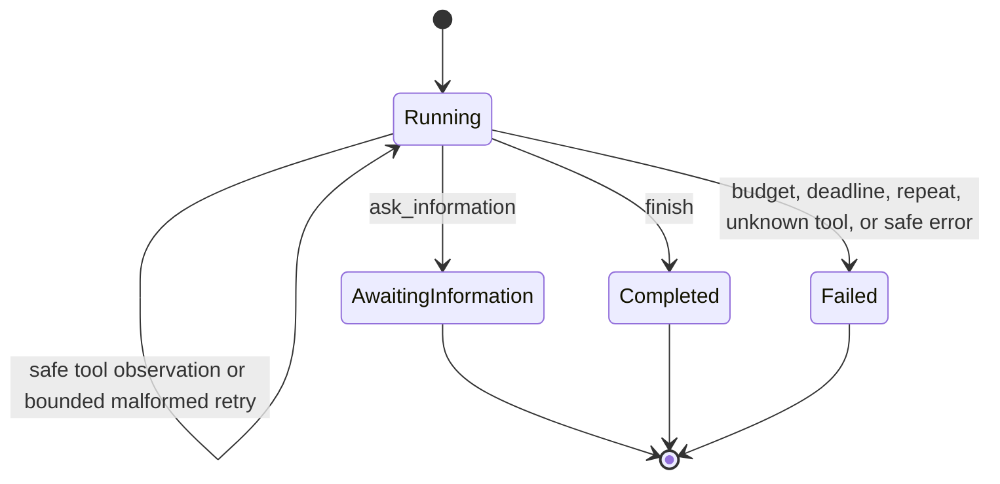

State validators reject incompatible terminal fields and unknown evidence
references. The loop uses a finite `for` range and rechecks its absolute
deadline around model and tool calls. Canonical SHA-256 fingerprints detect an
identical tool name and argument object without retaining another raw copy in
the repeat guard.

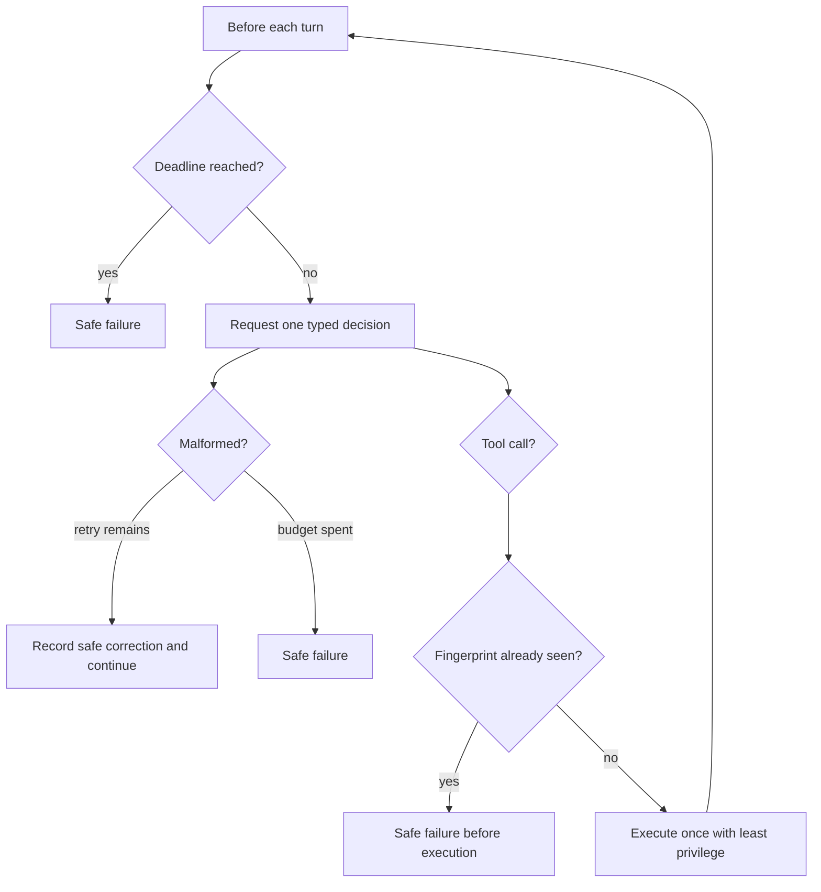

## Phase 7 LangGraph path

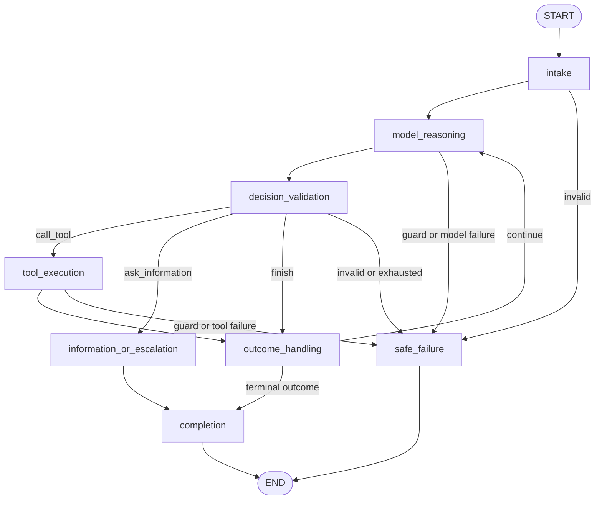

`AgentGraphState` contains the trusted `AgentRunState` plus safe node history,
one typed route, a pending typed decision, a provider-neutral model-error code,
and a minimized pending failure. The model, dispatcher, actor identity, and
clock are injected through frozen LangGraph runtime context and are absent from
inspectable state.

The graph reuses the Phase 6 `DecisionModel`, recorded fixtures, Ollama adapter,
request builder, exact dispatcher, fingerprints, budgets, safe observations,
and terminal contracts. Conditional edges make all permitted transitions
visible. `RecoveryGraphRunner.stream_states` yields complete state after every
sequential super-step without exposing chain-of-thought.

LangGraph does not replace tool authorization, Pydantic validation,
deterministic application services, or domain rules. The graph is compiled
without a checkpointer; persistence and resumption remain Phase 8.

## Initial tool catalogue

| Tool | Kind | Responsibility |
| --- | --- | --- |
| `get_booking` | Read | Return the authorized booking and itinerary view |
| `get_flight_status` | Read | Return the current synthetic operational status |
| `get_disruption_policy` | Read | Return relevant policy sections with references |
| `search_alternative_itineraries` | Read | Produce scheduled-flight candidates; inventory and ticket rules remain explicitly unevaluated |
| `validate_itinerary` | Read | Return structured rule results for a candidate |
| `prepare_rebooking` | Proposal | Store an immutable proposed change without executing it |
| `execute_rebooking` | Write | Execute one approved, current, idempotent proposal |

## Open architecture questions

- Which recovery rules belong in the first benchmark?
- Should policy lookup begin as deterministic section retrieval or keyword search?
- Which events must the UI receive live, and which can be loaded from the API?
- Should graph checkpoints share PostgreSQL with business data while remaining logically separated?
- What evidence is safe and useful to retain in traces?

Answers are recorded in [decisions.md](decisions.md) when the responsible phase reaches them.

Phase 4 resolved the read-tool boundary questions in D-022 through D-024.
Proposal and write tools remain future catalogue entries, not registered or
implemented capabilities.

## Phase 11 release and evidence path

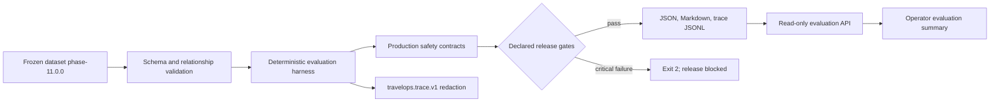

Failure injection is a test/development adapter outside the business model.
Production settings reject it at validation time. The evaluator calls the same
typed boundaries and observes safety counters; it has no alternate approval or
execution route. Runtime JSON logs, durable workflow events, business audit,
and evaluation traces share safe correlation references without copying raw
passenger text, prompts, credentials, authorization headers, or idempotency
keys.

## Advanced evolution

The Phase 11 architecture remains the baseline. [The advanced roadmap](roadmap.md) evolves it through controlled additions:

```mermaid
flowchart LR
    BASE["Phase 11 baseline"] --> CONTEXT["Context and tool governance"]
    CONTEXT --> PLAN["Planning and replanning"]
    PLAN --> PARALLEL["Parallel investigation"]
    PARALLEL --> MEMORY["Scoped memory"]
    MEMORY --> ROUTING["Model routing"]
    ROUTING --> EVAL["Trajectory evaluation"]
    EVAL --> RAG["Policy RAG tool"]
    RAG --> MULTI["Multi-agent experiment"]
    MULTI --> MCP["MCP interface"]
```

Each addition must preserve the boundary rules in this document and remain removable behind a stable interface or feature flag when the phase is experimental.

## Phase 12 context and capability boundary

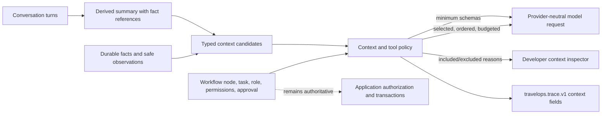

The `travelops.context.v1` object is a transient, derived model input. It is not
durable graph state, conversation history, a database row, a raw tool envelope,
or a provider message type. Each item links to durable fact identifiers and
records scope, task/node applicability, authority, timestamps, freshness,
sensitivity, explicitly estimated tokens, relevance, priority, conflict and
supersession metadata.

Selection rejects cross-case, unauthorized, stale, expired, secret,
superseded, and untrusted evidence before ordering. Mandatory safety,
authorization, approval, and execution facts rank first and are never
truncated. A budget that cannot contain them produces a safe escalation before
a model call. Non-mandatory oversized content may become a bounded derived view
that retains source identifiers.

The tool policy starts with no capabilities and permits a schema only when the
task, node, role, permission, workflow state, and approval requirements all
match. Schema visibility does not grant execution authority. The existing tool
adapters, proposal service, transactional revalidation, database constraints,
and idempotency ledger remain the enforcement boundary.

Cache keys include schema/policy/cache version, case, operator, role,
permissions, authorization scopes, task, node, workflow/approval state, budget,
item fingerprints, source versions, summary versions, freshness time, and tool
policy version. Cache invalidation can target one case and cannot return an
entry across a case, user, role, permission, or scope boundary.
## Phase 8 durable workflow and live-progress path

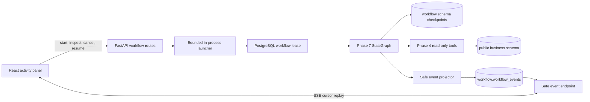

The launcher is not a second orchestration framework or durable task queue. It
only asks the application service to claim a run. A unique partial index blocks
a second active run for one case, and an expiring lease blocks concurrent resume
attempts for one run.

The graph executes one checkpointed node boundary at a time. Between boundaries
the lifecycle service can renew its lease, observe cancellation, pause, or
continue. Resume supplies the saved `thread_id` and no new graph input. Runtime
context is reconstructed through a factory; provider clients, dispatchers,
sessions, repositories, credentials, SQL, and callables never enter graph state.

The `workflow` PostgreSQL schema holds application run/event tables and the
official saver's internal checkpoint tables. Business records remain in the
public schema. Events expose safe summaries and references only. The browser
loads the run snapshot first, then streams after that snapshot's sequence so a
refresh or reconnect cannot silently replace authoritative state with a partial
event history.
