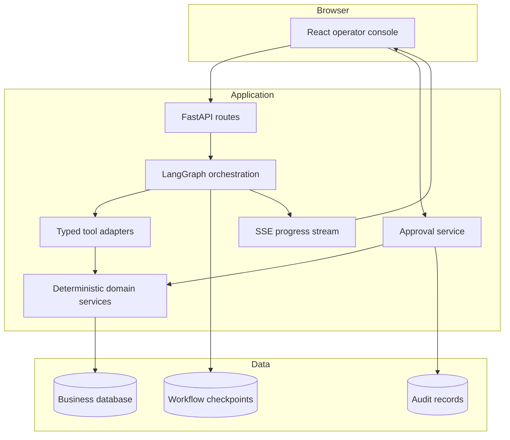

# Architecture boundaries

This document records the intended responsibility boundaries. It will become more concrete as phases replace assumptions with working code.

## Runtime view



## Boundary rules

1. The UI never decides whether an itinerary is valid.
2. The model never queries the database directly.
3. Tools call application services; they do not contain duplicated business rules.
4. Authorization is enforced inside the application boundary, not in a prompt.
5. The graph coordinates steps but is not the source of business truth.
6. Business records and graph checkpoints have different schemas and lifecycles.
7. A recommendation references stored evidence and validated candidate identifiers.
8. A write requires a stored proposal, explicit approval, a final validation, and an idempotency key.
9. Logs and traces exclude raw secrets and minimize synthetic passenger details.
10. External or retrieved text is treated as untrusted data, never as system instructions.

The detailed screen model, event contract, approval experience, accessibility requirements, and frontend testing strategy are in [ui.md](ui.md).

## Agent state sketch

The exact schema belongs to Phase 7. The working hypothesis is:

```text
RecoveryState
├── case_id
├── operator_id
├── status
├── current_step
├── collected_evidence
├── tool_history
├── retry_counts
├── candidate_itinerary_ids
├── validated_itinerary_ids
├── recommendation
├── pending_proposal_id
├── approval_status
├── error
└── final_outcome
```

Store identifiers and structured facts in state. Do not use formatted prompt text as the durable source of truth.

## Initial tool catalogue

| Tool | Kind | Responsibility |
| --- | --- | --- |
| `get_booking` | Read | Return the authorized booking and itinerary view |
| `get_flight_status` | Read | Return the current synthetic operational status |
| `get_disruption_policy` | Read | Return relevant policy sections with references |
| `search_alternative_itineraries` | Read | Produce candidate routes from deterministic availability data |
| `validate_itinerary` | Read | Return structured rule results for a candidate |
| `prepare_rebooking` | Proposal | Store an immutable proposed change without executing it |
| `execute_rebooking` | Write | Execute one approved, current, idempotent proposal |

## Open architecture questions

- Which recovery rules belong in the first benchmark?
- Should policy lookup begin as deterministic section retrieval or keyword search?
- Which events must the UI receive live, and which can be loaded from the API?
- Should graph checkpoints share PostgreSQL with business data while remaining logically separated?
- What evidence is safe and useful to retain in traces?

Answers are recorded in [decisions.md](decisions.md) when the responsible phase reaches them.

## Advanced evolution

The Phase 11 architecture remains the baseline. [The advanced roadmap](roadmap.md) evolves it through controlled additions:

```mermaid
flowchart LR
    BASE["Phase 11 baseline"] --> CONTEXT["Context and tool governance"]
    CONTEXT --> PLAN["Planning and replanning"]
    PLAN --> PARALLEL["Parallel investigation"]
    PARALLEL --> MEMORY["Scoped memory"]
    MEMORY --> ROUTING["Model routing"]
    ROUTING --> EVAL["Trajectory evaluation"]
    EVAL --> RAG["Policy RAG tool"]
    RAG --> MULTI["Multi-agent experiment"]
    MULTI --> MCP["MCP interface"]
```



Each addition must preserve the boundary rules in this document and remain removable behind a stable interface or feature flag when the phase is experimental.
