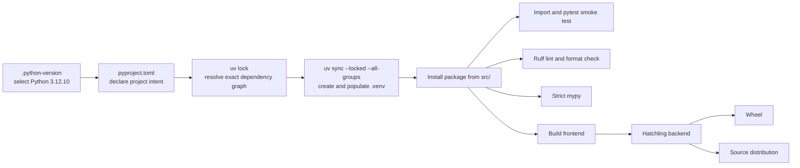
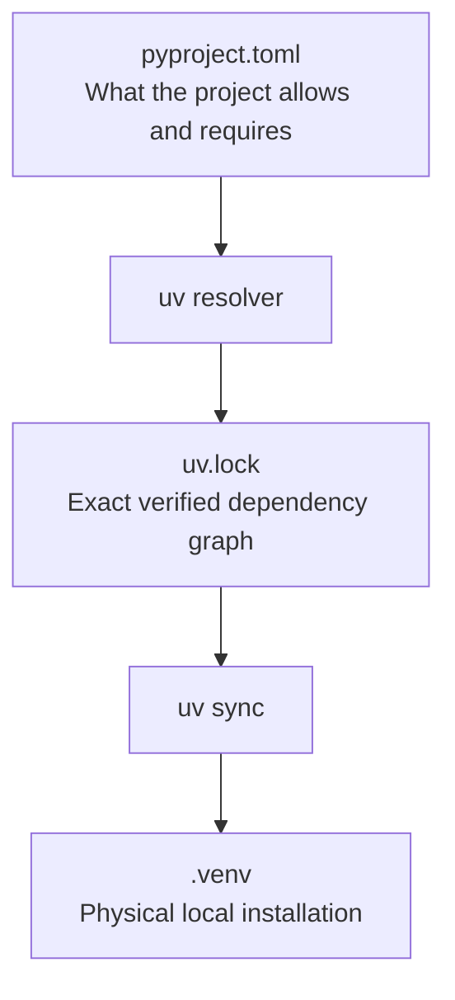

# Phase 0 notes — reproducible Python foundation

## How to read these notes

This document records the project at the end of Phase 0. Later phases may have expanded the linked files, but the explanations below describe the foundation that Phase 0 introduced.

Use the note in two ways:

- **Brief review:** read “Phase in brief,” the workflow, and the step summaries.
- **Detailed study:** read the Why, What, How, and Evidence sections under each step, followed by the glossary.

## Phase in brief

### Purpose

Phase 0 made the repository reproducible before adding application behavior. Its job was to ensure that another developer could create the same Python environment, import the package, run the same quality checks, and build standard Python distributions.

### Result

The phase delivered:

- A Python 3.12 project using a `src/` package layout
- A project-local virtual environment managed by uv
- Authored project configuration in [`pyproject.toml`](../../pyproject.toml)
- An exact dependency resolution in [`uv.lock`](../../uv.lock)
- pytest, Ruff lint, Ruff format, and strict mypy policies
- A minimal installed-package import test
- A successful wheel and source-distribution build
- Decision records, learning notes, and a progress handoff

### Deliberate boundary

Phase 0 added no API, business domain, database, frontend, agent, model integration, authentication, or Docker infrastructure. The package was intentionally almost empty: the phase proved that the project machinery worked before application behavior depended on it.

## Foundation workflow



The durable inputs are `.python-version`, `pyproject.toml`, `uv.lock`, source code, and tests. The `.venv`, caches, and `dist/` artifacts are generated and can be recreated.

## Artifact map

| Artifact | Responsibility in Phase 0 |
| --- | --- |
| [`.python-version`](../../.python-version) | Select the development Python interpreter version for uv. |
| [`pyproject.toml`](../../pyproject.toml) | Declare project metadata, dependency ranges, build backend, and tool policies. |
| [`uv.lock`](../../uv.lock) | Record the exact resolved dependency graph and package artifacts. |
| [`src/travelops_recovery_agent`](../../src/travelops_recovery_agent) | Hold installable application source outside the repository root. |
| [`py.typed`](../../src/travelops_recovery_agent/py.typed) | Tell type checkers that the installed package provides type information. |
| [`tests/test_package.py`](../../tests/test_package.py) | Prove the installed package can be imported. |
| [`docs/decisions.md`](../decisions.md) | Preserve meaningful choices and their tradeoffs. |
| [`docs/progress.md`](../progress.md) | Record verification evidence and the handoff to the next phase. |

## Step-by-step implementation

### Step 1 — Select a Python baseline

**Why this step was taken**

Python behavior and dependency compatibility can differ between interpreter versions. A reproducible project therefore needs an explicit interpreter baseline rather than silently using whichever global Python happens to appear first on a machine.

**What was implemented**

- `.python-version` selected Python 3.12.10 for local uv commands.
- `requires-python = ">=3.12,<3.13"` declared that the package supports the Python 3.12 line.

**How it was implemented**

uv reads `.python-version` when choosing an interpreter for `.venv`. Package tools read `requires-python` from `pyproject.toml` when resolving dependencies or installing the distribution.

The patch pin and supported range serve different purposes: the patch pin makes this checkout repeatable, while the package metadata expresses the supported interpreter family.

**Evidence**

uv selected CPython 3.12.10 when the environment was created and synchronized.

### Step 2 — Create an installable package with a `src/` layout

**Why this step was taken**

Tests should exercise the package that users install, not accidentally import code merely because the repository root is on Python’s import path. A `src/` layout exposes missing or incorrect packaging configuration early.

**What was implemented**

```text
src/
└── travelops_recovery_agent/
    ├── __init__.py
    └── py.typed
```

`__init__.py` defined the package. `py.typed` declared that its type annotations are part of the installed package contract.

**How it was implemented**

The source lived below `src/`, not directly at the repository root. Hatchling’s wheel configuration explicitly selected `src/travelops_recovery_agent`. uv installed the project as an editable distribution, so imports passed through package installation while source edits remained immediately visible.

**Evidence**

The import command resolved to `src/travelops_recovery_agent/__init__.py`, and archive inspection confirmed that the wheel actually contained `travelops_recovery_agent`.

### Step 3 — Centralize project and build configuration

**Why this step was taken**

Package metadata and development-tool policies are repository concerns. They should be visible in one standard configuration file instead of being scattered through application modules or custom shell scripts.

**What was implemented**

`pyproject.toml` received:

- Project name, version, description, README, and supported Python
- Runtime and development dependency declarations
- The PEP 517 build-system contract
- Hatchling package-selection rules
- pytest, Ruff, and strict mypy settings

**How it was implemented**

The `[build-system]` table named `hatchling.build` as the backend. The `[project]` table described the installable distribution. `[dependency-groups]` kept development tools separate from runtime requirements. `[tool.*]` tables supplied configuration directly to each quality tool.

Application code did not configure pytest, Ruff, mypy, or packaging because those tools operate on the project from outside the running application.

**Evidence**

Python’s TOML parser successfully read the file, every tool discovered its configuration there, and the package built without a legacy `setup.py`.

### Step 4 — Separate authored dependency intent from exact resolution

**Why this step was taken**

Dependency ranges communicate compatibility, but resolving those ranges on different days can select different transitive packages. Reproducibility requires a durable record of the exact graph that was verified.

**What was implemented**

- `pyproject.toml` declared acceptable direct dependency ranges.
- `uv.lock` recorded exact direct and transitive versions plus artifact information.

**How it was implemented**

`uv lock` resolved the project requirements and generated `uv.lock`. `uv lock --check` later verified that project intent and the generated resolution remained consistent.

The lockfile was treated as generated but committed-style project data: it should be versioned, but edited through uv rather than by hand.

**Evidence**

The initial lock resolved 17 exact packages after the build backend was included in the development group. Locked checks passed without changing the graph.

### Step 5 — Create and synchronize the virtual environment

**Why this step was taken**

The lockfile is only a recipe. The project also needs an isolated place where the selected interpreter, package installations, and command entry points physically exist.

**What was implemented**

A project-local `.venv` was created and populated with the package and all locked development dependencies.

**How it was implemented**

```powershell
uv sync --locked --all-groups
```

- `sync` made the environment match the lockfile.
- `--locked` refused to silently regenerate a stale lockfile.
- `--all-groups` installed development tools as well as runtime dependencies.

On Windows, `.venv` contains launchers in `.venv/Scripts`, installed packages in `.venv/Lib/site-packages`, and metadata describing the environment. Activation mainly changes shell lookup paths; `uv run` can use the environment without activation.

**Evidence**

A freshly recreated `.venv` synchronized successfully with Python 3.12.10 and all exact locked packages.

### Step 6 — Add the smallest package behavior test

**Why this step was taken**

Before adding application behavior, the project needed proof that its most basic contract worked: the distribution installs and its package imports by the expected name.

**What was implemented**

`tests/test_package.py` imported `travelops_recovery_agent` and asserted the module name.

**How it was implemented**

pytest used importlib import mode and the editable installed distribution. The final test did not rely on a temporary `PYTHONPATH=src` workaround.

**Evidence**

pytest collected one test and reported `1 passed` at the Phase 0 gate.

### Step 7 — Establish four different quality gates

**Why this step was taken**

Tests alone cannot detect every maintenance problem. The foundation needed separate checks for executed behavior, static defects, canonical layout, and type consistency.

**What was implemented**

| Gate | Technical role | What it does not prove |
| --- | --- | --- |
| pytest | Executes selected behavior and compares results with expectations. | It does not prove untested paths are correct. |
| Ruff lint | Statically detects selected syntax, import, correctness, modernization, and maintenance issues. | It does not execute business behavior. |
| Ruff format | Enforces one source-code layout. | It does not prove code is correct or well designed. |
| Strict mypy | Checks consistency between declared and inferred types without running the program. | It does not validate runtime values or business outcomes. |

**How it was implemented**

All policies were placed in `pyproject.toml`. Ruff targeted Python 3.12 and the `src` and `tests` trees. Mypy used strict mode and checked both application and test code. pytest used explicit test discovery and strict configuration rules.

**Evidence**

At the Phase 0 gate, pytest passed, Ruff lint passed, Ruff format check passed, and strict mypy found no issues.

### Step 8 — Build standard Python distribution artifacts

**Why this step was taken**

A source checkout being importable is not enough. Building proves that package metadata and file-selection rules can produce artifacts another environment could install.

**What was implemented**

- A universal pure-Python wheel: `travelops_recovery_agent-0.1.0-py3-none-any.whl`
- A source distribution: `travelops_recovery_agent-0.1.0.tar.gz`

**How it was implemented**

```powershell
uv run --locked python -m build --no-isolation
```

`build` acted as the frontend and requested the standard distribution operations. Hatchling acted as the backend and interpreted `pyproject.toml`, selected files, wrote metadata, and created the archives. Hatchling was included in the locked development group, and `--no-isolation` made the verification build use that synchronized version.

**Evidence**

Archive inspection showed that the wheel contained the package and distribution metadata. The source distribution contained source code, tests, README, and build configuration rather than the entire Git working tree.

### Step 9 — Record decisions and phase evidence

**Why this step was taken**

Commands prove that something worked once; they do not preserve why a choice was made or when it should be reconsidered. A learning-first project needs both technical evidence and design rationale.

**What was implemented**

- [D-009](../decisions.md#d-009--use-uv-for-the-reproducible-python-environment) records the uv and Python strategy.
- [D-010](../decisions.md#d-010--package-from-src-with-hatchling) records the layout and build backend.
- `docs/progress.md` records the verified gate and handoff.

**How it was implemented**

Each decision states its context, selected option, alternatives, consequences, and revisit condition. The progress entry records what was built, commands that passed, concepts established, deliberately excluded work, and the next phase boundary.

**Evidence**

Phase 0 ended with working source, reproducible commands, distribution artifacts, decisions, notes, and a clean checkpoint rather than undocumented setup knowledge.

## Detailed concept guide

### `pyproject.toml` versus `uv.lock` versus `.venv`



- `pyproject.toml` is authored intent.
- `uv.lock` is generated exact resolution.
- `.venv` is disposable machine-local state created from that resolution.

Deleting `.venv` should be safe because synchronization can recreate it. Deleting the lockfile loses the exact verified graph and forces a new resolution.

### Build frontend versus build backend

The frontend answers: “Please build a wheel and source distribution using the standard protocol.” The backend answers: “I know how to interpret this project and construct those artifacts.”

In this project:

- `python -m build` is the frontend invocation.
- Hatchling is the backend.
- PEP 517 defines how they communicate.

### Wheel versus source distribution

| Artifact | Primary purpose | Typical contents |
| --- | --- | --- |
| Wheel | Direct installation | Importable package files and installation metadata |
| Source distribution | Portable build input | Source, build configuration, README, selected tests, and source metadata |

`py3-none-any` means the Phase 0 wheel was pure Python and not tied to a specific operating system or CPU architecture.

## Commands and what each proves

```powershell
# Recreate or synchronize the environment from the exact lock
uv sync --locked --all-groups

# Prove the installed package resolves
uv run --locked python -c "import travelops_recovery_agent; print(travelops_recovery_agent.__file__)"

# Execute behavioral tests
uv run --locked pytest

# Detect configured static source problems
uv run --locked ruff check .

# Verify canonical formatting without editing files
uv run --locked ruff format --check .

# Check strict static typing
uv run --locked mypy

# Produce wheel and source distribution with the locked backend
uv run --locked python -m build --no-isolation
```

## Problems encountered and lessons learned

### Build isolation used an independently resolved backend

The first successful build used PEP 517 isolation, which installed an allowed Hatchling version into a temporary environment. That is standard behavior, but it meant the backend was not supplied by this project’s synchronized lock. Hatchling was added to the development group, the lock was regenerated, and the verification command adopted `--no-isolation`.

**Lesson:** reproducible application dependencies and reproducible build tooling are related but separate concerns.

### A PowerShell interpolation probe failed

A colon immediately after an interpolated variable was parsed as part of its name. Delimiting the variable corrected the read-only command.

**Lesson:** shell failures can come from shell parsing before the intended program ever runs. Check whether a failed command actually reached the tool before diagnosing repository behavior.

## Remaining limitations at the Phase 0 boundary

- The package had no runtime behavior beyond importability.
- No HTTP server, settings model, logging, request correlation, database, airline domain, synthetic data, frontend, agent framework, model integration, authentication, or Docker addition existed.
- Python support was intentionally limited to 3.12.
- The lockfile reproduced Python packages, not the operating system or external system libraries.
- Publishing, CI, and container delivery remained future work.

## Glossary

| Term | Meaning in this project |
| --- | --- |
| Build backend | Tool that interprets project configuration and creates distributions; Hatchling in Phase 0. |
| Build frontend | Tool that requests standard builds; the `build` package invoked with `python -m build`. |
| Dependency constraint | An authored allowed version range such as `pytest>=8.3,<9`. |
| Dependency group | A named set of dependencies for a purpose; `dev` contains development tools. |
| Distribution | A packaged form of the project that can be installed or used as build input. |
| Editable install | Installation that points imports at the working source tree so edits are immediately visible. |
| Entry point script | Executable wrapper installed into `.venv/Scripts`, such as `pytest.exe`. |
| Linter | Static analyzer that reports selected source defects and maintenance issues. |
| Lockfile | Generated file containing the exact resolved dependency graph and artifact information. |
| Package | Importable Python namespace such as `travelops_recovery_agent`. |
| PEP 517 | Standard interface between Python build frontends and backends. |
| `py.typed` | Marker telling type checkers that an installed package distributes type information. |
| `pyproject.toml` | Standard authored configuration for Python project metadata, dependencies, building, and tools. |
| `src/` layout | Project structure that places importable packages below `src/` to prevent accidental root imports. |
| Source distribution | `.tar.gz` archive containing selected source and build inputs. |
| Static type checker | Tool that checks type consistency without running the program; mypy here. |
| Transitive dependency | Package required by another dependency rather than declared directly by this project. |
| uv | Tool used to select Python, resolve dependencies, create `.venv`, synchronize it, and run commands. |
| Virtual environment | Project-local directory containing an isolated Python package installation and command scripts. |
| Wheel | Directly installable `.whl` distribution archive. |
