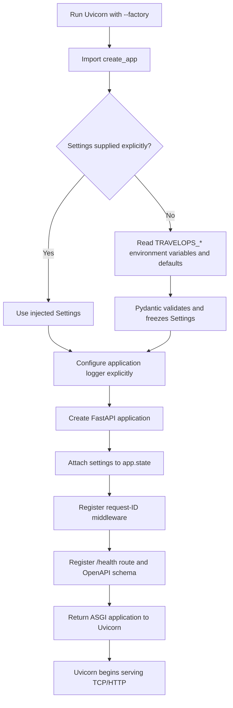
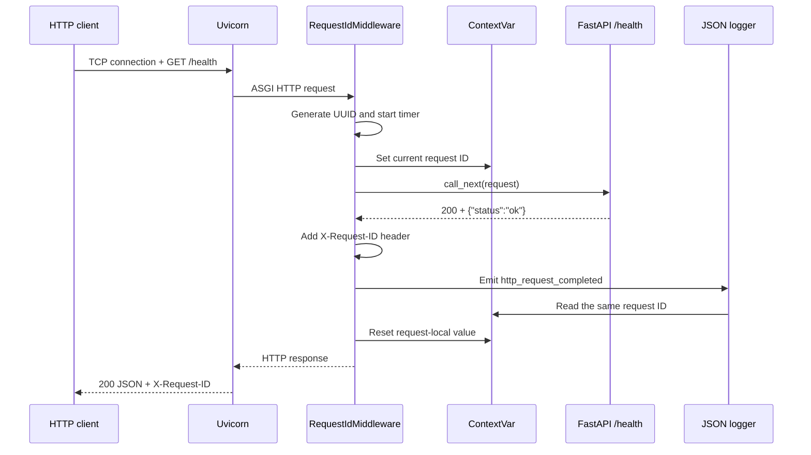
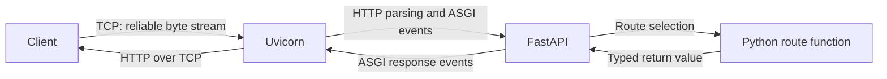

# Phase 1 notes — API, configuration, and logging

## How to read these notes

This document records the project at the end of Phase 1. Later phases may have expanded the linked files, but the explanations below describe the HTTP foundation introduced in this phase.

Use the note in two ways:

- **Brief review:** read “Phase in brief,” the two workflows, and the step summaries.
- **Detailed study:** read the Why, What, How, and Evidence sections under each step, followed by the glossary.

## Phase in brief

### Purpose

Phase 1 turned the installable Phase 0 package into the smallest observable HTTP application. It established how the process starts, how configuration enters the application, how a request reaches Python code, and how one request can be correlated with one structured log event.

### Result

The phase delivered:

- A FastAPI application factory
- Validated, immutable settings with explicit precedence
- Secret-safe configuration representation
- A typed `GET /health` liveness endpoint
- Generated OpenAPI documentation
- A server-generated request ID on every HTTP response
- Request-local correlation using `ContextVar`
- Structured JSON request logs
- In-process tests and a real Uvicorn socket demonstration
- Passing Phase 0 quality and package-build gates

### Deliberate boundary

Phase 1 added HTTP infrastructure, not airline behavior. It introduced no database, airline domain model, synthetic disruption data, case routes, operational tools, frontend, agent framework, LLM, authentication, or Docker infrastructure.

## Startup workflow



The important boundary is that importing a module does not create the complete application or configure global logging. Uvicorn explicitly calls the factory.

## HTTP request workflow



The response header and log event contain the same UUID, allowing an operator to connect what a client saw with what the server recorded.

## Artifact map

| Artifact | Responsibility in Phase 1 |
| --- | --- |
| [`core/config.py`](../../src/travelops_recovery_agent/core/config.py) | Define validated application settings, enums, defaults, and environment prefix. |
| [`api/app.py`](../../src/travelops_recovery_agent/api/app.py) | Assemble and return a configured FastAPI application. |
| [`api/schemas.py`](../../src/travelops_recovery_agent/api/schemas.py) | Define the typed HTTP response contract for `/health`. |
| [`core/context.py`](../../src/travelops_recovery_agent/core/context.py) | Hold the request-local correlation value. |
| [`api/middleware.py`](../../src/travelops_recovery_agent/api/middleware.py) | Wrap every request with ID generation, timing, response correlation, and request logging. |
| [`core/logging.py`](../../src/travelops_recovery_agent/core/logging.py) | Format application log records as JSON and configure the application logger explicitly. |
| [`tests/core/test_config.py`](../../tests/core/test_config.py) | Verify settings defaults, precedence, invalid input, and secret masking. |
| [`tests/api/test_app.py`](../../tests/api/test_app.py) | Verify the factory, health endpoint, OpenAPI, request IDs, log correlation, and secret safety. |

## Step-by-step implementation

### Step 1 — Add runtime and development dependencies deliberately

**Why this step was taken**

The HTTP application needs libraries while it is running, while its in-process tests need a client only during development. Separating these categories keeps the application contract clear and avoids treating test infrastructure as production behavior.

**What was implemented**

Runtime dependencies:

- FastAPI for routing, validation integration, serialization, and OpenAPI
- pydantic-settings for environment-backed typed settings
- Uvicorn for the real ASGI server

Development dependency:

- HTTPX2 for FastAPI/Starlette’s in-process test client

**How it was implemented**

The runtime packages were added to `[project].dependencies`. HTTPX2 was added to the `dev` dependency group. uv regenerated `uv.lock`, and locked synchronization installed the new exact graph.

The distinction is operational:

- A **runtime dependency** is needed while the application serves requests.
- A **development dependency** supports testing, linting, typing, formatting, or building but is not part of the application’s behavior for users.

**Evidence**

All required packages imported from the synchronized environment, the lock check passed, and the existing Phase 0 package remained installable.

### Step 2 — Define typed and validated settings

**Why this step was taken**

Configuration enters from untyped strings such as environment variables. Invalid values should fail when the application is assembled, not surface later as confusing behavior during a request.

**What was implemented**

The initial `Settings` model included:

- `environment`: development, test, or production
- `log_level`: DEBUG, INFO, WARNING, or ERROR
- `service_token`: an optional `SecretStr` used to demonstrate secret-safe handling

It also defined the `TRAVELOPS_` environment prefix, case-insensitive environment names, forbidden extra constructor fields, and frozen instances.

**How it was implemented**

`Settings` inherited from `BaseSettings`. `Environment` and `LogLevel` used string enums so invalid values produced structured validation errors. `SecretStr` masked the token in normal string and object representations. `frozen=True` prevented configuration from being mutated after startup.

The Phase 1 precedence was:

```text
Explicit Settings constructor value
    → TRAVELOPS_* environment variable
    → declared default
```

Automatic `.env` loading was intentionally omitted so the source order remained easy to see and test.

**Evidence**

Tests proved defaults, environment overrides, constructor precedence, clear rejection of an invalid environment, and masking of secret values.

### Step 3 — Construct the application through a factory

**Why this step was taken**

A global `app = FastAPI()` created during import would hide when settings are loaded, when logging changes, and how test applications receive isolated dependencies. Explicit construction makes startup behavior visible and repeatable.

**What was implemented**

```python
def create_app(settings: Settings | None = None) -> FastAPI: ...
```

The factory accepted optional settings, configured logging, created FastAPI, stored settings on `app.state`, registered middleware, and registered the health route.

**How it was implemented**

If a caller supplied `Settings`, the factory used that exact object. Otherwise it constructed `Settings()` from environment variables and defaults. This is a small form of dependency injection: the application receives a dependency instead of reaching for hidden global state.

Uvicorn used the `module:function` target with `--factory`, telling it to call `create_app` and serve the returned ASGI application.

**Evidence**

An automated test created an application with test settings and confirmed the same object was stored on `app.state`. The real Uvicorn process successfully invoked the factory.

### Step 4 — Add a typed liveness endpoint and OpenAPI contract

**Why this step was taken**

The first endpoint needed to prove that the process could accept and answer HTTP without pretending that nonexistent databases or external services were ready.

**What was implemented**

- `GET /health`
- Response body: `{"status": "ok"}`
- A `HealthResponse` Pydantic schema with the literal value `"ok"`
- Automatic OpenAPI documentation containing the health operation

**How it was implemented**

FastAPI used the route decorator to map `GET /health` to an async Python function. The function returned `HealthResponse`, giving FastAPI an explicit response shape for serialization and OpenAPI generation. The schema lived in `api/schemas.py` because it described an HTTP contract, while `api/app.py` remained responsible for application assembly.

This was a **liveness** check: it showed the process could handle a request. It was not a **readiness** check because Phase 1 had no required database or external service to inspect.

**Evidence**

The in-process client received HTTP 200 and the expected JSON. `/openapi.json` contained `/health`, and the real Uvicorn server returned the same behavior over a TCP socket.

### Step 5 — Create request-local context

**Why this step was taken**

Middleware creates a request ID, while logging needs to read it later. Passing the value manually through every route and function would couple unrelated application code to logging infrastructure. A normal module global would be unsafe because concurrent requests could overwrite each other.

**What was implemented**

`core/context.py` defined:

```python
current_request_id: ContextVar[str | None]
```

**How it was implemented**

`ContextVar` associates a value with the current asynchronous execution context. Middleware stores the ID and receives a token representing the previous value. Logging reads the current value. The middleware resets the token in `finally`, even if the route raises an exception.

Conceptually:

```text
Request A context → request ID A
Request B context → request ID B
```

Both requests can be in progress on the same process without sharing the slot’s value.

**Evidence**

The request log and response header contained the same ID, and the context cleanup lived on the guaranteed `finally` path.

### Step 6 — Apply correlation and timing through middleware

**Why this step was taken**

Request correlation is a technical concern shared by every endpoint. Duplicating ID generation, response headers, timing, and logs inside each route would be inconsistent and easy to forget.

**What was implemented**

`RequestIdMiddleware`:

1. Generated a UUID for every request.
2. Stored it in request-local context.
3. Started a monotonic timer.
4. Passed control to the next middleware or route.
5. Added `X-Request-ID` to successful responses.
6. Logged completion or failure with method, path, status, and duration.
7. Reset request context in `finally`.

**How it was implemented**

The central operation was:

```python
response = await call_next(request)
```

This means: continue processing the request, wait for the downstream response, then resume middleware work on the way out. `perf_counter()` measured elapsed duration using a monotonic clock. Only `request.url.path` was logged, avoiding potentially sensitive query-string values.

The server generated IDs rather than trusting arbitrary client input. The ID was correlation metadata, not authentication or authorization.

**Evidence**

Tests confirmed that the response header contained a valid UUID and that the structured completion log used the identical UUID.

### Step 7 — Emit structured logs without import-time side effects

**Why this step was taken**

Operational logs need machine-readable fields, but importing this package should not unexpectedly reconfigure the root logger or unrelated libraries in a larger process.

**What was implemented**

- `JsonFormatter`, using the Python standard logging library
- `configure_logging(log_level)`, called explicitly by the application factory
- A dedicated `travelops_recovery_agent` logger hierarchy
- JSON fields for timestamp, level, logger, message, request ID, HTTP method, path, status, duration, and exception when present

**How it was implemented**

The formatter converted each `LogRecord` into a dictionary and serialized it with `json.dumps`. It retrieved the request ID from `ContextVar` and copied explicitly allowed HTTP fields from the log record.

`configure_logging` attached a stream handler only to the application logger, set its level, and disabled propagation. The module did not call `basicConfig()` and did not attach handlers during import.

Settings and secret values were never serialized into request events.

**Evidence**

Tests parsed emitted JSON, confirmed the expected HTTP fields and matching request ID, and confirmed that a configured secret value did not appear in captured logs.

### Step 8 — Test the ASGI application in-process

**Why this step was taken**

Most HTTP behavior can be verified faster and more deterministically without reserving a network port or coordinating a background server.

**What was implemented**

Automated coverage for:

- Injected settings in the application factory
- Settings defaults and precedence
- Invalid configuration
- Secret masking and log exclusion
- `/health` status and JSON
- OpenAPI inclusion
- UUID response header
- Response-to-log request correlation

**How it was implemented**

FastAPI’s test client invoked the ASGI application in the same Python process. It still exercised FastAPI routing and middleware, but it replaced the real TCP listener and HTTP server boundary with a test transport.

HTTPX2 was used as a development dependency because Starlette had deprecated its compatibility path through the older `httpx` package.

**Evidence**

Twelve tests passed without warnings at the final Phase 1 gate.

### Step 9 — Demonstrate the application over a real socket

**Why this step was taken**

In-process tests do not prove that Uvicorn can bind a port, load the factory, translate real HTTP into ASGI events, and return bytes to an external client.

**What was implemented**

A manual two-terminal demonstration:

- Terminal 1 started Uvicorn on `127.0.0.1:8000`.
- Terminal 2 requested `/health` and `/openapi.json`.
- The response status, body, request-ID header, OpenAPI paths, and JSON server log were inspected.

**How it was implemented**

```powershell
uv run --locked uvicorn travelops_recovery_agent.api.app:create_app --factory --host 127.0.0.1 --port 8000
```

Uvicorn opened the TCP listener and called the application factory. PowerShell’s HTTP commands acted as a separate client process.

**Evidence**

The live request returned HTTP 200, `{"status":"ok"}`, and `X-Request-ID`. `/openapi.json` included `/health`, and the server emitted the correlated JSON event.

### Step 10 — Preserve quality, packaging, and learning evidence

**Why this step was taken**

Adding an API must not weaken the reproducible foundation. A phase is complete only when new behavior works, earlier guarantees remain intact, and the mechanisms are documented.

**What was implemented**

- Phase 1 tests alongside the existing import test
- Updated locked dependencies
- Cross-platform LF policy in `.gitattributes`
- Decision records D-011 through D-013
- Updated progress and README status
- A repeated wheel and source-distribution build

**How it was implemented**

The full locked suite ran after implementation and documentation. Ruff formatted the source, strict mypy covered application and test code, pytest exercised both phases, and Hatchling rebuilt the standard artifacts.

**Evidence**

The final gate reported:

- 12 passing tests without warnings
- Ruff lint passed
- Ruff format check passed
- Strict mypy found no issues in 12 source files
- Installed-package import passed
- Wheel and source distribution built successfully

## Detailed concept guide

### TCP, HTTP, ASGI, Uvicorn, and FastAPI responsibilities



- **TCP** provides an ordered connection. It does not understand routes or JSON.
- **HTTP** defines method, path, headers, status, and body.
- **ASGI** defines the Python event interface between server and application.
- **Uvicorn** owns the network listener and protocol translation.
- **FastAPI** owns routing, schema integration, serialization, and OpenAPI.
- **The route function** owns the endpoint’s application behavior.

### Application factory and dependency injection

An application factory delays assembly until an explicit caller asks for an application. Passing `Settings` into that factory is dependency injection: the factory uses a supplied dependency rather than fetching an invisible global singleton.

This improves:

- Test isolation
- Startup validation
- Future service assembly
- Clarity about side effects

### Liveness versus readiness

| Check | Question | Phase 1 answer |
| --- | --- | --- |
| Liveness | Can this process receive and answer HTTP? | Yes: `GET /health`. |
| Readiness | Can this instance perform useful work with required dependencies? | Not meaningful yet; there were no required external dependencies. |

Returning “ready” for a database that does not exist would be false confidence, not useful observability.

### Structured event versus formatted text

The event is the set of facts:

```text
message=http_request_completed
request_id=...
http_method=GET
http_path=/health
http_status=200
duration_ms=...
```

JSON is the chosen encoding of those facts. Because fields remain separate, log processors can filter by status, group by path, or search by request ID without parsing a prose sentence.

### What a request ID does and does not do

A request ID:

- Correlates a response with application logs
- Gives support and developers a shared reference
- Separates concurrent request context

A request ID does not:

- Authenticate a user
- Authorize an action
- Prove that a log was not modified
- Trace work across multiple services by itself
- Replace an audit identifier or idempotency key

## Commands and what each proves

```powershell
# Reproduce the exact Python environment
uv sync --locked --all-groups

# Prove the installed package still imports
uv run --locked python -c "import travelops_recovery_agent; print(travelops_recovery_agent.__file__)"

# Run configuration, API, middleware, logging, and package tests
uv run --locked pytest

# Run the quality and build gates
uv run --locked ruff check .
uv run --locked ruff format --check .
uv run --locked mypy
uv run --locked python -m build --no-isolation

# Start the real server in terminal 1
uv run --locked uvicorn travelops_recovery_agent.api.app:create_app --factory --host 127.0.0.1 --port 8000

# Exercise liveness and correlation in terminal 2
$response = Invoke-WebRequest http://127.0.0.1:8000/health
$response.StatusCode
$response.Content
$response.Headers["X-Request-ID"]

# Inspect the generated API contract
$openApi = Invoke-RestMethod http://127.0.0.1:8000/openapi.json
$openApi.info.title
$openApi.paths.PSObject.Properties.Name
```

## Problems encountered and lessons learned

### The first socket request could not connect

The client ran before Uvicorn was listening, so PowerShell reported that it could not connect and no response object existed.

**Lesson:** “connection refused/unavailable” is a network-listener problem, not an HTTP error from FastAPI. A server must be running in one terminal before another process can call it.

### Formatting and import ordering failed at the deferred gate

Windows line endings and one import block did not match the configured Ruff policy. Ruff normalized the source, and `.gitattributes` established LF for Python, TOML, Markdown, lock, and Python-version files.

**Lesson:** formatter policy and Git checkout policy must agree, or a clean checkout can recreate formatting noise.

### Runtime coercion and static typing disagreed in tests

Pydantic could convert a raw string into `SecretStr` at runtime, but strict mypy required the declared constructor type. Tests were changed to construct `SecretStr` explicitly.

**Lesson:** runtime validation may accept broader inputs than the static function signature promises. Strict typing checks the declared contract.

### The test-client dependency emitted a deprecation warning

Starlette warned that its compatibility route through `httpx` was deprecated. The development dependency changed to HTTPX2, the lockfile was regenerated, and the final suite passed without warnings.

**Lesson:** warnings are early migration signals. A green suite with an ignored compatibility warning can still be accumulating future breakage.

## Decisions made

- [D-011](../decisions.md#d-011--construct-the-api-with-an-application-factory) selected explicit application construction and settings injection.
- [D-012](../decisions.md#d-012--generate-request-ids-in-middleware) selected server-generated UUIDs, middleware, and `ContextVar` isolation.
- [D-013](../decisions.md#d-013--emit-application-logs-as-json) selected explicit standard-library JSON logging on the application logger hierarchy.
- API response schemas were separated from construction code, while one health route remained in the factory until additional routes justified a router module.

## Remaining limitations at the Phase 1 boundary

- The API exposed only liveness and generated documentation.
- No dependency existed for a meaningful readiness check.
- Request IDs correlated one process only; distributed trace propagation was absent.
- Logs had no external collector, rotation policy, or formal sensitive-data classification.
- The optional service token demonstrated safe representation but did not implement authentication.
- No database, airline domain, synthetic data, frontend, agent framework, model integration, authentication, or Docker addition existed.

## Glossary

| Term | Meaning in this project |
| --- | --- |
| Application factory | Function that explicitly constructs and returns a configured FastAPI application. |
| ASGI | Async Python interface through which Uvicorn and FastAPI exchange request and response events. |
| `app.state` | FastAPI/Starlette storage attached to one application instance; Phase 1 stored resolved settings there. |
| Configuration precedence | Rule deciding which source wins when the same setting appears in multiple places. |
| `ContextVar` | Context-local storage that keeps request values isolated across concurrent asynchronous tasks. |
| Correlation | Connecting related evidence, such as a client response and its server log, using a shared identifier. |
| Dependency injection | Supplying an object to code that needs it instead of making that code locate hidden global state. |
| Environment variable | Process-level string input used to configure an application without editing source code. |
| FastAPI | ASGI web framework providing routing, schema integration, serialization, and OpenAPI generation. |
| Frozen settings | Validated configuration object that cannot be reassigned after construction. |
| HTTP | Application protocol defining requests and responses with methods, paths, headers, status, and bodies. |
| HTTPX2 | Development HTTP client used by Starlette/FastAPI’s in-process testing support at the Phase 1 boundary. |
| In-process test | Test that calls the ASGI application through a test transport without opening a real network socket. |
| Liveness | Evidence that the process can receive and answer a request. |
| Middleware | Code that wraps every request before and after route execution to apply shared HTTP behavior. |
| OpenAPI | Machine-readable description of HTTP operations and their data contracts. |
| Pydantic | Runtime data validation and serialization library used by FastAPI and the response schema. |
| pydantic-settings | Library that maps configuration sources such as environment variables into validated Pydantic models. |
| Readiness | Evidence that the process and all required dependencies can perform useful work. |
| Request ID | Correlation identifier generated once per request and returned in `X-Request-ID`. |
| Route | Mapping between an HTTP method/path and a Python handler function. |
| `SecretStr` | Pydantic type that masks a sensitive value in normal string and object representations. |
| Structured logging | Recording events as separate named fields rather than only as prose. |
| TCP | Transport protocol providing the reliable ordered byte stream used by HTTP connections. |
| Uvicorn | ASGI server that listens on a socket, handles HTTP, and calls the FastAPI application. |
| UUID | Universally unique identifier format used for Phase 1 request IDs. |
