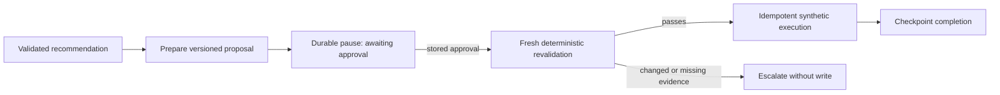

# Phase 10 notes — proposal, approval, and safe execution

Phase 10 crosses the first write boundary. Its completion gate is:

> The agent executes only an explicitly approved, freshly revalidated proposal,
> applies the synthetic booking change at most once, and records a complete
> audit trail.

## Recommendation, proposal, approval, and execution

A **recommendation** is the read-only Phase 9 answer: one itinerary passed the
current deterministic rules. A **proposal** copies that exact itinerary,
validation reference, and evidence snapshot into an expiring versioned record.
An **approval** is an attributable human decision bound to the proposal version
and itinerary fingerprint. **Execution** is a separate, idempotent transaction
that first recomputes every safety rule and then records one synthetic booking
change.

None implies the next. A recommendation cannot authorize a write, approval does
not mean a write already happened, and the UI reports a booking change only
after the transaction commits.

## Exact-version approval and lifecycle

The lifecycle is enforced by one transition table in application code:

```text
drafted -> awaiting_approval -> approved -> executing -> executed
                              \-> rejected
                              \-> expired
approved -> revalidation_failed | expired
executing -> execution_failed
```

Approval supplies both the positive proposal version and the complete itinerary
fingerprint. A modified itinerary is a new proposal version and requires a new
decision. The database permits one decision per proposal; identical retries
return the existing decision while stale or conflicting requests fail. The
creator cannot approve their own proposal, and the required role is checked by
application code. The model has no approval API or authority.

## Why revalidation follows approval

Approval can take minutes while flight status, inventory, schedules, ticket
rules, and policy evidence change. This is a time-of-check/time-of-use gap.
Immediately before the effect, PostgreSQL row locks stabilize the proposal,
booking, flights, disruptions, availability, and ticket evidence. The Phase 9
service is rerun inside that transaction. Execution requires:

- the exact option and flights still exist;
- non-cancelled status, route, chronology, and minimum connection time pass;
- seats cover the complete passenger party on every segment;
- ticket and policy rules still pass;
- the recomputed itinerary and evidence fingerprints equal the approved snapshot;
- proposal and stored approval are current and exact.

Any difference produces `revalidation_failed`, a failure reason, escalation,
and no booking change.

## Transaction, idempotency, and concurrency boundaries

An execution request requires an idempotency key. `execution_attempts` has a
unique key constraint. Replaying the same proposal/actor request returns the
stored result; reusing the key for different input is a conflict. The proposal
and booking are row-locked, and `booking_changes` has unique proposal and
booking constraints. Concurrent attempts can therefore commit at most one
change even across backend processes.

Fresh validation, the execution attempt, immutable audit events, booking-change
ledger, and final proposal result share the success transaction. The synthetic
provider runs inside a savepoint: an injected provider failure rolls back its
partial work, records `execution_failed`, and leaves no booking change. A
process restart after the effect reads the successful attempt and cannot repeat
it.

The original itinerary remains in `itinerary_segments`; the immutable
`booking_changes` ledger records the replacement and is the authoritative
synthetic effect. This preserves before/after evidence without connecting to a
real reservation system.

## Durable human pause and resume

The production LangGraph path is:



The checkpoint stores safe identifiers and status, never executable sessions or
credentials. Resume reads the authoritative proposal row; caller input cannot
invent approval. A workflow-derived idempotency key makes restart during or
after execution replay-safe. Structured workflow events cover proposal wait,
approval observation, revalidation, execution, and escalation; the permanent
business audit remains separate.

## API and operator workspace

`/api/v1` provides proposal create/get, approve, reject, status, execute,
execution-result, and audit routes. Consequential requests require explicit
`X-Actor-ID` and `X-Actor-Role` context. Errors use stable codes for missing
actors, stale approval, expiry, invalid state, idempotency conflict, and unsafe
evidence.

The React workspace labels proposal version and expiry, exact itinerary and
evidence, approval state, confirmation controls, revalidation, execution result,
failures, and audit history. Approval and execution are separate confirmations;
execution is disabled until the server reports eligibility.

## Auditability and minimization

The audit contains proposal/version references, actor, timestamp, correlation
and workflow IDs, hashed idempotency information, revalidation outcomes,
attempts, and booking flight IDs before/after. It omits names, prompts, request
bodies, secrets, and raw idempotency keys. A PostgreSQL trigger rejects audit
updates and deletes.

## Synthetic provider and production limitations

`SyntheticExecutionProvider` keeps execution provider-independent. Phase 10's
repository adapter writes no airline, GDS, payment, ticket, or seat-reservation
system. A future provider needs its own external effect idempotency contract,
reconciliation, authentication, inventory holds, compensation policy, and
operational monitoring. The demo header actor is not production identity;
production requires authenticated principals and governed role assignment.

## Verification commands

```powershell
uv lock --check
uv sync --locked --all-groups
uv run --locked ruff check .
uv run --locked ruff format --check .
uv run --locked mypy
uv run --locked pytest -m "not integration"
uv run --locked pytest -m integration
uv run --locked python -m build --no-isolation

Set-Location frontend
npm.cmd ci
npm.cmd run format:check
npm.cmd run typecheck
npm.cmd run lint
npm.cmd test -- --run
npm.cmd run build
npm.cmd run test:e2e
```

The final run passed 412 non-integration backend tests, 49 real-PostgreSQL
integration tests, 11 Vitest component tests, and 2 Playwright browser tests.
Lock verification, Ruff lint/format, strict mypy, package build, npm clean
install, Prettier, TypeScript, Oxlint, and the Vite production build passed.
Manual in-app browser verification on seeded `CASE-0002` showed awaiting,
approved, revalidated, executed, and five-event audit states; the confirmed
synthetic change was `FLT-NV103 → FLT-NV104` to `FLT-NV1006`, with no browser
console errors.
