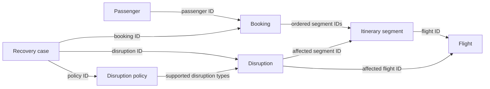
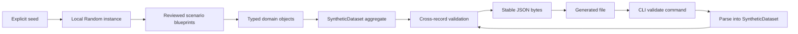

# Phase 2 notes — airline domain and synthetic cases

## How to read these notes

This document records the project at the end of Phase 2. Later phases may add
database mappings, API routes, operational tools, and agent workflows, but the
explanations below describe the independent airline domain and synthetic-data
boundary that Phase 2 introduced.

Use the note in two ways:

- **Brief review:** read “Phase in brief,” the workflows, the artifact map, and
  the step summaries.
- **Detailed study:** read the Why, What, How, and Evidence sections under each
  implementation step, followed by the concept guide and glossary.

## Phase in brief

### Purpose

Phase 2 gave TravelOps a coherent fictional airline world before introducing a
database or an AI model. Its job was to define which facts make passengers,
flights, bookings, itineraries, disruptions, policies, and recovery cases valid,
then generate repeatable examples on which every later layer can depend.

The phase had two related goals:

1. Make invalid airline data impossible to accept silently.
2. Make valid disruption scenarios reproducible from an explicit seed.

### Result

The phase delivered:

- Immutable typed domain models for passengers, flights, itinerary segments,
  bookings, disruptions, disruption policies, and recovery cases
- Stable, format-validated identifiers and explicit relationships between models
- Construction-time and cross-record invariants with useful validation errors
- Timezone-aware flight, disruption, and dataset timestamps
- A versioned dataset envelope containing schema, generator, seed, timestamp,
  and provenance metadata
- Ten reviewed scenarios covering delays, cancellations, missed connections,
  connecting journeys, and group bookings
- A deterministic generator using a private `random.Random(seed)` instance
- Stable ordered UTF-8 JSON serialization and validated loading
- Standard-library CLI commands for dataset generation and validation
- Automated domain, dataset, serialization, generator, determinism, and CLI tests
- Passing Phase 0, Phase 1, and Phase 2 quality gates

The final seed-42 dataset contained:

| Record type | Count |
| --- | ---: |
| Passengers | 13 |
| Flights | 20 |
| Bookings | 10 |
| Disruptions | 10 |
| Policies | 1 |
| Recovery cases | 10 |

### Deliberate boundary

Phase 2 added no PostgreSQL, SQLAlchemy, Alembic, repository, database table,
new airline API route, operational tool, frontend, agent framework, LLM call,
or real airline integration. The domain and generator deliberately work without
FastAPI, persistence, or a network connection. Phase 3 owns persistence, and
later phases own tools, UI, and agent behavior.

## Domain relationship workflow



Each object validates facts it can know by itself. For example, a `Flight` can
know whether its arrival follows its departure. Rules that require the complete
collection—such as whether a booking’s flight ID exists—are checked by the
dataset aggregate.

## Generation and validation workflow



The seed affects controlled fictional details such as passenger names. Scenario
meaning, identifiers, ordering, timestamps, and serialization remain deliberate
and stable. Loading a file reconstructs the same `SyntheticDataset`, so a saved
fixture passes through the same validation rules as a freshly generated one.

## Artifact map

| Artifact | Responsibility in Phase 2 |
| --- | --- |
| [`domain/models.py`](../../src/travelops_recovery_agent/domain/models.py) | Define airline entities, value-like types, relationships, and business invariants. |
| [`domain/__init__.py`](../../src/travelops_recovery_agent/domain/__init__.py) | Publish the supported domain-model surface. |
| [`data/dataset.py`](../../src/travelops_recovery_agent/data/dataset.py) | Define versioned metadata, aggregate validation, stable serialization, file writing, and validated loading. |
| [`data/generator.py`](../../src/travelops_recovery_agent/data/generator.py) | Build ten reviewed fictional recovery scenarios deterministically from a seed. |
| [`data/cli.py`](../../src/travelops_recovery_agent/data/cli.py) | Provide command-line generation and validation without HTTP or database dependencies. |
| [`data/__init__.py`](../../src/travelops_recovery_agent/data/__init__.py) | Publish the supported dataset and generator functions. |
| [`tests/domain/test_models.py`](../../tests/domain/test_models.py) | Prove valid domain construction and rejection of invalid local and itinerary states. |
| [`tests/data/test_dataset.py`](../../tests/data/test_dataset.py) | Prove metadata, aggregate relationships, serialization, loading, and failure paths. |
| [`tests/data/test_generator.py`](../../tests/data/test_generator.py) | Prove scenario coverage, deterministic output, ordering, and random-state isolation. |
| [`tests/data/test_cli.py`](../../tests/data/test_cli.py) | Prove command behavior, exit codes, file output, validation, and module execution. |
| [`pyproject.toml`](../../pyproject.toml) | Declare Pydantic as a direct runtime dependency because Phase 2 imports it directly. |
| [`uv.lock`](../../uv.lock) | Record Pydantic in the project’s exact resolved dependency graph. |
| [`docs/decisions.md`](../decisions.md) | Preserve Phase 2 architectural choices and their tradeoffs. |
| [`docs/progress.md`](../progress.md) | Record the final verification evidence and handoff to Phase 3. |

## Step-by-step implementation

### Step 1 — Declare the domain dependency directly

**Why this step was taken**

FastAPI already brought Pydantic into the environment indirectly, but Phase 2
imports Pydantic from domain and dataset modules that do not depend on FastAPI.
A project should declare the libraries its own code imports rather than relying
on another dependency to keep installing them accidentally.

**What was implemented**

`pydantic>=2.13,<3` was added to the runtime dependencies in `pyproject.toml`,
and `uv.lock` was regenerated.

No new validation framework was added. Phase 2 reused the Pydantic major version
already selected by the Phase 1 dependency graph.

**How it was implemented**

The authored dependency constraint allows compatible Pydantic 2 releases but
excludes a future breaking major version. uv recalculated project metadata in
the lockfile. Because the required Pydantic version was already resolved through
FastAPI, this changed dependency ownership without introducing a second copy or
an unrelated package version.

The alternative was to keep relying on FastAPI’s transitive dependency. That
would hide the domain’s real runtime requirement and could break if FastAPI ever
changed how it performed validation internally.

**Evidence**

`uv lock --check` and `uv sync --locked --all-groups` succeeded, the installed
package imported, and the final build metadata included Pydantic as a direct
requirement.

### Step 2 — Establish a shared immutable domain-model foundation

**Why this step was taken**

All airline models need consistent behavior. Unknown fields should fail instead
of being silently discarded, and an accepted business fact should not be
mutated later without passing validation again.

Identifiers and codes also need predictable formats so relationships remain
readable and mistakes such as using a booking ID where a flight ID belongs are
visible in fixtures and error messages.

**What was implemented**

`DomainModel` established two shared rules:

- `extra="forbid"` rejects undeclared input fields.
- `frozen=True` prevents field reassignment after construction.

Annotated string types defined constraints for:

- Passenger, flight, booking, segment, disruption, policy, and recovery-case IDs
- Three-letter fictional airport codes
- Two-letter fictional carrier codes
- Three- or four-digit flight numbers
- Non-empty trimmed descriptive text

**How it was implemented**

The shared class inherited from Pydantic’s `BaseModel`. `Annotated` combined the
normal Python `str` type with `StringConstraints`, keeping field annotations
compact while producing field-specific validation errors.

Prefixes such as `PAX-`, `FLT-`, `BKG-`, and `CASE-` make serialized references
easy for a human to follow. They are stable business identifiers, not database
row numbers. Freezing models prevents accidental reassignment; creating a new
validated value remains the deliberate way to represent a change.

The alternative was to repeat configuration and validators in every model or to
use unrestricted strings. Repetition would drift, while unrestricted strings
would allow ambiguous and empty identifiers into every later layer.

**Evidence**

Tests accepted correctly formatted identifiers, trimmed surrounding whitespace
from names, rejected malformed IDs and codes, rejected unknown fields, and
confirmed the expected immutable typed values were constructed.

### Step 3 — Model passengers and timezone-aware flights

**Why this step was taken**

Passengers and flights are the smallest entities needed for an airline journey.
They establish identity, route, and time before bookings and disruptions can
refer to them.

Airline schedules cross timezones. A clock reading without a UTC offset cannot
identify a unique instant, so naive datetimes would make connection ordering
ambiguous or wrong.

**What was implemented**

`Passenger` contains:

- Stable passenger ID
- Non-empty given name
- Non-empty family name

`Flight` contains:

- Stable flight ID
- Carrier code and flight number
- Origin and destination airport codes
- Scheduled departure and arrival datetimes

Flight invariants require:

- Both datetimes to be timezone-aware
- Origin and destination to differ
- Scheduled arrival to occur after scheduled departure

**How it was implemented**

A field validator checks both flight datetimes. It rejects a value when either
`tzinfo` or `utcoffset()` is absent. Checking `utcoffset()` as well as `tzinfo`
avoids treating an unusable timezone object as sufficient.

An after-model validator compares route and schedule fields only after their
individual parsing succeeds. Python compares aware datetimes as real instants,
including when their displayed UTC offsets differ.

The rules live on `Flight` because every flight must satisfy them regardless of
whether it came from the generator, JSON, an API, or a future database mapper.

**Evidence**

Tests accepted a valid aware schedule, rejected naive departure and arrival
values, rejected equal or reversed times, rejected identical origin and
destination codes, and rejected malformed flight identifiers and codes.

### Step 4 — Model bookings, segments, and complete itineraries

**Why this step was taken**

A booking is not merely a list of flight IDs. It connects passengers to an
ordered journey, and the journey must be unambiguous, chronological, and
geographically connected.

Some rules can be checked inside a booking, but others require the actual flight
collection. Keeping that distinction explicit teaches where validation context
comes from.

**What was implemented**

`ItinerarySegment` contains:

- Stable segment ID
- Referenced flight ID
- Positive sequence number

`Booking` contains:

- Stable booking ID
- One or more passenger IDs
- One or more itinerary segments

Booking-local invariants reject:

- Empty passenger or segment collections
- Duplicate passenger, segment, or flight references
- Segment sequences that are not ordered and contiguous from 1

`validate_itinerary()` then checks:

- Every segment references a supplied flight
- Each arrival airport matches the next departure airport
- The next flight does not depart before the previous flight arrives

**How it was implemented**

Bookings store tuples rather than mutable lists. The after-model validator builds
small lists and sets to compare cardinality and expected sequence numbers.

`validate_itinerary()` accepts a booking plus a `Mapping[str, Flight]`. This
makes its external context explicit and keeps lookup efficient. It resolves
flights in segment order and uses `itertools.pairwise()` to inspect consecutive
legs.

The function permits a zero-minute connection because it is not chronologically
impossible. A practical minimum connection-time policy depends on airport and
journey rules and belongs to a later recovery-validation phase.

The alternative was to embed complete flight objects inside each booking. That
would duplicate flight data and make identity disagreements possible. Explicit
IDs preserve entity relationships while aggregate validation resolves them.

**Evidence**

Tests covered valid ordered bookings, every duplicate and empty-collection rule,
missing flight references, disconnected airport routes, negative connection
times, and correct chronological comparison across different timezone offsets.

### Step 5 — Model type-specific disruptions, policies, and recovery cases

**Why this step was taken**

TravelOps needs more than a generic “problem” label. Delays, cancellations, and
missed connections carry different facts and must not accept contradictory
details. A recovery case also needs explicit links to the affected booking and
the policy governing recovery.

**What was implemented**

`DisruptionType` defines three supported values:

- `delayed_flight`
- `cancelled_flight`
- `missed_connection`

Each type has its own detail model:

- `DelayedFlightDetails` requires positive delay minutes.
- `CancelledFlightDetails` requires a non-empty fictional reason.
- `MissedConnectionDetails` requires different arriving and missed flight IDs.

`Disruption` identifies the affected flight and segment, records an aware
occurrence time, and contains one of those detail types. A missed connection
must affect its missed flight.

`DisruptionPolicy` names the disruption types it supports, defines a positive
rebooking window, and records whether next-day recovery is allowed.

`RecoveryCase` connects one booking ID, one disruption ID, and one policy ID
under a stable case identity and human-readable title.

**How it was implemented**

The disruption details form a discriminated union using the `type` field. When
Pydantic reads JSON, that discriminator selects the exact detail model before
validating its fields. A cancellation therefore cannot be accepted with only
`delay_minutes`, and a delay cannot omit its positive duration.

Local validators enforce rules available within one object. Cross-object rules,
such as whether the affected segment actually belongs to the recovery case’s
booking, remain for the dataset aggregate where all related entities are known.

The alternative was one disruption model containing many optional fields. That
would allow unclear combinations such as a cancellation with delay-only details
or a missed connection without both flight references.

**Evidence**

Tests proved correct union selection for every disruption type, rejected zero
delay minutes, rejected mismatched detail fields, rejected naive occurrence
times, enforced different missed-connection flights, required the missed flight
to be affected, and checked policy type uniqueness and case identifiers.

### Step 6 — Create a versioned dataset envelope with provenance

**Why this step was taken**

Separate valid objects do not yet form a portable dataset. A saved fixture needs
one defined top-level shape and enough metadata to explain which contract and
generator produced it.

Without a schema version, a future structural change could cause an old file to
be misinterpreted. Without a seed and provenance, a generated dataset would be
difficult to reproduce or distinguish from real airline information.

**What was implemented**

`DatasetMetadata` contains:

- Dataset schema version `1.0`
- Generator name `travelops-recovery-agent`
- Generator version
- Explicit integer seed
- Timezone-aware deterministic generation timestamp
- Non-empty fictional-data provenance

`SyntheticDataset` contains ordered tuples of:

- Passengers
- Flights
- Bookings
- Disruptions
- Policies
- Recovery cases

**How it was implemented**

Literal types restrict the currently supported schema and generator name.
Metadata forbids extra fields and is frozen like the domain models. Field
validators strip and reject blank version or provenance text and require an
aware generation timestamp.

Schema version and generator version are separate. The schema version describes
the file contract; the generator version describes the implementation that
created an instance of that contract. One can change without automatically
requiring the other to change.

The timestamp does not call `now()`. The generator derives it from a fixed
reference time and the seed, preserving deterministic output.

**Evidence**

Tests accepted required metadata, confirmed the seed and provenance, rejected
unsupported schema versions, rejected naive timestamps, and rejected blank
generator-version and provenance fields.

### Step 7 — Validate the dataset as one coherent aggregate

**Why this step was taken**

Individual models cannot detect every invalid relationship. A booking can hold a
well-formatted passenger ID that does not exist. A disruption can reference a
validly formatted segment belonging to another booking. A policy can be valid
but irrelevant to the case’s disruption type.

These failures must be rejected before a future API, database, tool, or agent
can treat the dataset as a source of truth.

**What was implemented**

The dataset rejects duplicate identifiers for:

- Passengers, flights, bookings, disruptions, policies, and recovery cases
- Segments across all bookings

It also checks that:

- Every booking passenger exists
- Every itinerary flight exists and the itinerary is connected and chronological
- Every disruption’s flight and segment exist
- The affected segment references the affected flight
- Missed-connection flight references exist
- Every recovery case’s booking, disruption, and policy exist
- The disruption affects the recovery case’s booking
- The selected policy supports the disruption type
- A missed connection’s arriving flight belongs to the booking
- The missed segment immediately follows the arriving segment

**How it was implemented**

An after-model validator builds dictionaries keyed by stable IDs. These indexes
turn relationship checks into direct lookups and retain the resolved objects
needed for coherence checks.

The validator calls the domain-level `validate_itinerary()` rather than copying
flight-continuity rules. It then walks disruptions and recovery cases, raising
messages that include the relevant object and missing or mismatched identifier.

This is an aggregate boundary: acceptance means not only that every record is
well shaped, but also that the entire fictional airline world agrees with itself.

The alternative was to defer relationship checks to database foreign keys.
Phase 2 intentionally has no database, and foreign keys alone would not express
rules such as geographic continuity or policy applicability.

**Evidence**

Dataset tests rejected every required missing reference, duplicate top-level and
segment IDs, a broken itinerary, mismatched disruption flight and segment,
unrelated booking and disruption combinations, unsupported policies, arriving
flights outside the booking, and missed connections that skipped a segment. A
coherent missed connection was accepted.

### Step 8 — Generate data with local seeded randomness

**Why this step was taken**

Later phases need repeatable data for migrations, service tests, tools, UI demos,
agent runs, and evaluation. The generator must vary safe fictional details while
ensuring that the same input always recreates the same dataset.

Using module-level randomness would mutate shared process state. Calling an LLM
would add credentials, network availability, cost, and model-version variation.
Faker would add a large dependency and an independently evolving data catalogue
for a problem that needs only a small reviewed set of names.

**What was implemented**

`generate_dataset(seed: int)` creates:

- One private `Random(seed)` instance
- Deterministic passengers, flights, bookings, segments, disruptions, and cases
- Stable sequential identifiers
- A deterministic metadata timestamp derived from the seed
- One validated `SyntheticDataset`

Small curated collections provide fictional passenger names and airport codes.

**How it was implemented**

The generator passes its seed directly to `random.Random`, then uses only that
object for choices. It never calls `random.seed()` or module-level selection
functions, so unrelated application randomness remains untouched.

Identifiers are derived from loop counters rather than random values. Flights
are scheduled from the fixed aware `REFERENCE_TIME`; each connection departs 90
minutes after the previous arrival. `generated_at` adds `seed % 86_400` seconds
to the reference time rather than observing the wall clock.

The seed therefore controls variation, while explicit sequences control stable
identity and ordering. Constructing `SyntheticDataset` at the end automatically
runs all local and aggregate validation.

**Evidence**

Tests proved that equal seeds produce equal datasets and identical serialized
bytes, different seeds are recorded in different datasets, and generation does
not alter the global random state.

### Step 9 — Define ten reviewed disruption scenarios

**Why this step was taken**

Ten arbitrarily randomized records would meet a numeric target without creating
useful product stories. Later workflows need cases with recognizable purposes
and predictable edge conditions.

Scenario meaning should be reviewed and stable, while only harmless details such
as fictional names vary with the seed.

**What was implemented**

An immutable `ScenarioBlueprint` records:

- Human-readable title
- Disruption type
- Affected segment sequence
- Passenger count
- Delay minutes when required
- Cancellation reason when required

The catalogue contains:

1. Short delay on the originating flight
2. Long delay on the connecting flight
3. Missed connection after an inbound delay
4. Cancelled originating flight
5. Cancelled connecting flight
6. Cancellation close to departure
7. Group booking affected by cancellation
8. Missed connection on a two-segment journey
9. Severe delay before an onward connection
10. Group booking with a missed connection

The distribution is three delays, four cancellations, and three missed
connections. Two scenarios exercise multi-passenger bookings.

**How it was implemented**

The catalogue is an ordered tuple of frozen dataclass instances. Generation
enumerates it from 1, using the number to derive related `PAX-`, `FLT-`, `SEG-`,
`BKG-`, `DIS-`, and `CASE-` identifiers.

`build_disruption_details()` translates a blueprint into the correct typed
detail model. It fails explicitly if a delay lacks minutes or a cancellation
lacks a reason. Missed connections always refer to the first flight as arriving
and the second as missed.

The catalogue fixes business meaning in reviewed source code instead of asking
randomness to invent it. Adding a new scenario therefore requires a deliberate
code and test review.

**Evidence**

Tests asserted exactly ten ordered case IDs and titles, the 3/4/3 disruption
distribution, the expected three- and two-passenger group bookings, and matching
numbered booking and disruption references for every case.

### Step 10 — Serialize and load one stable JSON format

**Why this step was taken**

In-memory equality is not enough for fixtures. The project needs a portable file
that later phases and command-line users can reproduce, compare, and validate.
The same seed should produce identical bytes, not merely equivalent Python
objects.

**What was implemented**

`data/dataset.py` provides:

- `dataset_to_json_bytes()` for the canonical serialized representation
- `write_dataset()` for writing those bytes to a path
- `load_dataset()` for parsing and validating an existing file

The JSON is indented, ordered, encoded as UTF-8, and terminated by one newline.

**How it was implemented**

Pydantic serializes fields in model-definition order, and tuples preserve the
generator’s collection order. `model_dump_json(indent=2)` produces readable
JSON, Python encodes the resulting string as UTF-8, and the function appends a
single final newline.

Writing uses `Path.write_bytes()`. Loading uses `Path.read_bytes()` followed by
`SyntheticDataset.model_validate_json()`, so serialized input passes through the
same nested model and aggregate invariants as generated input.

The alternative was ad hoc `json.dumps()` and dictionary parsing throughout the
CLI or future services. Central functions create one serialization contract and
one validation entry point.

**Evidence**

Tests confirmed UTF-8-decodable JSON and the final newline, exact written bytes,
model round-trip equality, clear rejection of malformed JSON and unsupported
versions, and useful paths such as `metadata.seed` and
`flights.0.scheduled_departure` for invalid nested input.

### Step 11 — Expose generation and validation through a CLI

**Why this step was taken**

The domain and generator need an observable boundary that works before an API or
database exists. A CLI lets a developer, test, script, or future database seed
workflow create and validate fixtures using the same application code.

**What was implemented**

The module exposes two subcommands:

```text
generate --seed INTEGER --output PATH
validate PATH
```

Generation reports the case count, seed, and destination. Validation reports the
schema version, recorded seed, and case count. File and validation failures write
an error to standard error and return exit code 1.

**How it was implemented**

The CLI uses standard-library `argparse`, so no new command framework dependency
was needed. `build_parser()` defines required subcommands and typed arguments.
`main()` delegates to the existing generator and dataset functions instead of
duplicating business rules.

The `if __name__ == "__main__"` block turns the return code into the process exit
status, enabling this installed-package path:

```powershell
python -m travelops_recovery_agent.data.cli
```

The CLI catches only expected file-system and Pydantic validation failures.
Unexpected programming errors remain visible instead of being mislabeled as bad
input.

**Evidence**

Tests exercised direct `main()` calls and a real subprocess module entry point.
They proved successful generation and validation, identical same-seed files,
missing-file and malformed-JSON errors, standard output, standard error, and
exit codes.

### Step 12 — Preserve earlier gates and record Phase 2 evidence

**Why this step was taken**

A phase is complete only if its new behavior works and all earlier guarantees
remain intact. Domain work must not break package installation, the FastAPI
factory, `/health`, request IDs, logging, formatting, typing, or distribution
builds.

The mechanisms also need written explanations so later persistence and agent
work can refer to intentional boundaries rather than reconstructing decisions
from source code alone.

**What was implemented**

Codex added and maintained:

- 41 focused domain tests
- 34 dataset, relationship, serialization, and loading tests
- 9 generator and determinism tests
- 6 CLI tests
- Phase 2 decisions D-014 through D-016
- Phase 2 progress evidence and README commands
- This learning note

Pydantic, domain, data, test, documentation, ignore, and line-ending changes
were kept within the Phase 2 scope.

**How it was implemented**

Focused test files were run after meaningful boundaries rather than after every
small edit. Ruff formatting and the complete quality suite were deferred to the
final gate, matching the project’s verification rhythm.

The final gate synchronized the locked environment, imported the installed
package, ran all tests, checked lint and canonical formatting, ran strict mypy,
generated and validated two files, compared their SHA-256 hashes, counted the
records, and built both Python distribution formats.

The generated root `synthetic-cases.json` demonstration file was ignored because
it is reproducible output rather than authored source data.

**Evidence**

The final gate produced:

- 102 passing tests without warnings, including the existing `/health` test
- Ruff lint success
- Ruff format success across 34 files
- Strict mypy success across 22 source files
- Identical seed-42 SHA-256 hashes
- A validated dataset with 10 cases, 10 disruptions, 13 passengers, and 20 flights
- Successful wheel and source-distribution builds
- A clean Git whitespace check

## Detailed concept guide

### Entity, value object, aggregate, and invariant

An **entity** has a stable identity across changes. `Passenger`, `Flight`,
`Booking`, and `RecoveryCase` are entities because their IDs continue to identify
the same business object even if descriptive information later changes.

A **value object** is understood by its value rather than an independent
lifecycle. Airport codes, carrier codes, typed identifier values, and disruption
details act as value objects here. Two equal airport-code values need no separate
identity.

An **aggregate** is a consistency boundary around related information.
`SyntheticDataset` is the Phase 2 aggregate because it owns every collection
needed to decide whether IDs exist and relationships agree.

An **invariant** is a rule that must always remain true. A flight must arrive
after departure, booking segments must be ordered, and a missed connection must
affect the segment immediately after its arriving flight.

### Domain model versus API schema versus persistence model

A domain model describes business meaning and valid behavior. An API schema
describes the data accepted or returned through HTTP. A persistence model
describes tables, columns, constraints, indexes, and storage relationships.

These representations may contain similar fields, but they answer different
questions. Phase 2 domain models do not import FastAPI schemas and do not contain
future SQLAlchemy table configuration. Phase 3 will map between domain and
persistence representations explicitly.

### Why business rules belong in deterministic domain code

Flight ordering, geographic continuity, duplicate IDs, and disruption
consistency have objective answers. Normal Python and Pydantic can apply those
rules quickly and repeatedly without prompts, model availability, or provider
behavior.

A later agent may decide which evidence to collect or how to explain a valid
option. It cannot redefine whether a flight arrives before it departs or whether
a case references a missing booking.

### Construction validation versus workflow validation

Construction validation uses fields already present on one object. `Flight` can
reject a naive datetime as soon as it is constructed.

Relationship or workflow validation needs surrounding context. A `Booking`
cannot determine whether `FLT-NV101` exists until a flight collection is
supplied. `validate_itinerary()` and `SyntheticDataset` make that context
explicit instead of hiding it in a generator, API, test, or future agent.

### Deterministic generation and seeded randomness

A deterministic generator returns the same result for the same explicit inputs.
A pseudorandom seed initializes a predictable sequence of choices. Determinism
also requires stable identifiers, timestamps, scenario order, collection order,
field order, encoding, and newline policy.

A private `Random(seed)` instance is safer than global random state because
generation cannot affect or be affected by unrelated calls elsewhere in the
process. This isolation was verified by preserving and comparing the module-level
random state in tests.

### Realistic synthetic data versus arbitrary random data

Realistic synthetic data obeys product relationships and represents useful
stories. Arbitrary random data merely combines plausible-looking values.

The Phase 2 catalogue fixes routes, two-leg journeys, affected segments,
disruption types, group sizes, and type-specific facts. The seed varies only
reviewed fictional names. An LLM or Faker was unnecessary because neither would
improve the ten intended business scenarios enough to justify variability,
credentials, network access, dependency size, or version drift.

### Dataset schema version and provenance

The schema version identifies the structural contract a loader must understand.
The generator version identifies the implementation that produced the instance.
The seed reproduces the controlled choices. The deterministic timestamp and
provenance state when the fictional timeline is anchored and that the data is
synthetic.

If a future phase changes the file incompatibly, it can introduce another schema
version instead of silently changing what `1.0` means.

### Stable identifiers, ordering, and serialization

Identifiers contain readable type prefixes and deterministic sequence numbers.
Collections use tuples and generator-defined ordering. Pydantic emits fields in
model-definition order. Serialization uses readable indentation, UTF-8 bytes,
and a final newline.

Byte stability matters because it makes fixture reviews, hashes, version-control
diffs, caching, and reproducibility checks meaningful.

### Timezone-aware datetimes

A naive datetime supplies a date and wall-clock reading without an offset, so it
does not identify one moment globally. This is dangerous for airline journeys
whose airports can use different local offsets.

An aware datetime includes enough timezone information for Python to compare the
underlying instants. Phase 2 requires awareness for scheduled departures,
scheduled arrivals, disruption occurrence times, and dataset generation times.

### Relationships across the airline domain

A booking references passengers and orders itinerary segments. Each segment
references one flight. A disruption identifies the affected segment and flight
and contains facts appropriate to its type. A policy declares which disruption
types it supports. A recovery case selects one booking, disruption, and policy.

The dataset validates this entire chain before later code may use the case.

### Why a CLI is a useful boundary

The CLI proves that domain and data behavior can be used without HTTP, SQL, or an
LLM. It is useful to humans, automated tests, shell scripts, and the Phase 3 seed
workflow. It also turns validation failures into observable error messages and
process exit codes.

### Direct versus transitive dependencies

A direct dependency is imported or relied on by this project’s own code. A
transitive dependency is installed because another package needs it.

FastAPI already installed Pydantic transitively, but Phase 2 domain code imports
Pydantic directly. Declaring it in `pyproject.toml` makes the real runtime
contract visible and prevents an unrelated FastAPI dependency change from
silently removing it.

## Commands and what each proves

```powershell
# Reproduce the exact runtime and development dependency graph
uv sync --locked --all-groups

# Prove the installed package still resolves through the src-layout distribution
uv run --locked python -c "import travelops_recovery_agent; print(travelops_recovery_agent.__file__)"

# Generate ten deterministic fictional recovery cases
uv run --locked python -m travelops_recovery_agent.data.cli generate `
  --seed 42 `
  --output synthetic-cases.json

# Reload the file and run every nested and aggregate validation rule
uv run --locked python -m travelops_recovery_agent.data.cli validate `
  synthetic-cases.json

# Generate the same seed twice for a byte-stability demonstration
$first = Join-Path $env:TEMP "travelops-seed42-first.json"
$second = Join-Path $env:TEMP "travelops-seed42-second.json"
uv run --locked python -m travelops_recovery_agent.data.cli generate --seed 42 --output $first
uv run --locked python -m travelops_recovery_agent.data.cli generate --seed 42 --output $second

# Prove both generated byte streams have the same hash
Get-FileHash -Algorithm SHA256 $first
Get-FileHash -Algorithm SHA256 $second

# Inspect the generated aggregate counts through validated loading
uv run --locked python -c "from pathlib import Path; from travelops_recovery_agent.data import load_dataset; d=load_dataset(Path(r'$first')); print(f'cases={len(d.recovery_cases)}, disruptions={len(d.disruptions)}, passengers={len(d.passengers)}, flights={len(d.flights)}')"

# Run all Phase 0, Phase 1, and Phase 2 behavioral tests
uv run --locked pytest

# Detect configured static source problems
uv run --locked ruff check .

# Verify canonical formatting without editing files
uv run --locked ruff format --check .

# Check strict static typing across source and tests
uv run --locked mypy

# Produce wheel and source distribution with the locked build backend
uv run --locked python -m build --no-isolation

# Start the existing Phase 1 server in terminal 1
uv run --locked uvicorn travelops_recovery_agent.api.app:create_app --factory --host 127.0.0.1 --port 8000

# Prove the existing liveness contract still works from terminal 2
$response = Invoke-WebRequest http://127.0.0.1:8000/health
$response.StatusCode
$response.Content
$response.Headers["X-Request-ID"]
```

## Problems encountered and lessons learned

### A package-level data import created an unnecessary circular path

`data/dataset.py` briefly imported the `data` package while `data/__init__.py`
was importing `data/dataset.py`. The import was unused and created a circular
initialization path.

**Lesson:** Lower-level modules should import the specific lower-level concepts
they need. Package re-export modules are for consumers and should not become a
backward dependency of the modules they publish.

### Consecutive itinerary traversal was expressed indirectly

The first itinerary implementation paired a list with a one-element slice using
`zip()`. Ruff reported both the missing `strict=` argument and that
`itertools.pairwise()` states consecutive traversal more directly.

**Lesson:** A standard-library abstraction that precisely names the operation is
usually clearer than manually coordinating two related iterables.

### Strict mypy exposed reused local variable types

The aggregate validator reused names such as `booking` and `disruption` after
loops. Runtime behavior was correct, but mypy retained the earlier inferred
types and rejected later optional lookup results. The resolved lookup variables
were renamed and narrowed after explicit `None` checks.

**Lesson:** Static typing benefits from names that distinguish an iterated
entity from an optional lookup result. Clearer names also make the validation
flow easier for humans to follow.

### The schema constant needed a literal annotation

Runtime validation accepted the string constant `"1.0"`, but strict mypy saw a
general `str` being supplied to a `Literal["1.0"]` field. Annotating the constant
as `Literal["1.0"]` aligned runtime and static contracts.

**Lesson:** Constants used as discriminators or version literals should retain
their narrow type instead of widening silently to `str`.

### A generated demonstration file appeared in Git status

Running the documented CLI created `synthetic-cases.json` at the repository
root. The file was valid but reproducible and was not an authored fixture.
`.gitignore` was updated to keep it out of checkpoint commits.

**Lesson:** Reproducible outputs should have an explicit source-control policy so
demonstrations do not create accidental repository changes.

### One missed-flight check overlapped another invariant

A missed connection must set its affected flight to the missed flight. The
general affected-flight existence check therefore also proves that the missed
flight exists, making a later explicit missed-flight check partly redundant.

**Lesson:** Layered validation can overlap. Redundancy is acceptable when it
improves errors, but each repeated rule should have a clear purpose and may be
simplified when it adds no additional evidence.

## Decisions made

- [D-014](../decisions.md#d-014--keep-the-airline-domain-independent) kept
  domain models separate from FastAPI schemas and future persistence models.
- [D-015](../decisions.md#d-015--validate-a-versioned-dataset-aggregate) placed
  duplicate, reference, itinerary, disruption, policy, and case coherence rules
  in one versioned aggregate.
- [D-016](../decisions.md#d-016--generate-reviewed-scenarios-deterministically)
  selected reviewed blueprints, local seeded randomness, stable JSON, and a
  standard-library CLI.
- Pydantic was declared directly because Phase 2 imports it independently of
  FastAPI.
- An LLM and Faker were not added because curated names and a private seeded
  generator served the reviewed scenario set with less variability and no extra
  runtime dependency.
- A zero-minute connection remained chronologically valid; practical minimum
  connection-time policy was deferred to later deterministic recovery services.
- Generated root-level dataset files were ignored rather than committed because
  the generator and seed are their reproducible source of truth.

## Remaining limitations at the Phase 2 boundary

- Data lives in memory or generated JSON files; PostgreSQL persistence,
  SQLAlchemy mappings, Alembic migrations, repositories, and seeding services
  belong to Phase 3.
- The API still exposes only the Phase 1 liveness endpoint and OpenAPI document;
  no passenger, booking, flight, disruption, policy, or case routes exist.
- The generator provides ten reviewed cases, not a large population simulator
  or locale-specific passenger-profile system.
- Flight schedules do not model real timezones, daylight-saving transitions,
  aircraft rotations, gates, fares, seats, or operational availability.
- Chronological continuity is enforced, but airport-specific minimum connection
  times and alternative-itinerary validation belong to later phases.
- Policies are small typed records, not a full rules engine or retrieved policy
  corpus.
- No recovery option is searched, ranked, recommended, prepared, or executed.
- No operational tool, frontend, agent framework, LLM, authentication,
  authorization, or real airline integration exists.
- All airlines, airports, passengers, bookings, policies, flights, disruptions,
  and cases are fictional and make no compatibility claim with real systems.

## Glossary

| Term | Meaning in this project |
| --- | --- |
| Aggregate | Consistency boundary that validates a related collection as one coherent unit; Phase 2 uses `SyntheticDataset`. |
| Aggregate invariant | Rule requiring multiple related objects, such as a recovery case’s disruption affecting its own booking. |
| Aware datetime | Datetime with a usable timezone offset, allowing unambiguous comparison of real instants. |
| Construction validation | Validation possible from one object’s own fields when it is created. |
| Deterministic generation | Producing the same complete output whenever the same explicit input seed is used. |
| Direct dependency | Library imported or required by this project’s code and therefore declared explicitly. |
| Discriminated union | Choice among structured model shapes selected by a field such as disruption `type`. |
| Domain model | Typed representation of airline meaning and business rules, independent of HTTP and storage. |
| Entity | Business object with a stable identity, such as a passenger, flight, booking, or recovery case. |
| Fixture | Controlled data used for demonstrations or automated tests. |
| Global random state | Process-wide pseudorandom state shared by module-level `random` functions. |
| Invariant | Rule that must remain true for accepted domain data. |
| Local random generator | Private `Random(seed)` instance whose choices do not mutate global random state. |
| Naive datetime | Date and clock reading without a usable timezone offset. |
| Persistence model | Future representation of storage tables, columns, constraints, and relationships. |
| Provenance | Metadata explaining where and how a dataset was produced. |
| Recovery case | Entity connecting one coherent booking, disruption, and applicable policy. |
| Schema version | Identifier for the structural contract of a serialized dataset. |
| Seed | Explicit integer used to initialize a reproducible pseudorandom sequence. |
| Stable identifier | Predictable typed ID used to preserve an entity’s identity and references. |
| Transitive dependency | Library installed because another declared dependency requires it. |
| Value object | Domain concept identified by its value rather than an independent lifecycle. |
