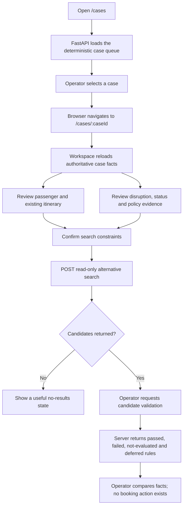
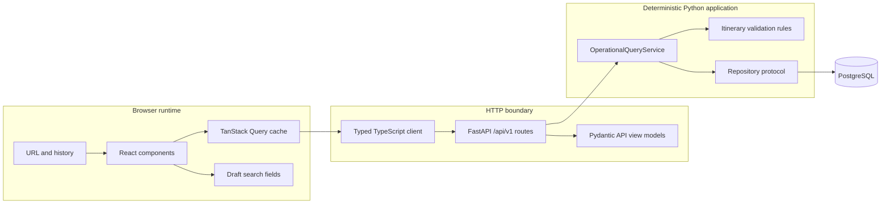
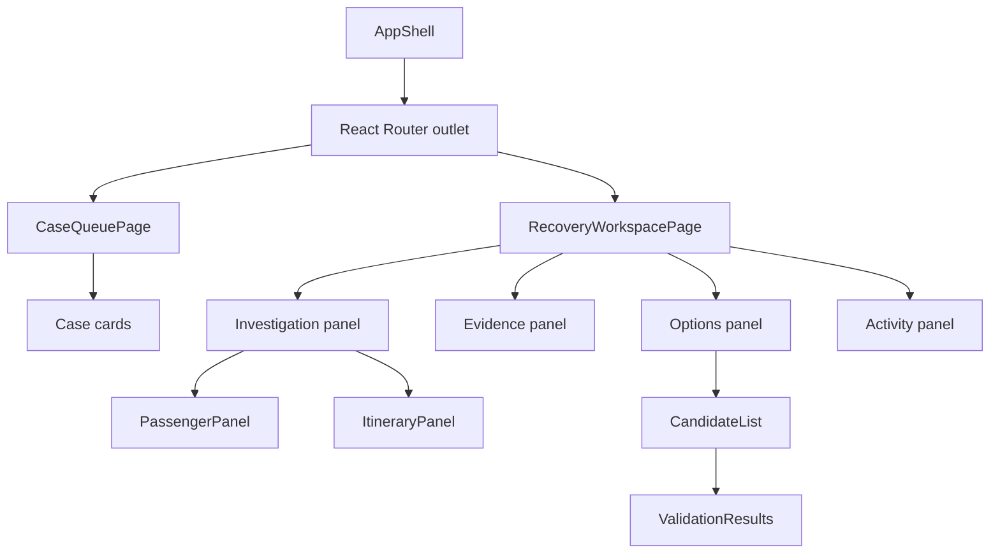
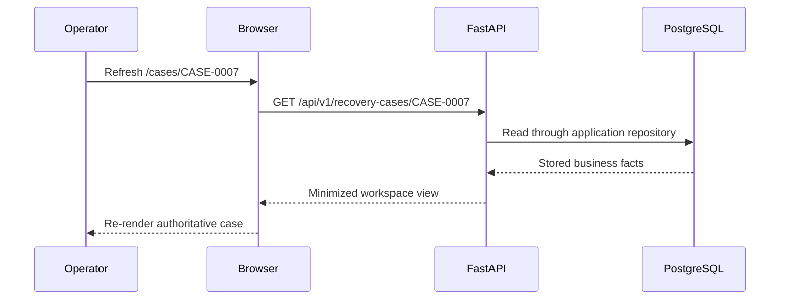

# Phase 5 notes — visual operator dashboard

## What this phase shipped

Phase 5 adds a React and TypeScript operations console under `frontend/` and
four small, versioned, read-only FastAPI routes:

- `GET /api/v1/recovery-cases`
- `GET /api/v1/recovery-cases/{case_id}`
- `POST /api/v1/alternative-itineraries/search`
- `POST /api/v1/itineraries/validate`

An operator can open the disruption queue, navigate directly to a case URL,
review minimized passenger and booking facts, inspect the ordered itinerary,
disruption, operational status and policy, search deterministic alternatives,
and validate a candidate. There is no LLM, agent loop, recommendation, approval,
rebooking write, or invented availability.

## The complete workflow

## Browser, frontend, API and backend

These are related but separate layers:

The **browser** executes JavaScript, displays HTML and CSS, and owns navigation.
The **frontend** is the React application running inside that browser. The
**API** is the typed HTTP boundary. The **backend** includes the application,
domain, persistence adapters and PostgreSQL. The browser never opens a database
connection and never imports Python tool or persistence types.

## Component composition

A React component is a typed function that composes a visible part of the
interface. Page components coordinate queries and local interaction. Smaller
components render repeatable presentation such as status badges and async
states. Abstractions were added only where multiple screens needed them.

## TypeScript at the HTTP boundary

`frontend/src/api/models.ts` describes the JSON shapes the browser expects.
`frontend/src/api/client.ts` owns HTTP calls and translates failed responses to
a safe `ApiError`. TypeScript catches mismatched field use while developing, but
it does not validate an untrusted response at runtime. Pydantic validates the
server output, HTTP contract tests pin its shape, and browser/component tests
exercise the client assumption. A generated runtime-validating client could be
revisited if the API grows substantially.

## API view models, domain models and database records

| Representation | Responsibility | Example |
| --- | --- | --- |
| SQLAlchemy record | Tables, columns, joins and indexes | `RecoveryCaseRecord` |
| Domain model | Airline meaning and invariants | `RecoveryCase`, `Flight` |
| Application query model | Internal deterministic workflow result | `RecoveryCaseQueueItem` |
| API view model | Minimized browser contract | `RecoveryCaseWorkspaceView` |

They deliberately remain separate. A browser contract must not change merely
because a database index changes, and a database record must not escape through
JSON accidentally.

## Client state and server state

TanStack Query owns server state: queue entries, workspace facts, search results
and request status. It supplies loading, error, retry and cache behavior without
copying server facts into component state. Local React state owns only draft
search fields and validation results from the current browser session.

The URL owns the selected case. `/cases/CASE-0007` can be loaded directly or
refreshed. On refresh React reads `CASE-0007` from the route and requests the
workspace again. Passenger or database data is never stored in `localStorage`.

## Loading, empty, not-found, error and unavailable states

The queue and workspace render visible loading status. An empty queue and empty
candidate search explain what the absence means. An unknown URL case receives a
safe 404 screen. Network and dependency failures use plain-language messages,
an optional safe technical detail, and retry where appropriate. API failures do
not contain stack traces, database URLs or credentials. Unknown optional facts
render as unavailable or deferred rather than being fabricated.

## Why validation stays in the backend

React may format times and labels, but it never decides that an itinerary is
valid. Search generates schedule candidates through the application service.
Validation then checks stored-flight existence, route continuity and chronology
in deterministic domain code. Minimum-connection policy, seats and ticket rules
are explicitly deferred because Phase 5 has no evidence for them. A green card
in CSS cannot turn a candidate into a valid or bookable itinerary.

## Manual investigation versus future automation

Phase 5 establishes the human-controlled baseline. The activity panel reports
only actions the operator performed in the current session. Phase 6 may add a
bounded model loop, Phase 7 graph orchestration, and Phase 8 durable progress;
none is disguised as frontend state here. Phase 9 owns evidence-backed ranking
and availability. Phase 10 owns proposal, approval and write safety.

## Accessibility and responsive behavior

The application uses landmarks, ordered lists, headings, labels and accessible
button/link names. A skip link and visible `:focus-visible` outline support
keyboard navigation. Statuses combine text, symbols, borders and color, so color
is not the only signal. Loading and validation results use status regions.
Exact dates include timezone abbreviations. Desktop uses a dense operations
grid; smaller viewports stack the same semantic regions without hiding facts.
Reduced-motion preferences disable the loading animation.

## Data minimization and browser privacy

The queue exposes only passenger count. The workspace exposes synthetic stable
passenger ID and display name because both are needed to identify the affected
party. There are no contact details, documents, payment fields, credentials or
database metadata. Policy text is rendered as ordinary React text, never raw
HTML. No business or passenger data is written to browser persistence.

## Tests and evidence

- Domain and application tests prove deterministic status, search and rules.
- Real-PostgreSQL repository tests prove complete-case ordering and mapping.
- API tests prove schemas, minimization, empty and not-found behavior, safe
  failures, request validation, search, validation and `/health` regression.
- React Testing Library tests prove queue and workspace behavior from the
  operator's perspective, including loading, empty, failure, evidence, search
  and validation states.
- Playwright exercises queue navigation, investigation, search, validation,
  direct case URL refresh and authoritative reload.

The completed gate produced this evidence:

- Ruff format and lint passed; strict mypy passed over 72 Python files.
- 243 non-database tests and all 18 isolated PostgreSQL integration tests passed.
- The Python wheel and source distribution built successfully.
- Prettier, TypeScript and Oxlint passed; seven component tests passed.
- The production Vite bundle built and the Playwright operator journey passed.
- A live seeded workflow was inspected at 1440×900 and 390×844 with no
  horizontal overflow and no browser console warnings or errors.

## Remaining limitations

Phase 5 deliberately leaves out LLMs, agents, LangChain, LangGraph, SSE,
background work, recommendations, prices, inventory, ticket-rule validity,
production authentication, booking writes, approval and audit persistence.
Those capabilities remain assigned to later phases rather than being simulated
in the dashboard.
