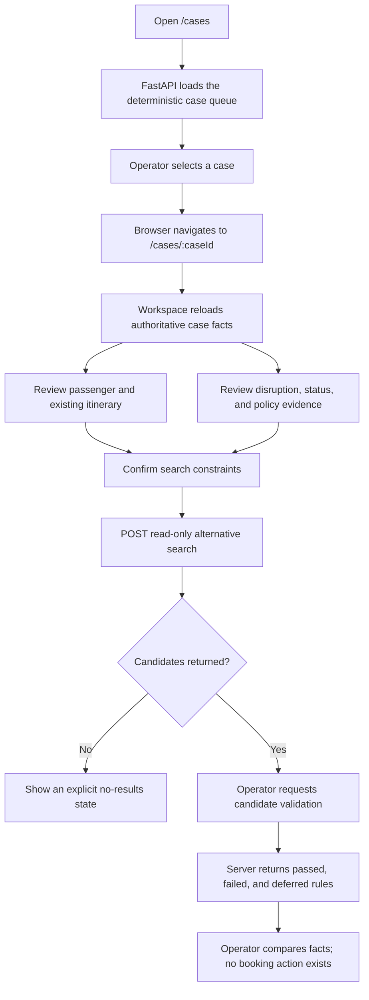
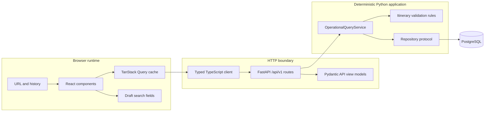
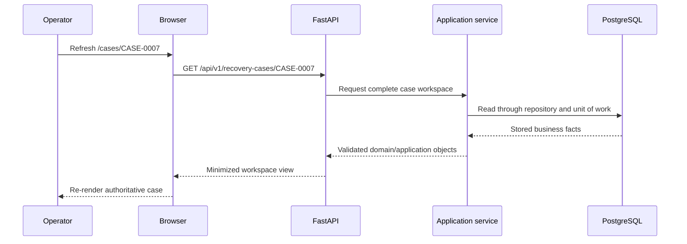

# Phase 5 notes — visual operator dashboard

## How to read these notes

This document records the project at the end of Phase 5. Later phases may add a
model loop, graph orchestration, durable workflow state, recommendations, and
write operations, but the explanations below describe the manual read-only
operator experience introduced in this phase.

The steps are presented in dependency order rather than file-alphabetical
order. Each step explains why the work was necessary, what was implemented,
how the pieces operate, why that implementation was selected, and what evidence
proved the result.

Use the note in two ways:

- **Brief review:** read “Phase in brief,” the workflows, and the step summaries.
- **Detailed study:** read the Why, What, How, and Evidence sections under every
  implementation step, followed by the concept guide and glossary.

## Phase in brief

### Purpose

Phase 5 gave an operator a visual way to investigate one synthetic disruption
without an LLM. Phases 2–4 already provided validated airline facts, durable
PostgreSQL storage, deterministic query services, and guarded read-only tools.
What was missing was a browser experience that made those facts, evidence
limits, and validation results understandable to a human.

The phase also established the browser boundary. React does not receive a
database session, persistence records, or model-oriented tool envelopes.
FastAPI maps application results into minimized UI-specific contracts, and the
browser treats the server as the source of business truth.

### Result

The phase delivered:

- A React and TypeScript application under `frontend/`
- A responsive disruption queue at `/cases`
- A directly addressable recovery workspace at `/cases/:caseId`
- Four versioned, read-only FastAPI recovery routes
- Strict Pydantic request, response, and safe-error schemas
- A typed TypeScript HTTP client and corresponding frontend models
- URL-owned case selection and server-owned query state
- Minimized passenger, booking, itinerary, disruption, status, and policy views
- Deterministic alternative-itinerary search from the operator workspace
- Separate backend itinerary validation with explicit deferred evidence
- Loading, empty, not-found, network-error, and service-unavailable states
- Accessible status communication and responsive desktop/mobile layouts
- API, application, repository, component, and Playwright workflow tests
- A production frontend build and complete Python package gate

The browser API consists of:

- `GET /api/v1/recovery-cases`
- `GET /api/v1/recovery-cases/{case_id}`
- `POST /api/v1/alternative-itineraries/search`
- `POST /api/v1/itineraries/validate`

The two POST routes are complex read queries. They do not mutate a booking,
recovery case, or any PostgreSQL row.

### Deliberate boundary

Phase 5 is a manual investigation baseline, not an automated recovery agent.
It deliberately excludes:

- LLM or model-provider integration
- An agent loop, LangChain, or LangGraph
- Durable workflow checkpoints or live event streaming
- Automated recommendations or candidate ranking
- Seat inventory, pricing, ticket-rule, or minimum-connection evidence that the
  synthetic dataset does not contain
- Proposal preparation, approval, revalidation, or booking writes
- Production authentication and authorization infrastructure
- Redis, queues, workers, background jobs, or caches
- Real airline systems or external operational feeds

Later phases own those capabilities. Phase 5 does not simulate them with local
React state or optimistic labels.

## Complete operator workflow



The operator controls every transition. Opening a case does not start an agent.
Searching does not claim that seats exist, and validating structure does not
make a candidate recommendable or bookable.

## Browser, frontend, API, and backend workflow



The browser executes JavaScript and renders HTML/CSS. The frontend is the React
application inside that browser. The API is the typed transport boundary. The
backend contains application coordination, deterministic domain rules,
persistence adapters, and PostgreSQL. A browser never opens a database
connection and never imports Python repository or persistence types.

## Refresh and authoritative-state workflow



The URL identifies which case to request. It does not contain the case facts.
Refreshing therefore reconstructs the screen from PostgreSQL rather than from
browser persistence.

## Artifact map

| Area                       | Primary files                                            | Responsibility                                                   |
| -------------------------- | -------------------------------------------------------- | ---------------------------------------------------------------- |
| Application query model    | `application/query_models.py`                            | Represent one complete queue item independently of HTTP          |
| Application service        | `application/query_services.py`                          | Coordinate complete-case listing, status, search, and validation |
| Repository contract        | `application/repositories.py`                            | Declare the stable complete-case list operation                  |
| PostgreSQL adapter         | `persistence/repositories.py`                            | Load complete cases in stable order through SQLAlchemy           |
| API schemas                | `api/recovery_schemas.py`                                | Validate minimized browser requests and responses                |
| API routes                 | `api/recovery_routes.py`                                 | Map HTTP calls to application services and safe responses        |
| Composition root           | `api/app.py`                                             | Construct/inject the service and include the recovery router     |
| Frontend HTTP boundary     | `frontend/src/api/`                                      | Describe expected JSON and perform safe HTTP calls               |
| Frontend application shell | `frontend/src/app/`                                      | Configure routing, providers, navigation, and query state        |
| Shared components          | `frontend/src/components/`                               | Render reusable async and status states                          |
| Case queue                 | `frontend/src/features/cases/`                           | Load and render the disruption queue                             |
| Recovery workspace         | `frontend/src/features/recovery/`                        | Render facts, evidence, search, candidates, and validation       |
| Visual system              | `frontend/src/styles/global.css`                         | Define responsive layout, typography, status, and focus styling  |
| Component fixtures/tests   | `frontend/src/test/` and feature tests                   | Exercise frontend behavior without PostgreSQL                    |
| Browser test               | `frontend/e2e/manual-investigation.spec.ts`              | Exercise the complete operator journey and URL refresh           |
| Backend tests              | `tests/api/`, `tests/application/`, `tests/integration/` | Prove contracts, coordination, and real-database behavior        |

These representations remain separate on purpose. Database records answer how
facts are stored. Domain and application models answer what those facts mean.
API schemas answer what a browser may receive. TypeScript models answer what
frontend code expects to consume.

## Step-by-step implementation

### Step 1 — Inspect the manual workflow and preserve the phase boundary

**Why this step was taken**

The existing system already contained several usable layers, and duplicating
them in React or creating a second business-logic path would weaken the design.
The project also needed to distinguish a manual dashboard from the future model
loop and graph workflow.

**What was implemented**

The Phase 5 scope was defined as a read-only browser workflow over existing
application services and deterministic rules. The required screens were reduced
to a case queue and one recovery workspace with investigation, evidence,
options, and activity regions.

The following boundaries were retained:

- PostgreSQL remains behind application-owned repositories.
- Domain rules remain in Python.
- Phase 4 tools remain available to future model callers.
- Browser routes use UI-specific view models rather than tool envelopes.
- No Phase 6 model behavior is stored in frontend state.

**How it was implemented**

Repository, query-service, tool, UI-specification, architecture, and phase-plan
files were inspected before broad implementation. Existing Phase 4 search and
validation behavior was selected for reuse. Only missing complete-case listing
and browser mapping capabilities were added.

This was chosen over invoking Phase 4 tool adapters from the browser because
tool permission, deadline, audit, and result envelopes are designed for
automated callers. A human-facing screen needs minimized view models and normal
HTTP error semantics instead.

**Evidence**

The final router exposes only four named recovery operations. Source inspection
shows that frontend code imports no Python tool, repository, SQLAlchemy, or
persistence type. The UI visibly states that the workspace is read-only and
that no agent, recommendation, seat claim, approval, or write occurs.

### Step 2 — Add a complete recovery-case queue query

**Why this step was taken**

Phase 4 could retrieve individual operational facts, but `/cases` needs a
stable list containing enough joined information to summarize every disruption
without issuing unrelated browser calls or exposing persistence records.

**What was implemented**

- `RecoveryCaseQueueItem` was added to `application/query_models.py`.
- `list_complete_cases()` was added to the repository protocol.
- The SQLAlchemy repository implemented stable complete-case listing.
- `OperationalQueryService.list_recovery_cases()` assembled queue items.
- `OperationalQueryService.get_recovery_case()` provided one complete case for
  the workspace boundary.
- Flight-status construction was refactored so queue and individual reads reuse
  the same deterministic interpretation.

**How it was implemented**

The persistence adapter reuses the same joins and mapping used for complete-case
retrieval, then orders records by stable recovery-case ID. The application
service combines each complete case with passenger count, ordered itinerary,
disruption, and affected-flight status.

The queue item is an application model rather than an API model because the
joined result is useful application meaning independent of HTTP. The API later
decides which of those fields the browser receives.

Stable ordering was selected so identical database state produces identical
queue order, component output, and test results.

**Evidence**

Application tests prove queue construction, passenger counts, routes, and
operational statuses. The real-PostgreSQL repository test proves that all ten
seeded cases load in stable order and still map into valid complete domain
objects.

### Step 3 — Define strict frontend-oriented API contracts

**Why this step was taken**

Returning domain models or SQLAlchemy records directly would couple the browser
to internal storage and could accidentally disclose fields. Search and
validation also need precise request contracts rather than query strings or
unstructured dictionaries.

**What was implemented**

`api/recovery_schemas.py` introduced strict immutable Pydantic models for:

- Queue routes and queue items
- Minimized passengers
- Itinerary segments and operational status
- Disruption and policy evidence
- Search defaults and search requests
- Candidate itineraries and segments
- Validation requests and rule results
- Safe API error responses

**How it was implemented**

All models inherit from a base configured with `extra="forbid"` and
`frozen=True`. Existing domain value types such as recovery-case, flight,
airport, booking, passenger, and policy identifiers are reused where their
validation semantics match the HTTP contract.

Search timestamps must be timezone-aware, and the arrival limit must be after
the departure limit. Connection count is restricted to zero or one because
that is the bounded Phase 4 search behavior. Validation requests require one or
two unique flight IDs.

Separate view models were chosen over automatic domain serialization because
the browser contract should change only when the operator experience changes,
not when a database relationship or internal domain representation changes.

**Evidence**

Schema tests prove strict extra-field rejection, aware and correctly ordered
search windows, and unique validation flight IDs. Generated OpenAPI publishes
the intended request and response structures for all four routes.

### Step 4 — Add four safe, versioned, read-only FastAPI routes

**Why this step was taken**

The React application needs a small transport boundary for queue facts,
workspace facts, scheduled candidate search, and deterministic validation.
Existing `/health` behavior had to remain unchanged.

**What was implemented**

`api/recovery_routes.py` added:

- `GET /api/v1/recovery-cases`
- `GET /api/v1/recovery-cases/{case_id}`
- `POST /api/v1/alternative-itineraries/search`
- `POST /api/v1/itineraries/validate`
- A narrow `RecoveryQueryService` protocol for route injection
- Domain/application-to-view mapping helpers
- Safe 404 and 503 JSON responses

`api/app.py` now includes the router and constructs an
`OperationalQueryService` when a database URL is configured.

**How it was implemented**

The application factory creates the engine, session factory, unit of work, and
query service at the composition root. FastAPI dependency overrides inject that
service into the router. The application lifespan disposes an engine owned by
the application.

Routes call application services, then explicitly map returned objects into API
views. Unknown cases return a safe 404. Database or dependency failures return
a generic retryable 503 without a stack trace, SQL statement, or database URL.
When no database is configured, a sentinel delays the configuration failure
until the route can translate it into the same safe 503 contract.

POST was selected for search and validation because their typed request bodies
are more complex than useful URL queries. HTTP method choice does not make them
business writes; neither route commits or changes stored state.

**Evidence**

API tests prove queue and workspace mapping, passenger minimization, empty
queues, unknown cases, safe dependency failures, missing database configuration,
search, validation, invalid windows, and the exact OpenAPI path set. Regression
tests prove `GET /health` still returns `{"status":"ok"}`.

### Step 5 — Represent uncertainty and deferred evidence honestly

**Why this step was taken**

The dataset contains schedules and disruptions but does not contain seat
inventory, ticket rules, prices, or airport-specific minimum-connection rules.
The interface must not turn missing evidence into a positive validation result.

**What was implemented**

Search responses label inventory as `not_evaluated`. Candidate validation
returns deterministic existing rules plus explicit deferred rules for:

- Minimum-connection policy
- Seat inventory
- Ticket rules

The UI displays these states separately from passed and failed structural
checks.

**How it was implemented**

Phase 4 continues to own deterministic candidate generation and structural
validation. The API adds UI-facing deferred results only for evidence that is
known to be absent. The frontend renders status text and symbols instead of
inferring validity from card color.

This separation was chosen because “found by search,” “structurally valid,”
“available,” “recommended,” and “bookable” are different claims. Combining
them would conceal the exact evidence boundary.

**Evidence**

API and component tests assert `not_evaluated`, passed, failed, and deferred
states. The live browser workflow showed three passed structural rules and
three deferred evidence rules without claiming availability.

### Step 6 — Establish a reproducible frontend toolchain

**Why this step was taken**

The frontend requires its own exact dependency graph, development server,
production build, static checks, component tests, and browser tests. Python’s
environment and package build do not manage JavaScript dependencies.

**What was implemented**

The existing Vite React/TypeScript scaffold was configured with:

- React Router for URL routing
- TanStack Query for server state
- Vitest, jsdom, and React Testing Library for component tests
- Playwright for browser workflow tests
- Prettier, TypeScript, and Oxlint quality commands
- A Vite development proxy for `/api` and `/health`
- Locked npm dependencies in `package-lock.json`

**How it was implemented**

`frontend/package.json` defines separate commands for development, formatting,
types, linting, component tests, browser tests, preview, and production build.
`vite.config.ts` configures React, the FastAPI proxy, and a focused Vitest file
pattern so Playwright specifications are not collected as component tests.

The frontend remains a separate directory because Python packaging and browser
bundling have different dependency and build responsibilities. The Vite proxy
keeps development requests same-origin from the frontend’s perspective without
hard-coding a production deployment URL into components.

**Evidence**

`npm ci`, Prettier checking, TypeScript compilation, Oxlint, Vitest, Playwright,
and the Vite production build all completed successfully from the locked
frontend dependency graph.

### Step 7 — Create the typed frontend HTTP boundary

**Why this step was taken**

React components should not repeat URLs, request construction, JSON parsing,
and failure translation. They also need compile-time knowledge of response
fields without depending on Python source code.

**What was implemented**

- `frontend/src/api/models.ts` defines the expected JSON shapes.
- `frontend/src/api/client.ts` owns the four HTTP calls.
- `ApiError` carries safe status, code, message, and retryability information.

**How it was implemented**

One generic request function applies JSON headers, catches network failures,
parses safe API error envelopes, and returns typed response data. Case IDs are
URL-encoded before workspace requests. Feature components call named client
methods instead of calling `fetch()` directly.

TypeScript was chosen as a development-time contract: it catches incompatible
field use and request construction. It does not prove that arbitrary runtime
JSON is safe. Pydantic validates server output, API contract tests pin response
shape, and frontend tests exercise the client assumption. A generated
runtime-validating client remains unnecessary at the current API size.

**Evidence**

Strict TypeScript compilation passed. Component tests use the same client and
verify successful responses, safe 404 handling, service failures, search, and
validation behavior.

### Step 8 — Make routing and server-state ownership explicit

**Why this step was taken**

The selected case must survive refresh and support direct links. Queue and
workspace data also need consistent loading, failure, retry, and caching
behavior without being copied into ad hoc global state.

**What was implemented**

The frontend application layer added:

- An application shell and shared navigation
- Routes for `/cases` and `/cases/:caseId`
- A redirect from the root to `/cases`
- A configured TanStack Query client and provider
- A visible skip link and main-content target

**How it was implemented**

React Router owns the selected case through the path. The workspace reads
`caseId` from the route and asks the API for authoritative facts. TanStack Query
owns HTTP-derived queue and workspace state. Local React state is limited to
draft search fields and validation results from the current interaction.

URL ownership was chosen over keeping selection in component state because a
component-only selection disappears on refresh and cannot be bookmarked.
TanStack Query was chosen over hand-written effect/loading flags because server
state has repeated lifecycle behavior that should be centralized.

No passenger or business data is written to `localStorage` or another browser
persistence mechanism.

**Evidence**

The Playwright test opens a queue item, verifies the case URL, reloads the page,
and proves that the workspace is fetched again. Live inspection confirmed that
`/cases/CASE-0001` and other case URLs load directly.

### Step 9 — Build the disruption queue

**Why this step was taken**

An operator needs a scannable entry point showing which synthetic cases exist
and enough operational context to choose one without exposing passenger names
across the whole queue.

**What was implemented**

`CaseQueuePage` renders:

- Total open synthetic case count
- Stable case ID and title
- Origin and destination
- Disruption type and affected service
- Passenger count, not passenger identity
- Journey start time
- Operational status with a direct investigation link
- Loading, empty, and failure states

**How it was implemented**

The page uses a query keyed to the recovery-case list and maps each view model
to a semantic article. Definition lists label operational facts. The entire
case object is not stored locally; selecting a card follows the case URL and
causes the workspace to load its own view.

Passenger count was selected instead of names because the queue needs party
size for operational scanning but does not need identity. Status uses text,
symbols, border treatment, and color so meaning is not color-dependent.

**Evidence**

Component tests prove loading and queue rendering, the empty state, minimized
content, and safe errors. The live seeded queue displayed all ten deterministic
cases with the correct routes, disruption types, party sizes, and statuses.

### Step 10 — Build the investigation and evidence workspace

**Why this step was taken**

Selecting a case must expose enough trusted context for manual investigation:
who is affected, what journey was booked, which segment is disrupted, what the
operational status says, and which policy applies.

**What was implemented**

`RecoveryWorkspacePage` composes four semantic regions:

- **Investigation:** minimized passenger identity and ordered itinerary
- **Evidence:** disruption, operational status, and applicable policy
- **Options:** deterministic search and candidate validation
- **Activity:** manual actions performed in the current browser session

The workspace also includes a breadcrumb, case title, route, booking ID, and a
read-only phase-boundary label.

**How it was implemented**

Page-level code coordinates queries and interaction. Smaller functions render
passengers, the itinerary timeline, evidence, policy facts, candidates, and
validation results. `StatusBadge` and async-state components are shared where
multiple screens need consistent presentation.

Itinerary sequence and affected-segment flags come from the server. Dates are
formatted for display with an explicit timezone abbreviation. Policy and
disruption text is rendered as ordinary React text rather than raw HTML.

The activity panel is deliberately transient. It reports only manual actions
in this browser session and does not pretend to be durable workflow history,
an audit record, or agent progress.

**Evidence**

Component tests prove passenger, itinerary, delay, and policy evidence. Live
inspection of seeded `CASE-0001` showed the correct passenger, two ordered
segments, affected delayed flight, recorded disruption, and standard recovery
policy.

### Step 11 — Connect deterministic search and validation

**Why this step was taken**

The manual baseline should allow an operator to exercise the same deterministic
capabilities a future agent will call, while keeping business decisions on the
server and making missing evidence visible.

**What was implemented**

The options panel provides:

- Server-owned origin, destination, and passenger count
- Editable aware earliest-departure and latest-arrival values
- A bounded zero-or-one connection selector
- Candidate cards with route, services, duration, and connection times
- A validation action for each candidate
- Structured rule results and deferred-evidence labels
- Explicit no-results, search-error, and validation-error states

**How it was implemented**

Search and validation use TanStack Query mutations because they are
operator-triggered server operations, not automatically loaded resources.
Starting a new search clears validation results so stale results cannot appear
to describe a new candidate set. Validation results are keyed by candidate ID.

React submits constraints but does not search flight data itself. FastAPI
reconstructs route and party facts from the requested case, calls the existing
application service, and returns scheduled candidates. A separate request then
validates selected flight IDs through deterministic backend rules.

This design was selected over frontend validation because rendering logic must
not become a second source of airline truth. CSS presentation cannot establish
that a route is continuous or chronological.

**Evidence**

API, component, and browser tests exercise search and validation. The live
workflow returned deterministic candidate `CAND-FLT-NV101-FLT-NV102`, then
reported passed stored-flight, continuity, and chronology rules alongside
deferred connection-policy, inventory, and ticket-rule checks.

### Step 12 — Design safe, accessible, and responsive states

**Why this step was taken**

Operational interfaces must remain understandable when data is loading,
missing, unavailable, or only partly validated. They must also work without a
wide desktop display and must not rely on color alone.

**What was implemented**

- Loading regions with textual status
- Empty queue and empty search-result explanations
- A direct safe not-found screen for unknown case URLs
- Plain-language network and service failure messages
- Optional safe technical error details
- Retry where appropriate
- Semantic landmarks, headings, lists, labels, and button/link names
- A skip link and visible `:focus-visible` treatment
- Text, symbol, border, and color status encoding
- Responsive layout rules for wide and narrow viewports
- Reduced-motion handling for loading animation

**How it was implemented**

Reusable `LoadingState`, `ErrorState`, and `EmptyState` components provide
consistent async behavior. `StatusBadge` maps known server states to visible
text and symbols. The CSS grid creates a dense desktop workspace and stacks
semantic regions on smaller viewports without removing evidence.

Safe errors were chosen over displaying caught exceptions because raw database
or network exceptions can contain implementation details or credentials.
Responsive stacking was chosen over hiding panels because narrow screens still
need the complete investigation record.

**Evidence**

Component and API tests prove empty, 404, network/dependency, search, and
validation error behavior. The live UI was inspected at 1440×900 and 390×844;
both layouts had no horizontal overflow. Browser logs contained no warnings or
errors.

### Step 13 — Test every layer at its natural boundary

**Why this step was taken**

One browser test cannot precisely diagnose domain, database, API, or component
failures. Conversely, isolated unit tests cannot prove that a real operator can
navigate the complete workflow.

**What was implemented**

- Application tests for queue assembly and status reuse
- Real-PostgreSQL tests for stable complete-case listing
- Pydantic schema tests for request constraints
- FastAPI contract tests for mapping and safe failures
- React Testing Library tests for queue and workspace behavior
- Recorded frontend fixtures for deterministic component tests
- A Playwright test for navigation, search, validation, and refresh

**How it was implemented**

Each test layer owns a different claim:

- Application tests prove coordination without HTTP or a browser.
- Integration tests prove SQLAlchemy mapping against real PostgreSQL.
- API tests prove minimized JSON contracts and status codes.
- Component tests prove rendered behavior from an operator’s perspective.
- Playwright proves that routing and the complete browser interaction work.

API and component tests inject deterministic services or fixtures rather than
requiring every test to start PostgreSQL. The final integration gate uses an
isolated `travelops_test` database so storage behavior is still exercised.

**Evidence**

The completed gate passed 243 non-database Python tests, all 18 isolated
PostgreSQL integration tests, seven frontend component tests, and one
Playwright end-to-end workflow.

### Step 14 — Complete live verification and record the design

**Why this step was taken**

Static checks and isolated tests do not prove that the migrated, seeded system
works as one running application or that the visual layout remains usable.
Future phases also need a reliable record of why the browser boundary was
designed this way.

**What was implemented**

- Phase 5 architecture documentation and workflow diagrams
- Three accepted decisions covering routing, server state, and browser APIs
- README startup and verification instructions
- A Phase 5 progress/session record
- Live seeded PostgreSQL, FastAPI, Vite, desktop, and mobile verification

**How it was implemented**

An isolated temporary PostgreSQL 18 container was migrated to Alembic revision
`0001`, tested, and seeded with deterministic seed 42. FastAPI and Vite were
started locally, and the real queue-to-validation workflow was inspected in a
browser. Temporary servers and the verification container were stopped after
the gate.

The final quality pass deferred full cross-project commands until meaningful
increments were complete. This kept feedback focused during implementation
while still requiring all previous phase contracts to pass before completion.

**Evidence**

- Ruff formatting and lint passed over Python source and tests.
- Strict mypy passed over 72 Python files.
- The Python wheel and source distribution built successfully.
- Prettier, TypeScript, and Oxlint passed.
- The production Vite bundle built successfully.
- All component, browser, non-database, and real-database tests passed.
- A live direct case URL, refresh, search, validation, desktop layout, and
  mobile layout were observed successfully.
- Final Git inspection found no staged files and only intended phase changes.

## Detailed concept guide

### Browser runtime versus frontend versus API versus backend

The browser runtime executes JavaScript, manages URLs/history, constructs the
DOM, applies CSS, and performs HTTP requests. The frontend is the React program
running inside that runtime. FastAPI is the HTTP boundary that validates and
serializes data. The backend also includes application coordination, domain
rules, persistence adapters, and PostgreSQL.

Calling all of these pieces “the frontend” or “the API” hides important trust
and responsibility boundaries. React can request validation; it cannot make a
server-owned rule true.

### React component composition


A React component is a typed function that describes one part of the visible
interface. Page components coordinate data and interaction. Smaller components
render repeatable pieces. Phase 5 extracted components when they represented a
clear region or were reused; it did not create an abstraction for every HTML
element.

### API view model versus domain model versus persistence record

| Representation          | Responsibility                           | Example                     |
| ----------------------- | ---------------------------------------- | --------------------------- |
| SQLAlchemy record       | Tables, columns, joins, and indexes      | `RecoveryCaseRecord`        |
| Domain model            | Airline meaning and invariants           | `RecoveryCase`, `Flight`    |
| Application query model | Internal deterministic query result      | `RecoveryCaseQueueItem`     |
| API view model          | Minimized browser contract               | `RecoveryCaseWorkspaceView` |
| TypeScript model        | Frontend’s compile-time JSON expectation | `RecoveryCaseWorkspace`     |

Keeping these separate prevents a database refactor from silently changing the
browser API. It also makes data minimization deliberate rather than accidental.

### TypeScript at the HTTP boundary

TypeScript checks source code while the frontend is built. It detects errors
such as reading a response property that the declared model does not have. It
does not inspect untrusted JSON at runtime merely because a value was annotated.

Phase 5 combines server-side Pydantic validation, API contract tests,
TypeScript compilation, component tests, and browser tests. A generated client
with runtime parsing could be introduced if the contract becomes large enough
to justify that additional machinery.

### Client state versus server state

Server state is data whose authority lives outside the current component, such
as queue entries and workspace facts. TanStack Query manages fetching, caching,
loading, failures, and refetching for that data.

Client state describes the current local interaction, such as draft search
timestamps or validation results displayed during this session. It can be reset
without changing PostgreSQL. The selected case belongs in the URL because it is
navigation state and must survive refresh.

### Read-only POST versus business write

HTTP POST commonly represents a command, but it is also useful for complex
typed query bodies. Phase 5 search and validation use POST because their inputs
are structured and validated. They are still read-only at the business and
database layers: no unit of work commits modified records.

Method semantics should be documented clearly, but the true write boundary is
defined by application behavior and persistence authority, not the method name
alone.

### Candidate search versus validation versus availability

Search answers: “Which stored schedules form a possible route in this time
window?” Structural validation answers: “Do the stored flights exist, connect,
and occur in chronological order?” Availability would answer whether seats and
ticket conditions permit the party to use the itinerary.

Phase 5 can prove the first two claims. It cannot prove availability, price, or
recommendation quality because the required evidence does not exist.

### Loading, empty, not-found, and unavailable

These states have different meanings:

- **Loading:** the answer has not arrived yet.
- **Empty:** the request succeeded and there are no items.
- **Not found:** the requested stable identifier does not exist.
- **Unavailable:** a dependency or network failure prevented an answer.

Merging them into a blank screen would make operational diagnosis impossible.
The API and UI therefore preserve the distinction.

### Accessibility and status communication

Semantic HTML gives assistive technology structure before CSS is applied.
Headings, regions, lists, labels, links, and buttons describe purpose. Visible
focus helps keyboard users track interaction. Text and symbols accompany color
because red/green alone is not a reliable status channel.

Responsive design is also an accessibility concern: narrow viewports stack the
same facts instead of requiring horizontal scrolling or hiding evidence.

### Passenger-data minimization and browser privacy

The queue needs party size but not passenger identity, so it exposes only a
count. The workspace needs enough identity to confirm the affected synthetic
party, so it exposes stable passenger ID and display name. It does not expose
contact details, documents, payment data, credentials, or database metadata.

The browser stores no passenger facts in local persistence, and policy text is
rendered as text rather than injected HTML.

### Manual investigation versus future automation

Phase 5 proves the human-controlled workflow first. Phase 6 may add a bounded
model loop, Phase 7 may reproduce it through LangGraph, and Phase 8 may add
durable state and live progress. Those phases can reuse the same application
rules, but they must not reinterpret transient React activity as workflow truth.

Phase 9 owns evidence-backed recommendations. Phase 10 owns proposals, approval,
revalidation, idempotency, and writes.

## Commands and what each proves

```powershell
# Reproduce the exact Python runtime and development dependency graph
uv sync --locked --all-groups

# Prove the installed package resolves through the src layout
uv run --locked python -c "import travelops_recovery_agent"

# Detect Python lint problems and verify canonical formatting
uv run --locked ruff check src tests
uv run --locked ruff format --check src tests

# Prove strict type agreement across Python source and tests
uv run --locked mypy

# Run the complete Python behavioral suite
uv run --locked pytest

# Run isolated real-PostgreSQL tests when the safe test URL is configured
uv run --locked pytest -m integration

# Produce standard Python wheel and source-distribution artifacts
uv run --locked python -m build
```

```powershell
# Reproduce the exact frontend dependency graph
Set-Location frontend
npm.cmd ci

# Verify frontend formatting, types, and static source quality
npm.cmd run format:check
npm.cmd run typecheck
npm.cmd run lint

# Run component behavior tests
npm.cmd test -- --run

# Build the production browser bundle
npm.cmd run build

# Exercise queue navigation, search, validation, and refresh in a browser
npm.cmd run test:e2e
```

```powershell
# Start FastAPI with the configured migrated and seeded PostgreSQL database
uv run --locked uvicorn travelops_recovery_agent.api.app:create_app `
  --factory --host 127.0.0.1 --port 8000

# In a second terminal, start Vite and proxy API requests to FastAPI
Set-Location frontend
npm.cmd run dev

# Prove the unchanged liveness contract directly
Invoke-RestMethod http://127.0.0.1:8000/health
```

The browser workflow begins at `http://127.0.0.1:5173/cases`. PostgreSQL must be
migrated and seeded using the Phase 3 commands documented in the repository
README before the real queue can load.

## Problems encountered and lessons learned

### A protocol placeholder was indented outside its method

The new repository protocol method initially had its `...` placeholder at class
indentation instead of method-body indentation. Strict mypy reported a missing
return and an empty body. Indenting the placeholder under the method restored a
valid protocol declaration.

**Lesson:** an interface-only method still needs a syntactically valid body;
small indentation errors can change the meaning of an entire class.

### PowerShell selected a blocked npm launcher

Running `npm` selected `npm.ps1`, which the local PowerShell execution policy
blocked. The same project commands succeeded through `npm.cmd` without changing
machine-wide policy.

**Lesson:** distinguish a shell launcher failure from an application or package
failure before changing project code.

### Component and browser tests needed separate discovery patterns

Vitest initially risked collecting Playwright specifications because both use
test-like filenames. The Vite/Vitest configuration was restricted to frontend
source component tests, while Playwright retained its own `e2e/` directory and
configuration.

**Lesson:** test runners need explicit ownership of test files when multiple
frameworks coexist in one project.

### Strict TypeScript exposed configuration and standard-library mismatches

The initial frontend used syntax incompatible with the selected erasable-syntax
setting and combined unsupported date-format options. Explicit class fields and
a compatible `Intl.DateTimeFormat` option set resolved the failures.

**Lesson:** TypeScript configuration constrains syntax as well as field types,
and browser standard-library types can catch invalid API option combinations.

### Integration tests were skipped when the test URL was absent

The normal suite correctly skipped real-database tests without
`TRAVELOPS_TEST_DATABASE_URL`. Final verification created an isolated temporary
PostgreSQL database, applied migration `0001`, and reran all integration tests.

**Lesson:** a skipped integration test is not evidence of database correctness;
the final phase gate must provide the dependency and observe the test pass.

### The first browser waits expected different visible wording

The interaction succeeded, but an inspection wait looked for wording different
from the rendered heading. A fresh DOM snapshot showed the actual successful
state and allowed the check to target the accessible label used by the UI.

**Lesson:** after a UI wait fails, inspect current visible state before
repeating the action or assuming the application failed.

### Playwright generated an untracked result artifact

The successful browser run created `frontend/test-results/.last-run.json`.
That generated file was removed, and Playwright result/report directories were
added to the frontend ignore rules.

**Lesson:** successful verification can still create non-source artifacts;
final Git scope inspection is part of the quality gate.

### Validation failures needed their own visible state

Search failures were rendered, but a late source review found that candidate
validation failures were not visible. The workspace added the same safe error
surface for validation and a component test covering the 503 response.

**Lesson:** every independently triggered async operation needs its own success,
pending, and failure presentation.

## Decisions made

- [D-025](../decisions.md#d-025--use-a-separate-vite-frontend-with-url-owned-case-selection)
  selected a separate Vite frontend, locked npm dependencies, React Router, and
  URL-owned case selection.
- [D-026](../decisions.md#d-026--give-tanstack-query-ownership-of-server-state)
  selected TanStack Query for HTTP-derived state while limiting React state to
  local interaction drafts and current-session results.
- [D-027](../decisions.md#d-027--expose-purpose-built-read-only-browser-apis-not-tool-adapters)
  selected four minimized browser APIs over exposing Phase 4 tool envelopes,
  generic database queries, or persistence records.
- Existing [D-024](../decisions.md#d-024--separate-deterministic-candidate-generation-from-validation)
  remained the reason that candidate search and validation are separate and
  that missing availability evidence is reported rather than invented.

## Remaining limitations at the Phase 5 boundary

- The dashboard is a manual console and does not invoke an LLM.
- There is no provider-independent model interface or bounded model loop; that
  belongs to Phase 6.
- There is no LangGraph state, node, edge, reducer, or graph compilation; that
  belongs to Phase 7.
- Activity is transient browser presentation, not a checkpoint, audit store, or
  resumable workflow; durability and live events belong to Phase 8.
- Candidate search uses schedules only and does not know seat inventory,
  prices, cabins, fare differences, or ticket restrictions.
- Minimum-connection policy, inventory, and ticket rules remain explicitly
  deferred rather than guessed.
- Structurally valid candidates are not ranked or recommended; validated
  recommendations belong to Phase 9.
- No proposal, approval, final revalidation, idempotency, or booking write
  exists; those belong to Phase 10.
- API routes have no production authentication or per-operator authorization.
- The frontend and backend are started separately in development; a production
  deployment and unified artifact strategy are not defined.
- The TypeScript client is handwritten and does not perform independent runtime
  response validation.
- There is no SSE, WebSocket, polling workflow, background worker, queue, Redis,
  or cache infrastructure.
- All operational facts remain fictional deterministic data rather than live
  airline evidence.

## Glossary

| Term                    | Meaning in this project                                                                                         |
| ----------------------- | --------------------------------------------------------------------------------------------------------------- |
| API view model          | Strict minimized Pydantic representation designed for a browser response or request.                            |
| Application query model | Internal typed result assembled by an application service independently of HTTP.                                |
| Browser runtime         | Program that executes JavaScript, manages navigation, renders the DOM/CSS, and performs HTTP requests.          |
| Candidate itinerary     | Scheduled route returned by deterministic search; not automatically valid, available, recommended, or bookable. |
| Client state            | Local interaction data owned by the current browser component or session.                                       |
| Component               | Typed React function that describes one part of the rendered interface.                                         |
| Component test          | Test rendering React in jsdom and interacting with it from the user’s perspective.                              |
| Deferred evidence       | Check whose required facts do not yet exist and therefore cannot honestly pass or fail.                         |
| Direct URL              | Route such as `/cases/CASE-0007` that can be opened without first navigating through the queue.                 |
| Empty state             | Successful request whose result collection contains no items.                                                   |
| Frontend                | React and TypeScript application executing inside the browser.                                                  |
| HTTP boundary           | FastAPI routes and schemas translating between transport data and application operations.                       |
| Mutation                | TanStack Query operation triggered imperatively; Phase 5 search/validation mutations remain business reads.     |
| Not-evaluated           | Explicit result showing that a claim such as seat availability was not checked.                                 |
| Operator workspace      | Case-specific screen combining investigation facts, evidence, options, and transient activity.                  |
| Playwright              | Browser automation framework used for the complete Phase 5 operator journey.                                    |
| Query cache             | TanStack Query-managed in-memory lifecycle and cached result for server-derived data.                           |
| Read-only POST          | HTTP POST with a structured request body whose application behavior performs no business or database write.     |
| Responsive layout       | CSS behavior that reorganizes the same semantic content for different viewport widths.                          |
| Server state            | Data whose source of authority is the backend, such as queue and workspace facts.                               |
| Structural validation   | Deterministic proof of stored-flight existence, route continuity, and chronological order.                      |
| TanStack Query          | Frontend library managing asynchronous server-state requests, caching, retries, and status.                     |
| TypeScript              | Static type system and compiler used to verify frontend source before execution.                                |
| Vite                    | Frontend development server and production bundler used by the React application.                               |
| Vitest                  | Frontend component-test runner integrated with the Vite configuration.                                          |
