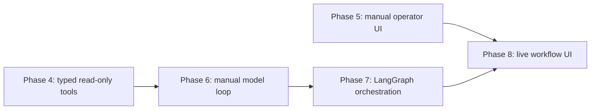
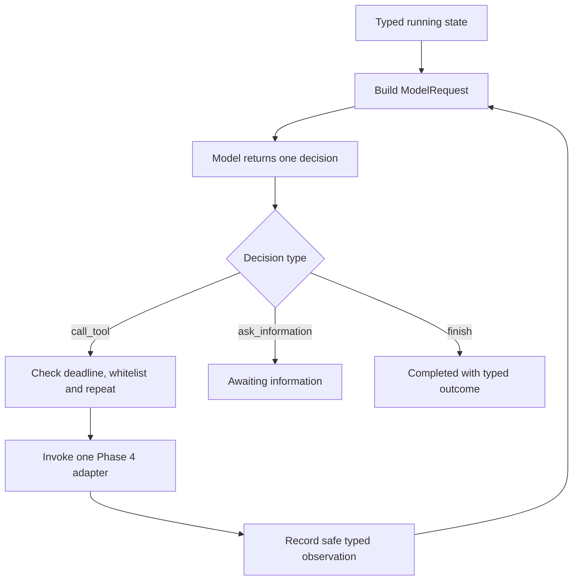
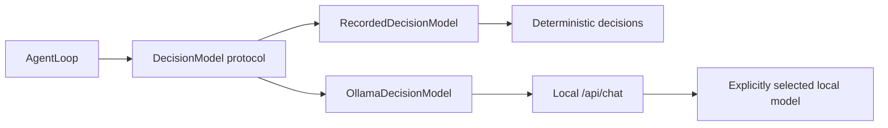
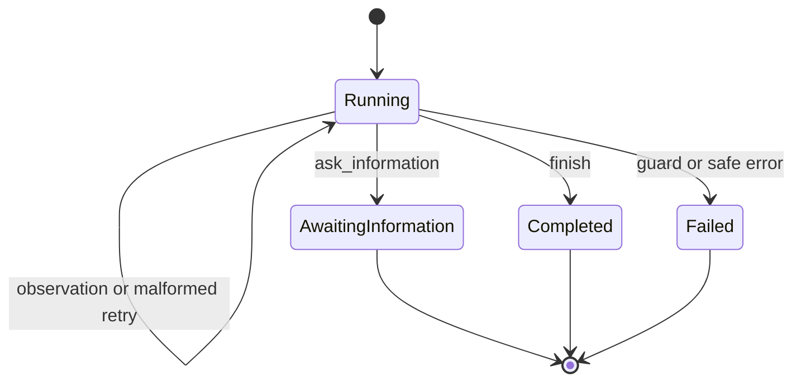
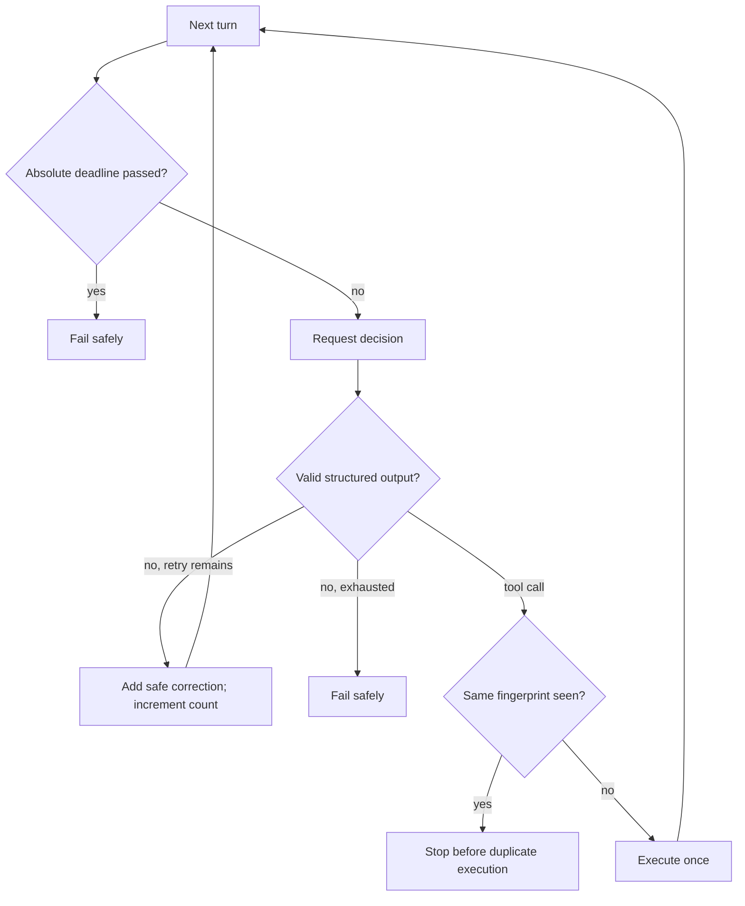
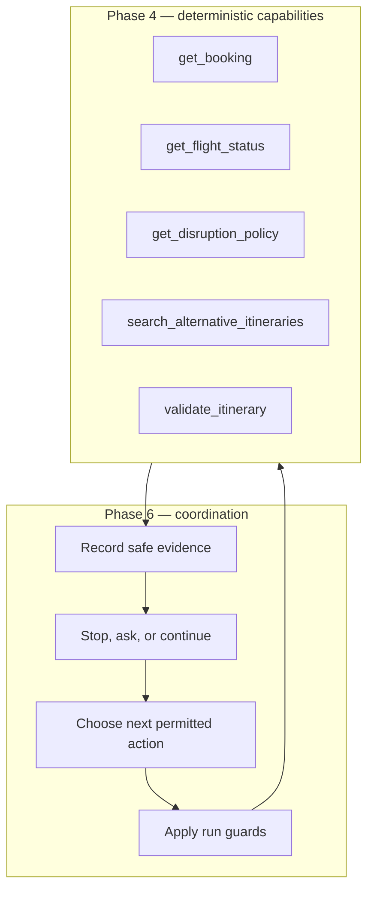
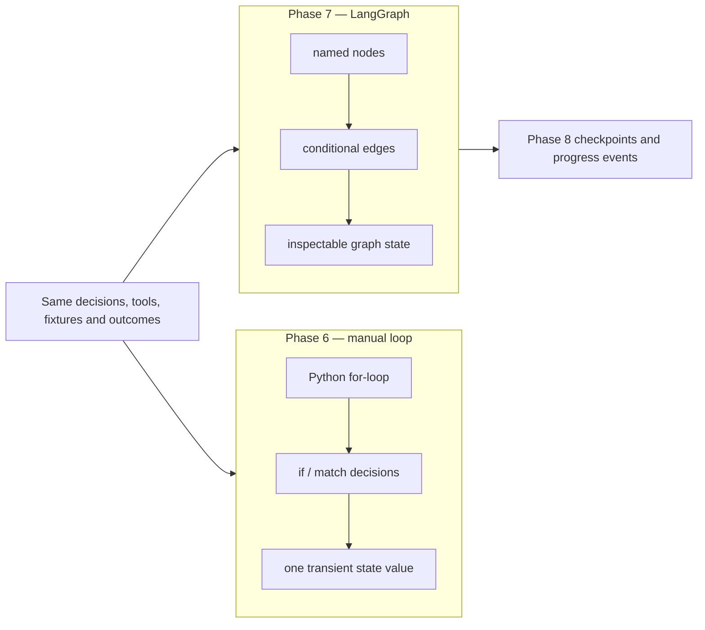

# Phase 6 notes — first explicit agent loop

## What this phase shipped

Phase 6 adds one provider-independent, read-only agent loop written in normal
Python. A model can make exactly one of three typed decisions on each turn:

- call one registered Phase 4 tool;
- ask the operator for named missing information; or
- finish with a structured outcome and evidence references.

The loop has explicit turn, deadline, malformed-output and repeated-call guards.
Ten recorded scenarios demonstrate successful investigation and the important
terminal paths without a live LLM, database or network.

```powershell
uv run --locked python -m travelops_recovery_agent.agent.cli --list
uv run --locked python -m travelops_recovery_agent.agent.cli `
  successful_investigation
uv run --locked python -m travelops_recovery_agent.agent.cli `
  repeated_tool_call
```

In non-technical terms, this is a careful investigator with a fixed toolbox and
a strict timer. It may inspect facts, ask for help, or stop, but it cannot invent
a new tool, change a booking, or investigate forever.

## Where this fits

Phase 4 built tools that work without an LLM. Phase 5 proved an operator can do
the investigation manually in the browser. Phase 6 teaches the smallest agent
mechanism by letting a model choose among those read-only tools. Phase 7 will
express the same behavior as a graph; Phase 8 will make it durable and visible
to the UI.



## The loop between model calls

The application builds a request from typed state and safe tool definitions.
The provider adapter asks for one structured decision. For a tool decision, the
application validates the decision, checks budgets and the whitelist, invokes
the adapter once, records a safe observation, and builds the next request. For
an information request or finish decision, it enters a terminal state.



The model proposes the next action. Application code remains in charge of what
can execute and whether the run may continue. Model reasoning is not domain
validation: a model can request `validate_itinerary`, but only deterministic
domain code can return the validation result.

## Provider-independent boundary

`DecisionModel` is a Python protocol with one `decide(ModelRequest)` operation.
The loop knows nothing about HTTP payloads, provider roles, model identifiers or
SDK response classes. Both the recorded provider and Ollama adapter satisfy the
same interface.



This is dependency inversion: the application owns the contract and providers
adapt to it. Replacing a provider does not grant new tools or change state rules.

Pydantic is used directly for strict contracts. PydanticAI is not needed because
Phase 6 deliberately exposes the loop mechanism. LangChain and LangGraph arrive
only when Phase 7 can compare their value against this working baseline.

## How tool schemas reach the model

The Phase 4 registry remains non-executable. Phase 6 copies only each tool's
name, description and JSON input schema into `ModelToolDefinition`. Executable
adapters are injected separately into a dispatcher and must exactly match the
five registered read-only names and permissions.


The model never sees or receives a database engine, session, repository, SQL
string, credential, arbitrary callable, API route or write tool. JSON Schema
guides generation; Pydantic validation and the dispatcher enforce the boundary.

## Typed decisions and typed run state

An `AgentDecision` is a discriminated union. The `type` field selects exactly
one of `call_tool`, `ask_information`, or `finish`; extra or mixed fields fail
validation. A finish includes structured summary, outcome code and known
evidence references rather than unstructured final prose alone.

A typed run state is a Pydantic object whose fields and legal combinations are
checked whenever it is created. Technically, `AgentRunState` is immutable and
validates cross-field invariants. In plain language, it is the application's
trusted run ledger: it records what happened, what limits remain and why the run
stopped in a form code can reliably inspect.

Messages are insufficient state. They help the model understand the
conversation, but prose does not safely enforce a deadline, prove a fingerprint
was seen, connect a tool message to a known observation, or ensure only one
terminal result exists.



The state is intentionally transient. It is neither PostgreSQL business data
nor a durable workflow checkpoint. Phase 7 will define inspectable graph state;
Phase 8 will add checkpoint persistence and resumption.

## Context growth and bounded recovery

Each successful tool call adds one safe observation and one referenced tool
message. A malformed decision adds a short application correction. Therefore
context grows during a run, but the turn budget and malformed retry budget place
a hard bound on that growth. Raw exception details, raw provider envelopes and
hidden chain-of-thought are never appended.



The loop is a finite `for` loop, never `while True`. It checks the absolute
deadline before and after model calls and after tool calls. A canonical JSON
representation of tool name and arguments is hashed for repeat detection. Tool
failures are recorded once and are not automatically retried. Unknown tools and
impossible state transitions fail closed instead of being guessed or repaired.

## Phase 4 tools versus the Phase 6 loop



Phase 6 does not rewrite Phase 4 validation or expose the tools as API routes.
It adds coordination around the existing capability boundary.

## Manual loop versus future LangGraph



LangGraph should make routing and state transitions inspectable and prepare for
durability; it must not hide the provider boundary or absorb business rules.
The Phase 7 gate will replay the same recordings and require equivalent terminal
outcomes. That comparison shows what the framework adds instead of assuming it.

## Why deterministic recordings matter

Recorded scenarios remove sampling, installation and network variance. They
prove the loop selects only the recorded action, preserves observations, stops
within budget, recovers from one malformed result, and fails safely when limits
are exhausted. The recorded tool arguments are also validated by the real Phase
4 Pydantic input models, preventing examples from drifting away from contracts.

The scenarios cover:

- successful tool investigation and finish;
- operator information request and direct finish;
- safe tool failure and unknown tool;
- repeated call detection;
- malformed recovery and exhaustion;
- maximum-turn and deadline exhaustion.

These fixtures evaluate orchestration logic, not whether a live model is good at
airline recovery. Model quality needs a reviewed task benchmark in a later phase.

## Ollama experiment

The optional adapter calls local Ollama `/api/chat` with `stream: false`,
`think: false`, temperature zero and a JSON Schema format. It uses the standard
library HTTP client, caps response size, accepts only an explicit loopback HTTP
origin and translates provider failures into minimized application errors.

No Ollama model is selected by default. Smoke checks against the locally
available Qwen 2.5 7B and 14B models did not reliably satisfy the strict
decision schema. The contract was not weakened to make a model appear to pass.
This negative result is useful: provider integration works, while model
suitability remains unproven and cannot become a phase dependency.

## Tests and demonstrations

The final completion-gate results are recorded in
[progress.md](../progress.md). The Phase 6-focused suite covers contracts,
state invariants, provider independence, safe schema projection, exact dispatch,
fingerprints, every loop terminal path, deterministic fixtures, CLI output and
the isolated Ollama wire adapter. Existing backend, PostgreSQL, API, frontend and
browser gates protect the Phase 0–5 baseline.

## Remaining limitations

Phase 6 deliberately does not add:

- PydanticAI, LangChain or LangGraph;
- durable state, checkpointing, resumption, cancellation or concurrency;
- API routes, background execution, SSE events or UI integration;
- recommendation ranking, live seat inventory, ticket rules or prices;
- write tools, approval, rebooking or persistent audit records;
- a selected production or local model, live-model quality claim or cost gate;
- retries based on provider rate limits or tool-specific recovery policies.

Those omissions keep the first loop small enough to understand and assign each
production concern to its planned phase.
