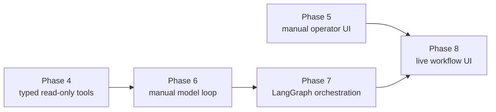
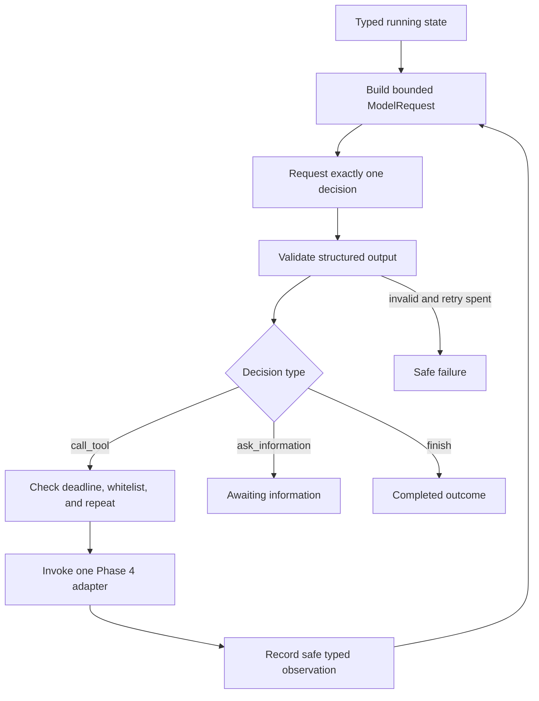
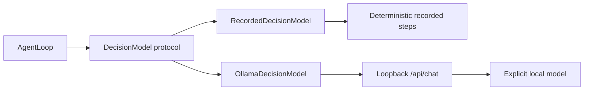
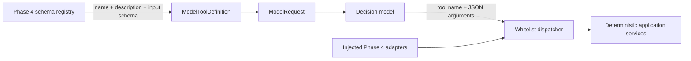
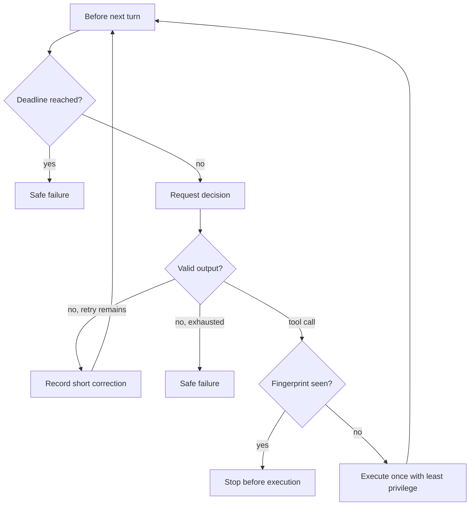
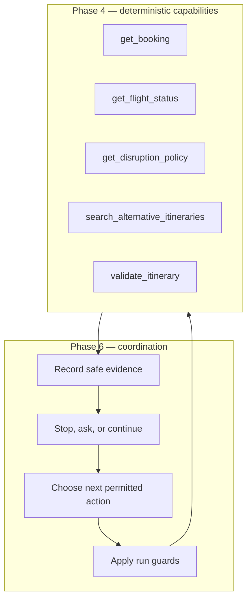

# Phase 6 notes — first explicit agent loop

## How to read these notes

This document records the project at the end of Phase 6. Later phases may reuse
or replace parts of the manual loop, but the explanations below describe the
first explicit agent mechanism before LangGraph orchestration was introduced.

Use the note in two ways:

- **Brief review:** read “Phase in brief,” the workflows, and the step summaries.
- **Detailed study:** read the Why, What, How, and Evidence sections under each
  step, followed by the concept guide and glossary.

The step explanations deliberately separate model behavior from application
enforcement. “The model chose a tool” never means “the model was trusted to
execute arbitrary code or decide that an itinerary is valid.”

## Phase in brief

### Purpose

Phase 6 introduced the smallest useful agent loop after Phase 4 had established
safe read-only tools and Phase 5 had demonstrated the same investigation as a
manual operator workflow.

The learning goal was to expose what an agent runtime actually does between
model calls: construct bounded context, request one decision, validate it,
enforce application limits, optionally execute one permitted tool, record a safe
observation, and either continue or enter one terminal state.

In non-technical terms, the phase built a careful investigator with a fixed
toolbox and a strict timer. The investigator may inspect facts, ask an operator
for missing information, or finish. It cannot invent capabilities, change a
booking, or investigate forever.

### Result

The phase delivered:

- A provider-independent `DecisionModel` protocol
- Three strict structured decisions: call a tool, ask for information, or finish
- An immutable typed run state with cross-field invariants
- Safe model-facing projection of the five Phase 4 tool schemas
- An exact read-only dispatcher with least-privilege execution context
- Stable opaque fingerprints for repeated-call detection
- A finite Python loop with maximum-turn and absolute-deadline protection
- Bounded malformed-output recovery and safe terminal failures
- Ten deterministic recorded scenarios and an offline demonstration CLI
- An optional loopback-only Ollama HTTP adapter with no SDK dependency
- Focused contract, state, routing, fixture, CLI, and provider-adapter tests
- Updated architecture, decisions, run instructions, and progress evidence

### Deliberate boundary

Phase 6 added no PydanticAI, LangChain, LangGraph, graph checkpoints, durable
workflow state, API routes, background worker, SSE stream, UI integration,
recommendation ranking, live availability, price, approval, or write tool.

The loop can coordinate only the five existing Phase 4 reads. Deterministic
application services still own booking access, flight facts, policy resolution,
candidate generation, and itinerary validation. The Phase 5 API and frontend
remain unchanged.

Ollama is an optional adapter, not the phase gate. No local model was selected
as a default because the tested Qwen 2.5 7B and 14B models did not reliably
satisfy the strict decision contract. Deterministic recordings provide the
reproducible evidence for the loop itself.

## Phase position and agent workflow



Phase 4 created deterministic capabilities that already worked without a model.
Phase 6 coordinates those capabilities. Phase 7 will reproduce the same behavior
as an explicit graph, and Phase 8 will introduce durable checkpoints and live UI
progress.



The model proposes the next action. Application code decides whether that action
is structurally valid, permitted, within budget, non-repeated, and safe to run.

## Provider and tool boundary workflow



The loop owns the provider-neutral request and decision contracts. A provider
adapter owns provider-specific transport and response translation. Switching a
provider cannot add a tool or bypass a run-state rule.



Schema discovery and execution remain separate. The model receives copied JSON
schema data, not executable adapters, database objects, credentials, arbitrary
callables, or write capabilities.

## Artifact map

| Artifact | Responsibility in Phase 6 |
| --- | --- |
| [`agent/models.py`](../../src/travelops_recovery_agent/agent/models.py) | Define strict decisions, lifecycle values, budgets, messages, observations, failures, and transient run-state invariants. |
| [`agent/decision_model.py`](../../src/travelops_recovery_agent/agent/decision_model.py) | Define the provider-independent model request, tool definition, model errors, and `DecisionModel` protocol. |
| [`agent/tools.py`](../../src/travelops_recovery_agent/agent/tools.py) | Project Phase 4 schemas, verify the executable whitelist, dispatch one read tool, and fingerprint calls. |
| [`agent/loop.py`](../../src/travelops_recovery_agent/agent/loop.py) | Implement the explicit bounded loop and all state transitions. |
| [`agent/fixtures.py`](../../src/travelops_recovery_agent/agent/fixtures.py) | Provide deterministic model trajectories and Phase 4-shaped recorded tool results. |
| [`agent/cli.py`](../../src/travelops_recovery_agent/agent/cli.py) | Compose and print safe offline demonstrations without hidden reasoning. |
| [`agent/providers/ollama.py`](../../src/travelops_recovery_agent/agent/providers/ollama.py) | Adapt local Ollama HTTP structured output to the application-owned model contract. |
| [`tests/agent/test_models.py`](../../tests/agent/test_models.py) | Prove the three-decision union and strict validation behavior. |
| [`tests/agent/test_state.py`](../../tests/agent/test_state.py) | Prove lifecycle, evidence, budget, timestamp, immutability, and secret-field invariants. |
| [`tests/agent/test_decision_model.py`](../../tests/agent/test_decision_model.py) | Prove provider independence and bounded model-request contents. |
| [`tests/agent/test_tools.py`](../../tests/agent/test_tools.py) | Prove exact schema projection, adapter configuration, permissions, and dispatch. |
| [`tests/agent/test_fingerprints.py`](../../tests/agent/test_fingerprints.py) | Prove stable canonical call identity without exposing arguments in the fingerprint. |
| [`tests/agent/test_loop.py`](../../tests/agent/test_loop.py) | Prove successful and failed transitions, guards, and safe exception handling. |
| [`tests/agent/test_fixtures.py`](../../tests/agent/test_fixtures.py) | Prove all recorded scenarios are deterministic and still match Phase 4 inputs. |
| [`tests/agent/test_cli.py`](../../tests/agent/test_cli.py) | Prove safe, stable CLI output and exit codes. |
| [`tests/agent/providers/test_ollama.py`](../../tests/agent/providers/test_ollama.py) | Prove the Ollama wire adapter offline through an injected fake transport. |

## Step-by-step implementation

### Step 1 — Inspect the existing boundaries and keep Phase 6 narrow

**Why this step was taken**

An agent loop can easily become a second application architecture. Before
adding one, the phase needed to identify which existing contracts were safe to
reuse and which future capabilities must remain unavailable.

Phase 4 already owned typed read-only tools, permissions, deadlines, audit
metadata, service calls, and safe result envelopes. Reimplementing those rules
inside an agent module would create two sources of truth.

**What was implemented**

- A new `agent` package with no database, API, or frontend dependency
- An explicit dependency direction from the loop to Phase 4 contracts
- A fixed catalogue of exactly five read-only tools
- No write, proposal, approval, recommendation, or persistence capability
- No PydanticAI, LangChain, or LangGraph dependency

**How it was implemented**

The implementation imported stable Phase 4 schema and execution contracts while
keeping engines, sessions, repositories, SQL, and API route objects outside the
agent package. The existing `pyproject.toml` dependencies were sufficient, so
the phase made no dependency or lockfile change.

The choice to use normal Python was deliberate. The manual mechanism must be
visible before Phase 7 can show what LangGraph adds.

**Evidence**

Final Git inspection showed no change to dependency files, Phase 5 API code, or
frontend source. Search of the agent package found no write-tool names and only
the existing five-tool schema registry reaches the model boundary.

### Step 2 — Define exactly three structured model decisions

**Why this step was taken**

Free-form model prose cannot safely tell application code what to execute or
why a run stopped. The application needs a small closed set of machine-checkable
choices.

Three choices are sufficient for the first loop: inspect another fact, request
missing operator input, or conclude the read-only investigation.

**What was implemented**

- `CallToolDecision` with one tool name and JSON-compatible argument object
- `AskInformationDecision` with one question and named missing fields
- `FinishDecision` containing an `AgentOutcome`
- A discriminated `AgentDecision` union selected by the `type` field
- Strict text lengths, identifier patterns, uniqueness, and extra-field rejection

**How it was implemented**

Pydantic models inherit from one frozen, extra-forbidding base. The union uses a
discriminator, so `type: call_tool`, `type: ask_information`, and `type: finish`
select different required fields. A `TypeAdapter` validates provider data as the
union rather than extracting decisions from prose.

Pydantic was used directly instead of PydanticAI. This preserves visible control
over the loop while still providing JSON Schema and runtime validation.

**Evidence**

Contract tests reject loose prose, mixed decision fields, unknown fields,
unknown decision types, invalid JSON values, and duplicate missing-field names.
They also prove a structured finish serializes with evidence references.

### Step 3 — Create an explicit typed run state

**Why this step was taken**

Conversation messages help a model understand context, but they are not a safe
application control record. Prose cannot reliably enforce a deadline, prove a
call already happened, connect evidence references, or ensure that a completed
run has exactly one outcome.

**What was implemented**

`AgentRunState` stores:

- Stable run and case identifiers
- Lifecycle status and current model turn
- Safe conversation messages and typed tool observations
- Previous tool-call fingerprints
- Malformed-output retry count
- Start time and fixed run budget
- Exactly one compatible terminal value: outcome, information request, or failure

**How it was implemented**

The state is a frozen Pydantic model. Cross-field validation rejects naive
timestamps, expired initial budgets, turns beyond budget, malformed counts beyond
their allowance, duplicate observations, unrecorded fingerprints, tool messages
pointing to unknown observations, incompatible terminal fields, and final
outcomes citing unavailable evidence.

Every loop transition rebuilds the state through validation. This avoids
mutating one trusted object into an impossible intermediate combination.

**Evidence**

State tests cover all lifecycle combinations, timestamps, counts, observation
links, evidence links, immutability, and rejection of unplanned secret fields.

### Step 4 — Define a provider-independent model port

**Why this step was taken**

If the loop consumed one provider’s response class, provider roles, tool-call
objects, or exception types directly, orchestration behavior would become tied
to that SDK. Deterministic testing would also require pretending to be that
provider instead of supplying application decisions.

**What was implemented**

- `ModelToolDefinition` for provider-neutral name, description, and input schema
- `ModelRequest` for one bounded turn of context
- `DecisionModel` protocol with `decide(ModelRequest)`
- Safe `DecisionModelError` categories for malformed output and invocation failure

**How it was implemented**

The protocol uses structural typing: any object with the correct method can be
injected. `ModelRequest` contains only run/case identifiers, turn, messages,
observations, and at most five tool definitions. Validators require unique tool
and observation names and valid message-to-observation references.

Provider failures are translated before crossing this boundary. Raw provider
responses, URLs, credentials, and exceptions are not stored in run state.

**Evidence**

Tests prove a small scripted object satisfies the protocol without an SDK,
unrelated objects do not, invalid references fail, and unplanned credential or
database fields are rejected.

### Step 5 — Project Phase 4 tool schemas safely to the model

**Why this step was taken**

A model needs to know which operations exist and what argument shape each one
accepts. It does not need the executable Python objects or their application
dependencies.

Separating schema discovery from execution prevents a catalogue from becoming
a generic capability registry.

**What was implemented**

`get_model_tool_definitions()` returns exactly:

- `get_booking`
- `get_flight_status`
- `get_disruption_policy`
- `search_alternative_itineraries`
- `validate_itinerary`

Each definition contains only the Phase 4 name, description, and input JSON
Schema.

**How it was implemented**

The Phase 4 `TOOL_SCHEMAS` registry remains the source of truth. Phase 6 creates
fresh Pydantic definitions and deep-copies nested schema dictionaries so a
provider cannot mutate the registry through a returned reference.

The model sees no output class, adapter, permission object, repository, database
session, SQL, or callable.

**Evidence**

Projection tests compare the complete name order, descriptions, and schemas to
Phase 4, verify JSON serialization, mutate detached copies, and confirm execution
and application internals are absent.

### Step 6 — Build an exact read-only dispatcher and call fingerprint

**Why this step was taken**

Valid JSON does not make a requested tool safe. The model might name an unknown
capability, configuration might omit an adapter, or the same call might repeat
without adding evidence.

**What was implemented**

- `ExecutableReadOnlyTool`, a narrow structural execution protocol
- `ReadOnlyToolDispatcher`, an immutable name-to-adapter mapping
- Startup checks for exact names, uniqueness, completeness, and permissions
- Safe unknown-tool and configuration errors
- Canonical SHA-256 tool-call fingerprints

**How it was implemented**

The dispatcher compares injected adapters with the complete Phase 4 registry.
It refuses extra, missing, duplicate, or permission-mismatched adapters. Dispatch
uses the exact validated tool name and passes a detached copy of arguments.

Fingerprinting canonicalizes a JSON object containing the tool name and
arguments with sorted keys and non-finite values forbidden, then hashes the
bytes. Equivalent object-key order produces the same opaque identity while a
meaningful name or argument change produces a different identity.

**Evidence**

Tests prove exact one-adapter invocation, detached arguments, unknown-tool
rejection, complete registry configuration, Phase 4 adapter compatibility, stable
fingerprints, and absence of raw arguments in the fingerprint string.

### Step 7 — Implement the manual model-and-tool loop

**Why this step was taken**

The project needed a visible baseline for the mechanism an orchestration
framework will later manage. A normal Python loop makes the order of requests,
guards, tool execution, observations, and terminal transitions explicit.

**What was implemented**

`AgentLoop.run()` coordinates one decision and at most one tool call per model
turn. It can return `completed`, `awaiting_information`, or `failed`.

**How it was implemented**

The loop:

1. Requires a running initial state.
2. Iterates over a finite `range` bounded by `max_model_turns`.
3. Checks the absolute deadline.
4. Builds a `ModelRequest` from validated state and safe schemas.
5. Requests and validates one decision.
6. Records only the concise decision summary, never hidden reasoning.
7. Dispatches one guarded tool, requests information, or stores the outcome.
8. Revalidates the complete state after every transition.

The model never calls a tool directly. It returns data; application code decides
what that data means and whether execution is allowed.

**Evidence**

Loop tests prove tool-call-then-finish behavior, direct finish, information
request, state request contents, and outcome evidence linking.

### Step 8 — Add finite budgets and fail-closed recovery

**Why this step was taken**

Models and dependencies can return malformed data, run slowly, request unknown
tools, repeat themselves, or raise unexpected exceptions. A production-minded
loop needs terminal guarantees in ordinary code rather than prompt instructions.

**What was implemented**

- Maximum model-turn budget
- Absolute timezone-aware deadline
- Maximum malformed-output retry count
- Repeated-call stop before second execution
- Unknown-tool rejection
- Safe model, tool, and impossible-transition failure categories
- One recorded tool result with no automatic tool retry

**How it was implemented**



The deadline is checked before a model call, after it returns, before tool
execution, and after the result is recorded. A malformed decision adds one short
application correction and consumes both a turn and the fixed malformed budget.
Raw exceptions are replaced by safe messages. A tool receives only its one
registered permission and the run’s existing absolute deadline.

The deadline is a stop check, not active cancellation of a blocking synchronous
call. That limitation remains explicit.

**Evidence**

Tests cover deadline exhaustion at each boundary, maximum turns, repeat
detection before a second invocation, unknown tools, one malformed recovery,
malformed exhaustion, safe tool failure, minimized unexpected exceptions, and
impossible state transitions.

### Step 9 — Add deterministic recorded model and tool fixtures

**Why this step was taken**

A phase gate cannot depend on model installation, network access, credentials,
sampling variance, or the behavior of a provider on a particular day. The loop
needs deterministic trajectories that test orchestration separately from model
quality.

**What was implemented**

Ten named scenarios cover:

- Successful investigation and evidence-grounded finish
- Ask for operator information
- Direct normal finish
- Safe tool failure
- Unknown tool
- Repeated identical call
- Malformed-output recovery
- Malformed-output exhaustion
- Maximum-turn exhaustion
- Deadline exhaustion before the model call

**How it was implemented**

`RecordedDecisionModel` returns the next immutable recorded decision or safe
model error. It also records the requests and emitted steps for test inspection.
`RecordedTool` implements the same execution shape and returns the existing Phase
4 `ToolSuccess` or `ToolFailure` envelopes with fixed audit data.

Recorded timestamps and inputs are stable. The successful booking example uses
the real Phase 4 identifier form `BKG-0007`, not an invented prompt-only value.

**Evidence**

Fixture tests replay every scenario, compare byte-for-byte output, prove the
deadline scenario never requests a model decision, reject provider credentials,
and validate every registered tool argument through the actual Phase 4 input
Pydantic model.

### Step 10 — Add a safe offline demonstration CLI

**Why this step was taken**

Tests prove behavior to developers, but a learning phase also needs a direct way
to observe the complete loop without writing composition code or starting a
database and model server.

**What was implemented**

The CLI can list scenarios or execute one named trajectory. It prints:

- Scenario and final status
- Safe stop reason
- Turns and malformed retries used
- Structured model events
- Safe tool observations
- Final outcome, information request, or minimized failure

**How it was implemented**

The CLI composes a fixed start time, `AgentRunState`, `RunBudget`, recorded model,
all five recorded tools, and an injected deterministic clock. Pydantic serializes
one stable JSON result. Failed scenarios return process exit code 1; successful
and awaiting-information scenarios return 0.

The output contains decision summaries but no chain-of-thought, raw provider
response, credential, database object, or exception detail.

**Evidence**

CLI tests prove listing, success output, failure exit code, byte-for-byte default
output, no hidden or secret fields, and no unrequested event after deadline.

### Step 11 — Add an optional local Ollama adapter

**Why this step was taken**

The provider-neutral port needed one real adapter to prove that the boundary can
translate a provider protocol without changing the core loop. Ollama allowed a
credential-free local experiment, but it was not suitable as a deterministic
phase gate.

**What was implemented**

- `OllamaConfig` with explicit model, timeout, and loopback HTTP origin
- A standard-library synchronous HTTP transport
- A one-megabyte response limit
- `/api/chat` requests with structured JSON Schema output
- Provider-message mapping and safe observation context
- Tool-specific decision schema branches
- Safe translation of invocation and malformed-output failures

**How it was implemented**

The adapter sends `stream: false`, `think: false`, temperature zero, and the
decision JSON Schema in `format`. It also includes the same schema in the system
instruction and tells the model not to invent tools or domain facts.

Each `call_tool` schema branch binds one exact tool name to that tool’s Phase 4
input schema. Nested tool `$defs` are hoisted into the decision schema root and
their `$ref` values are rewritten because Ollama’s schema converter resolves
those references from the root.

The standard library was sufficient, so no Ollama SDK or additional HTTP client
entered the dependency graph. Configuration rejects remote hosts, HTTPS,
credentials in the URL, missing ports, and URLs with paths, queries, or fragments.

**Evidence**

Offline adapter tests prove protocol compatibility, exact payload controls,
tool-specific schemas, endpoint validation, required explicit model selection,
bounded safe failures, ignored provider extras, and absence of credentials or
application internals.

Live smoke checks reached the local Ollama service, but the installed Qwen 2.5
7B and 14B models did not reliably produce the strict decision shape. No live
model was accepted or configured as a default, and the application contract was
not weakened.

### Step 12 — Verify the phase and preserve the earlier system

**Why this step was taken**

A focused agent suite cannot prove that adding the loop preserved packaging,
database behavior, the API, or the Phase 5 browser. The phase boundary requires
both new-capability evidence and regression evidence.

**What was implemented**

- Focused tests for all Phase 6 modules and Phase 4 tool contracts
- Full Python, isolated PostgreSQL, packaging, frontend, and browser gates
- README run instructions and a complete Phase 6 learning note
- Architecture and decision records
- A Phase 6 progress handoff

**How it was implemented**

The locked Python environment was checked and synchronized. Unit tests ran
without integration dependencies. A disposable PostgreSQL 18 container hosted
only `travelops_test` for the 18 integration tests and was removed afterward.
The existing frontend completed clean install, static checks, component tests,
production build, and Playwright regression.

Final inspection checked local documentation links, whitespace, dependency
files, API/frontend scope, generated Playwright results, listeners, containers,
and Git status. Nothing was staged or committed by the phase work.

**Evidence**

- 185 focused agent and tool tests passed.
- 354 non-database repository tests passed.
- All 18 isolated PostgreSQL integration tests passed.
- Ruff lint and format passed.
- Strict mypy passed over 92 source files.
- Wheel and source-distribution builds passed.
- Prettier, TypeScript, Oxlint, seven component tests, production build, and one
  Playwright journey passed.
- Dependency files, API code, and frontend source were unchanged.
- No Phase 6 test container, server listener, or Playwright result remained.

## Detailed concept guide

### What an agent loop does between model calls

An agent is not just one prompt. The application repeatedly performs a control
cycle around a model:

1. Select trusted state and safe capabilities for the next request.
2. Ask a model for one constrained decision.
3. Validate the returned structure.
4. Apply authorization, budget, deadline, and repeat guards.
5. Optionally execute one tool through application code.
6. Record a minimized observation.
7. Continue or produce one explicit terminal state.

The model supplies a proposal at step 2. The surrounding application supplies
the reliability and authority boundaries.

### Structured output versus valid domain behavior

Structured output proves that data has the expected shape. It does not prove the
selected action is allowed, the arguments refer to real records, or an itinerary
is valid.

Pydantic validates decision structure. The dispatcher enforces the tool
whitelist. Phase 4 adapters enforce permissions and deadlines. Application and
domain services decide what stored facts and validation rules mean.

### Typed run state versus conversation messages

| Representation | Purpose | Why it is insufficient alone |
| --- | --- | --- |
| Conversation message | Give the model concise linguistic context. | Prose cannot enforce counts, deadlines, terminal-field combinations, or evidence integrity. |
| Tool observation | Preserve one safe structured execution result. | It does not describe the complete run lifecycle or remaining budget. |
| `AgentRunState` | Hold the application’s trusted control record for one run. | It is transient and cannot survive a restart. |
| Future checkpoint | Persist graph execution for resumption. | This belongs to Phase 8 and is not business truth. |

A typed run state is therefore a validated ledger, not merely “all chat
messages in a dictionary.”

### Lifecycle states and terminal outcomes

```mermaid
stateDiagram-v2
    [*] --> Running
    Running --> Running: safe observation or malformed retry
    Running --> AwaitingInformation: ask_information
    Running --> Completed: finish
    Running --> Failed: guard or safe error
    AwaitingInformation --> [*]
    Completed --> [*]
    Failed --> [*]
```



`completed` requires one final outcome. `awaiting_information` requires one
information request. `failed` requires one safe failure. `running` permits none
of those terminal values. Pydantic rejects every mixed combination.

### Context growth and its bounds

Each model turn can add one short agent summary. A successful tool call adds one
safe observation and a tool message that references it. One malformed result
can add one short application correction.

This context still grows, but its size is bounded by model-turn, observation,
message, and malformed-retry limits. Raw exceptions, provider envelopes, and
hidden chain-of-thought are not added. Phase 12 will address more advanced
context selection only after the durable baseline exists.

### Tool schema versus executable tool

A tool schema is JSON-compatible descriptive data. An executable adapter is a
Python object with access to an application service. Treating them as separate
things lets the model discover a capability without receiving the capability
itself.

The schema helps generation. Pydantic checks arguments. The dispatcher selects
one registered adapter. The adapter enforces its execution contract.

### Least privilege in one tool turn

The dispatcher looks up the requested registered tool’s required permission.
The loop then creates a `ToolExecutionContext` containing only that single
permission, the actor ID, run correlation ID, and existing absolute deadline.

The model cannot add permissions in its arguments. A prompt cannot grant access;
only application composition and contracts can.

### Repeated-call fingerprints

Comparing raw dictionaries is possible, but retaining a canonical opaque
fingerprint gives the repeat guard one stable identity and avoids another raw
argument copy in that control field.

The fingerprint does not make a tool call idempotent. It only detects an exact
same-name, same-arguments attempt within one transient run. Future write tools
will require proper persistent idempotency keys and transaction rules.

### Malformed output recovery

A malformed model response can be recoverable, but unlimited repair attempts
would create another unbounded loop. Phase 6 permits only the configured number
of retries. The next request receives a short instruction to return exactly one
structured decision; it does not receive raw invalid content.

Invocation failures are not treated as malformed decisions, and tool failures
are not automatically retried. Later evaluation may justify error-specific
policies, but Phase 6 chooses deterministic fail-closed behavior.

### Deterministic fixtures versus live-model evaluation

Recorded providers answer: “Given these decisions and tool results, does the
loop transition correctly?” A live-model benchmark answers a different question:
“Can this model choose good decisions across reviewed airline cases?”

Mixing those questions would make orchestration tests flaky and make model
quality claims unclear. Phase 6 proves the first. Phase 11 owns a reviewed
evaluation dataset and measured live-model behavior.

### Phase 4 tools versus Phase 6 coordination



Phase 6 does not duplicate Phase 4 business rules or expose tools as HTTP
routes. It coordinates already-safe capabilities.

### Manual loop versus future LangGraph


LangGraph should make routing and intermediate state inspectable. It does not
replace Pydantic validation, provider adaptation, tool authorization, domain
services, or the database. Phase 7 must replay the Phase 6 recordings and reach
equivalent terminal results before its abstraction is considered useful.

### Pydantic, PydanticAI, LangChain, and LangGraph

| Technology | Phase 6 role |
| --- | --- |
| Pydantic | Validate decisions, requests, state, configuration, and safe results. |
| PydanticAI | Not used; it would own parts of the loop this phase needs to expose. |
| LangChain | Not used; Phase 7 may add only minimal adapters if they reduce boundary code. |
| LangGraph | Not used; Phase 7 will compare its graph orchestration with this baseline. |
| Ollama | Optional local provider adapter behind `DecisionModel`; not a trusted default. |

## Commands and what each proves

```powershell
# Verify project intent and the exact dependency resolution agree
uv lock --check

# Reproduce the locked runtime and development environment
uv sync --locked --all-groups

# Prove the Phase 6 modules resolve through the installed src-layout package
uv run --locked python -c `
  "from travelops_recovery_agent.agent.loop import AgentLoop"

# List deterministic scenarios without a model server or database
uv run --locked python -m travelops_recovery_agent.agent.cli --list

# Demonstrate a model decision, safe tool result, and evidence-grounded finish
uv run --locked python -m travelops_recovery_agent.agent.cli `
  successful_investigation

# Demonstrate stopping before a duplicate tool execution
uv run --locked python -m travelops_recovery_agent.agent.cli `
  repeated_tool_call

# Run Phase 6 and inherited Phase 4 focused behavior
uv run --locked pytest tests/agent tests/tools

# Run all tests that do not require the isolated PostgreSQL database
uv run --locked pytest -m "not integration"

# Run real-database tests only with a URL whose database is travelops_test
uv run --locked pytest -m integration

# Detect Python source problems and verify canonical formatting
uv run --locked ruff check .
uv run --locked ruff format --check .

# Prove strict static type agreement across source and tests
uv run --locked mypy

# Produce standard Python wheel and source-distribution artifacts
uv run --locked python -m build --no-isolation
```

```powershell
# Preserve the Phase 5 browser baseline
Set-Location frontend
npm.cmd ci
npm.cmd run format:check
npm.cmd run typecheck
npm.cmd run lint
npm.cmd test
npm.cmd run build
npm.cmd run test:e2e
```

The Ollama adapter has no required live command because no local model passed the
Phase 6 contract gate. Its transport and schema behavior are verified offline in
the focused test suite.

## Problems encountered and lessons learned

### A recorded booking example used the wrong identifier shape

An early recorded example used `BOOKING-0007`, while the actual Phase 4 booking
contract uses identifiers such as `BKG-0007`. The example looked plausible but
did not match the real tool input domain.

The fixture was corrected, and a regression test now validates every recorded
registered-tool argument through the actual Phase 4 input Pydantic model.

**Lesson:** a typed outer decision containing a generic JSON argument object does
not prove the inner tool arguments match their real contract; test both layers.

### Small local models returned structurally wrong arguments

The local Qwen 2.5 7B model nested a booking ID inside an invented `value`
object, and the available 14B model also failed to produce a reliable strict
decision under the initial schema.

Tool-specific schema branches made the requested structure more explicit, but
the models still did not reliably meet the contract. No default was selected.

**Lesson:** provider support for JSON Schema is not proof that a particular
model will follow a complex application contract reliably.

### Nested JSON Schema definitions failed at the provider boundary

The first tool-specific Ollama schema placed Phase 4 `$defs` below the nested
tool input. Ollama’s converter resolved references from the decision-schema root
and rejected the request.

The adapter now hoists nested definitions to the root and rewrites their `$ref`
paths while keeping the application models unchanged.

**Lesson:** JSON Schema is a standard, but provider converters can support
different subsets and reference-resolution behavior. Adapt at the provider
boundary rather than weakening core contracts.

### The first import smoke command assumed package-root re-exports

The initial verification tried to import `AgentLoop` from
`travelops_recovery_agent.agent`. The package `__init__.py` intentionally does
not re-export implementation classes, so the command failed before testing the
intended module.

The smoke test was corrected to import from `agent.loop`, `agent.decision_model`, and
`agent.models`.

**Lesson:** an import failure may reveal an incorrect verification assumption,
not a broken implementation. Test the public location the package actually
defines.

### Integration configuration was absent from the verification shell

The normal shell had no development or test database password, and Compose
correctly refused to interpolate an unset required secret.

A disposable PostgreSQL container was started on a separate port with an
ephemeral generated password, only `travelops_test` was created, and the
container and environment variable were removed in a `finally` block.

**Lesson:** final integration evidence should create an isolated dependency
without reading, printing, or mutating a developer’s retained database secret.

### Shell parsing and cleanup commands failed before execution

One audit expression had an unterminated PowerShell string, and a recursive
cleanup command was rejected by the safety layer. Neither command changed the
repository. The audit was split into simpler read-only checks, exact generated
paths were inspected, and the Playwright result file was removed explicitly.

**Lesson:** distinguish command-construction or safety-policy failures from
application failures, and resolve exact paths before destructive cleanup.

## Decisions made

- Updated [D-006](../decisions.md#d-006--defer-the-model-provider) to accept an
  application-owned provider boundary, deterministic recordings as the required
  provider, and Ollama only as an optional experiment with no default model.
- [D-028](../decisions.md#d-028--own-the-first-agent-loop-and-state-in-normal-python)
  selected direct Pydantic contracts and a normal Python loop instead of
  PydanticAI, LangChain, or LangGraph in Phase 6.
- [D-029](../decisions.md#d-029--fail-closed-around-tool-dispatch-and-run-budgets)
  selected an exact whitelist, least privilege, fixed budgets, deadline checks,
  fingerprints, and no automatic tool retry.
- [D-030](../decisions.md#d-030--make-recorded-scenarios-the-phase-6-provider-gate)
  selected deterministic application-level trajectories instead of a live model
  as the orchestration gate.
- [D-031](../decisions.md#d-031--keep-ollama-optional-local-and-behind-the-model-boundary)
  selected a standard-library, loopback-only Ollama adapter with an explicit
  model and no SDK dependency.

## Remaining limitations at the Phase 6 boundary

- The run state exists only in memory and cannot survive a process restart.
- There is no LangGraph state, node, edge, reducer, command, or compiled graph.
- The manual loop has no durable checkpoint, pause/resume protocol, or
  at-least-once execution protection.
- The absolute deadline does not actively cancel a synchronous provider or tool
  call that blocks beyond its timeout.
- There is no API route, background execution, SSE stream, or UI connection.
- No model has passed a reviewed airline-recovery benchmark or earned default
  selection.
- Recorded scenarios prove orchestration behavior, not model decision quality.
- The Ollama adapter is synchronous and local-only; it has no streaming,
  authentication, remote TLS, rate-limit policy, or production deployment claim.
- Tool failures and provider invocation failures are not automatically retried.
- Context is bounded but not yet summarized, selected by token budget, or
  evaluated for relevance.
- The loop uses only read tools and cannot prepare or execute a rebooking.
- Candidate search still lacks seats, prices, cabins, fare differences, and
  ticket-rule evidence.
- Structurally valid itineraries are not ranked or recommended.
- There is no operator approval, final revalidation, idempotency key, booking
  write, or persistent audit record.
- Production authentication and real airline integrations remain unavailable.

## Glossary

| Term | Meaning in this project |
| --- | --- |
| Agent decision | One validated `call_tool`, `ask_information`, or `finish` object returned through the model boundary. |
| Agent loop | Application control cycle that requests decisions, enforces guards, executes permitted tools, records observations, and stops explicitly. |
| Agent outcome | Structured read-only conclusion with a summary, known evidence references, and explicit limitations. |
| Absolute deadline | One timezone-aware time after which the run must stop, shared with tool execution contexts. |
| Application message | Short trusted correction supplied by the loop, such as the malformed-output instruction. |
| Chain-of-thought | Hidden internal model reasoning that Phase 6 neither requests for storage nor exposes in CLI output. |
| Conversation message | Concise model-facing context; useful for language understanding but not the complete trusted run state. |
| Decision discriminator | `type` field that selects which exact decision model and required fields apply. |
| `DecisionModel` | Application-owned protocol for requesting one provider-independent structured decision. |
| Dependency inversion | Design in which the application owns the interface and provider adapters depend on it. |
| Fail closed | Stop safely when a tool, state, permission, or output is unknown instead of guessing a permissive interpretation. |
| Fingerprint | Canonical SHA-256 identity of one tool name and JSON argument object used for repeat detection. |
| JSON Schema | Machine-readable description supplied to a model to guide the shape of a structured decision or tool input. |
| Least privilege | Giving a tool execution context only the single permission required by the selected registered adapter. |
| Malformed decision | Provider output that does not validate as exactly one supported structured decision. |
| Model adapter | Provider-specific implementation that translates application requests and provider responses behind `DecisionModel`. |
| Model request | Bounded provider-neutral data for one turn: identifiers, messages, observations, and safe tool definitions. |
| Observation | Safe structured result of one tool execution, referenced by a stable observation ID. |
| Ollama | Optional local model runtime adapted through loopback `/api/chat`; not a selected default model. |
| Provider-independent | Free of provider SDK classes, credentials, model names, wire response shapes, and exception details. |
| Pydantic | Runtime validation and JSON Schema library used directly for Phase 6 contracts and state. |
| PydanticAI | Higher-level agent framework deliberately not used in Phase 6. |
| Recorded provider | Deterministic `DecisionModel` implementation that replays predefined application decisions without a live LLM. |
| Run budget | Fixed maximum model turns, malformed retries, and absolute deadline for one transient run. |
| Run state | Immutable validated in-memory ledger of lifecycle, context, evidence, counts, fingerprints, and terminal result. |
| Safe failure | Minimized typed error containing an application category and message without raw provider, tool, or secret details. |
| Terminal state | `completed`, `awaiting_information`, or `failed`; the loop performs no later turn after reaching one. |
| Tool definition | Detached name, description, and input JSON Schema shown to a model; it is not executable authority. |
| Tool dispatcher | Application component that maps one validated registered name to exactly one injected Phase 4 adapter. |
| Tool whitelist | Complete fixed set of five Phase 4 read-only tool names permitted in Phase 6. |
| Transient state | In-memory state that disappears with the process and is not a Phase 8 durable checkpoint. |
