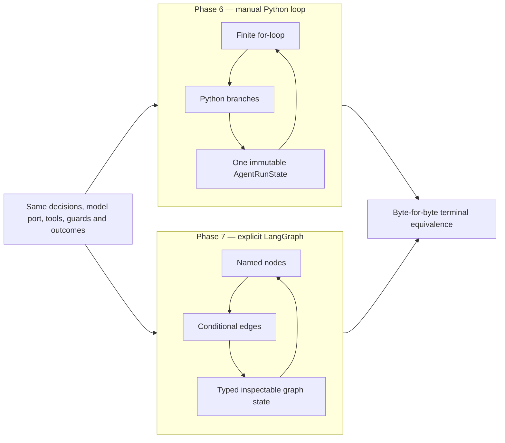
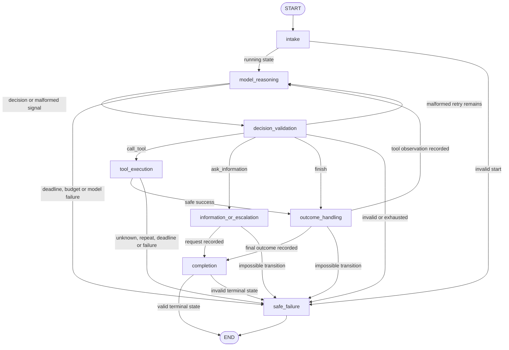
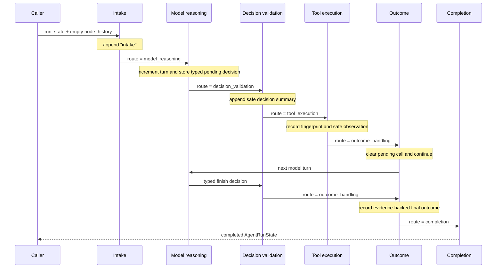
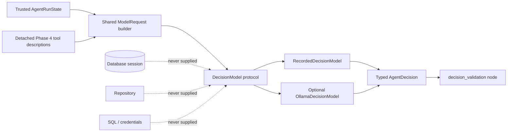
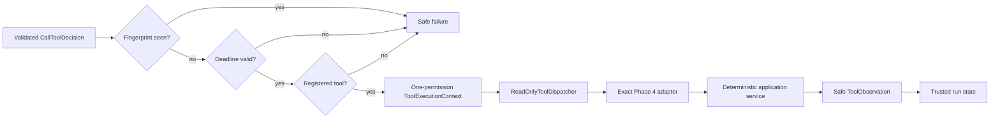
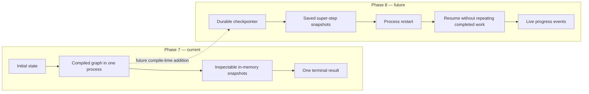

# Phase 7 notes — LangGraph orchestration and minimal LangChain integration

## How to read these notes

These notes explain both what Phase 7 built and why each part exists. Start with
the phase brief and diagrams for the overall picture. Read the implementation
steps to follow the construction order. Use the detailed concept guide and
glossary when a LangGraph term is unfamiliar.

The central learning goal is not merely to make LangGraph run. It is to show
exactly what the framework adds to a working manual loop, while proving that it
does not replace TravelOps contracts, permissions, validation, or domain rules.

## Phase in brief

### Purpose

Phase 6 implemented a small model-and-tool loop as an ordinary Python `for`
loop. That baseline made every decision, safety check, tool call, state update,
and stop condition visible without a framework.

Phase 7 reproduces that verified behavior as a compiled LangGraph `StateGraph`.
The same investigation is now expressed as named nodes connected by explicit
conditional edges. Complete state can be streamed after each node, and the graph
topology can be rendered before execution.

In plain language, Phase 6 wrote the workflow as a set of instructions in one
function. Phase 7 draws the instructions as a map with named stops and permitted
roads.

### Result

Phase 7 adds:

- LangGraph through the existing uv lockfile workflow;
- explicit typed graph state and a runtime context kept outside that state;
- eight named workflow nodes;
- visible conditional routing and explicit terminal paths;
- an append reducer for safe node history;
- complete state streaming after each graph step;
- the existing turn, deadline, malformed-output, repeated-call, unknown-tool,
  safe-tool-failure, model-failure, and impossible-transition protections;
- deterministic replay of all ten Phase 6 recorded scenarios;
- byte-for-byte equality between the final trusted Phase 6 and Phase 7 run
  states for every recording;
- no checkpointer, resumption, API, background execution, SSE, or UI change.

### Deliberate boundary

LangGraph coordinates the workflow. It does not decide airline truth.

The model may propose `validate_itinerary`, but only the existing deterministic
application and domain services determine whether the itinerary satisfies known
rules. The graph may route to a tool node, but only the existing dispatcher may
authorize and invoke one of the five registered read-only adapters.

The graph never receives a database session, engine, repository, SQL string,
credential, write tool, or application-internal callable in its state. Hidden
chain-of-thought is neither requested nor stored. Only typed decisions, concise
summaries, safe observations, routing values, and minimized failures are visible.

## Phase 6 loop versus Phase 7 graph

Both orchestrators implement the same application behavior. The difference is
where the control flow is expressed.



The manual loop remains useful reference code. Phase 7 does not delete it. The
equivalence suite runs both implementations independently so later changes can
detect behavior drift.

## Complete node, edge, and terminal map



Solid conceptual paths above correspond to explicit conditional routing tables
in code. LangGraph compilation turns the builder into an executable graph and
checks that referenced nodes exist.

## Graph-state evolution

State is the current trusted memory of one execution. Nodes return partial
updates; LangGraph applies the appropriate reducer for each updated field.



For the successful recording, `node_history` grows as follows:

```text
()
("intake",)
("intake", "model_reasoning")
("intake", "model_reasoning", "decision_validation")
...
(..., "outcome_handling", "completion")
```

`stream_mode="values"` yields the complete clipboard after each step.
`stream_mode="updates"` would yield only what each node returned.

## Provider and model boundary



`DecisionModel` remains application-owned. LangGraph receives it through runtime
context and calls the same `decide(ModelRequest)` operation as Phase 6. The
recorded provider and optional Ollama adapter therefore require no framework
rewrite, and Ollama still has no default model.

## Tool-execution boundary



The model never invokes an adapter directly. The graph also does not reimplement
tool input models, permissions, or business validation. It prepares the same
least-privilege execution context and delegates to the existing dispatcher.

## Phase 7 transient execution versus Phase 8 durability



Phase 7 calls `builder.compile()` without a checkpointer. Streaming makes state
observable during the active run, but the snapshots disappear when the process
ends. Phase 8 will design checkpoint identity, persistence, resumption,
at-least-once behavior, cancellation, and live progress deliberately.

## Artifact map

| Artifact | Responsibility |
| --- | --- |
| [`agent/graph.py`](../../src/travelops_recovery_agent/agent/graph.py) | Define typed graph state, runtime context, nodes, routing, compilation, invocation, and state streaming. |
| [`agent/model_request.py`](../../src/travelops_recovery_agent/agent/model_request.py) | Build the identical minimized model request used by both orchestrators. |
| [`agent/decision_model.py`](../../src/travelops_recovery_agent/agent/decision_model.py) | Define the provider-independent model request, errors, tool descriptions, and `DecisionModel` protocol. |
| [`agent/loop.py`](../../src/travelops_recovery_agent/agent/loop.py) | Retain the Phase 6 manual-loop reference implementation. |
| [`agent/models.py`](../../src/travelops_recovery_agent/agent/models.py) | Retain the strict decision, observation, failure, budget, and run-state contracts. |
| [`agent/tools.py`](../../src/travelops_recovery_agent/agent/tools.py) | Retain schema projection, call fingerprints, and exact read-only dispatch. |
| [`agent/fixtures.py`](../../src/travelops_recovery_agent/agent/fixtures.py) | Retain all ten deterministic recorded decision/tool scenarios. |
| [`tests/agent/test_graph.py`](../../tests/agent/test_graph.py) | Prove graph paths, state inspection, safety boundaries, and manual-loop equivalence. |
| [`pyproject.toml`](../../pyproject.toml) | Declare bounded direct dependencies on `langgraph>=1.2,<2` and the one imported foundation package, `langchain-core>=1.2,<2`. |
| [`uv.lock`](../../uv.lock) | Record the exact resolved LangGraph, LangChain Core, and transitive versions. |

`model.py` was renamed to `decision_model.py` during the phase because singular
`model.py` beside plural `models.py` was unnecessarily confusing. The former is
the model-provider port; the latter contains application data models.

## Step-by-step implementation

### Step 1 — Add LangGraph through the locked dependency workflow

`uv add "langgraph>=1.2,<2"` and
`uv add "langchain-core>=1.2,<2"` added authored project intent and regenerated
the exact lock. LangChain Core is direct because application code imports its
`RunnableConfig`; relying on LangGraph to install that import transitively would
hide a real dependency. The verified resolution selected LangGraph 1.2.11 and
LangChain Core 1.5.4. The `<2` upper bounds prevent unnoticed future
major-version upgrades; the lockfile pins one exact current graph for
reproducibility.

No full `langchain` package, provider SDK, PydanticAI, checkpointer backend, or
LangGraph server package was added directly.

### Step 2 — Define graph state as the workflow clipboard

`AgentGraphState` is a typed dictionary with six channels:

| Channel | Meaning | Update rule |
| --- | --- | --- |
| `run_state` | Existing immutable validated Phase 6 control state | Replace with a newly validated value |
| `node_history` | Safe ordered names of visited nodes | Append with `operator.add` |
| `route` | Application-selected next destination | Replace |
| `pending_decision` | One typed model proposal awaiting handling | Replace or clear |
| `model_error_code` | Safe provider-neutral malformed signal | Replace or clear |
| `pending_failure` | Minimized failure awaiting terminal conversion | Replace or clear |

The graph does not use conversation messages as control state. Messages cannot
reliably enforce budgets, prove a fingerprint exists, or identify the one legal
terminal value.

### Step 3 — Separate state from runtime context

`AgentGraphContext` holds the executable dependencies:

- `DecisionModel`;
- `ReadOnlyToolDispatcher`;
- actor identifier;
- injectable clock.

State is the investigation clipboard. Context is the equipment used to perform
the investigation. Context is passed separately to `invoke` or `stream`, so it
is absent from state snapshots and from future checkpoint design.

This prevents an inspectable or serialized state value from containing a model
client, arbitrary callable, tool adapter, repository, or credential.

### Step 4 — Add a reducer for append-only node history

LangGraph applies one reducer per state channel. Channels without an annotated
reducer use replacement: the new value overwrites the old one.

`node_history` uses:

```python
Annotated[tuple[GraphNode, ...], add]
```

If existing history is `("intake",)` and a node returns
`("model_reasoning",)`, the reducer produces:

```text
("intake", "model_reasoning")
```

The history is safe operational trace data, not hidden model reasoning.

### Step 5 — Make intake fail closed

The `intake` node accepts only `RunStatus.RUNNING`. A completed, failed, or
awaiting-information state cannot silently restart as a fresh investigation.
Invalid input routes through `safe_failure` with `impossible_transition` before
the model is called.

### Step 6 — Isolate one model turn in `model_reasoning`

The reasoning node:

1. checks the absolute deadline;
2. checks the maximum-turn budget;
3. creates a new validated run state with the next turn number;
4. builds the shared minimized `ModelRequest`;
5. calls the injected `DecisionModel` exactly once;
6. rechecks the deadline after the external call;
7. stores only a typed decision or safe model-error category;
8. routes to validation or safe failure.

It does not execute tools or interpret airline validity. “Reasoning” here means
requesting the model's next structured proposal. Chain-of-thought is not stored.

### Step 7 — Validate and route model proposals separately

`decision_validation` revalidates the proposal with the Phase 6 discriminated
Pydantic union. It appends only the decision's bounded summary to messages.

It then routes:

| Decision | Destination |
| --- | --- |
| `call_tool` | `tool_execution` |
| `ask_information` | `information_or_escalation` |
| `finish` | `outcome_handling` |
| malformed with retry remaining | `model_reasoning` |
| malformed with no retry remaining | `safe_failure` |

A malformed correction is application-authored concise text. Raw provider
content and exception details never enter state.

### Step 8 — Keep tool execution behind all Phase 6 guards

`tool_execution` accepts only a validated `CallToolDecision`. It computes the
same canonical fingerprint, stops duplicates before execution, checks the
deadline, asks the dispatcher for the exact registered permission, records the
attempt, invokes once, and records one safe observation.

Unknown tools are not guessed. Safe failure envelopes are recorded once and not
retried automatically. Unexpected exceptions become a generic safe failure.

### Step 9 — Separate outcome, information, completion, and failure handling

`outcome_handling` has two legal jobs:

- after a successful tool call, clear the pending call and route to another
  model turn;
- after a finish decision, construct a completed run state whose evidence IDs
  must reference known observations.

It adds no recommendation ranking, availability claim, or ticket rule.

`information_or_escalation` records the existing typed operator question and
enters `awaiting_information`. Phase 7 terminates there; it does not persist or
resume the request.

`completion` verifies the two successful terminal statuses. `safe_failure`
converts only a minimized pending failure into the existing failed run shape.

### Step 10 — Compile explicit conditional routing

`StateGraph` is initially a builder. Nodes and edges are registered by name.
`builder.compile()` creates the executable `CompiledStateGraph` and performs
basic topology validation.

Conditional edges use small routing functions that read the typed `route`
channel. The project deliberately does not return LangGraph `Command` objects
from nodes in Phase 7. A `Command` can combine a state update and dynamic `goto`
in one return value, but separate routing tables make the teaching topology and
allowed destinations easier to inspect.

### Step 11 — Invoke through a small runner

`RecoveryGraphRunner` binds the compiled graph to runtime context and exposes:

- `run(initial_state)` for one terminal trusted `AgentRunState`;
- `stream_states(initial_state)` for complete state after every super-step;
- `graph` for topology and Mermaid inspection.

The runner raises LangGraph's internal recursion limit above the application's
explicit turn budget. This prevents a framework default from stopping a legal
bounded run while leaving the application budget as the authoritative guard.

### Step 12 — Prove manual-loop equivalence

Each of the ten recordings is independently instantiated twice: once for
`AgentLoop`, once for `RecoveryGraphRunner`. The gate compares:

- terminal status;
- final outcome;
- information request;
- safe failure code;
- executed tool-name sequence;
- complete safe observations;
- evidence references;
- model request sequence;
- the complete serialized trusted terminal state.

Every scenario is byte-for-byte equal. This proves the framework changed the
representation of orchestration, not the verified application behavior.

## Detailed concept guide

### State

State is the current memory and condition of a workflow execution. It is not the
workflow itself. The graph defines what can happen; state records what has
happened and what is currently pending.

### Node

A node is one named unit of work. In LangGraph it is usually a Python function
that receives current state, may receive runtime context, and returns a partial
state update. A useful node has one clear responsibility.

### Edge

An edge is a permitted road from one node to another. A normal edge always
chooses one destination. A conditional edge calls a routing function and maps
its result to one of a fixed set of destinations.

### Reducer

A reducer tells LangGraph how to combine an existing channel value with a node's
new value. The default reducer replaces. The node-history reducer appends.
Reducers are state-update policy, not domain-validation policy.

### Routing

Routing selects which node executes next. TravelOps routing reads safe typed
application state. It does not ask the model to name arbitrary graph nodes.

### Command

`Command` is a LangGraph primitive that can combine state updates and a dynamic
destination. It is useful when update and routing are inseparable or when
navigating subgraphs. Phase 7 explains it but does not use it because explicit
conditional edges make all legal roads visible in one compiled topology.

### Graph compilation

The builder is a blueprint. Compilation turns the blueprint into an executable
graph and checks basic structure. Compile-time options are also where a future
checkpointer can be attached. Phase 7 compiles without one.

### Terminal state

`END` is LangGraph's virtual exit marker. The trusted application terminal state
is still one of `completed`, `awaiting_information`, or `failed`. Reaching `END`
without a valid application terminal would be a bug, so completion and failure
nodes construct or verify those values before exit.

### Runtime context

Runtime context supplies stable services to nodes without storing them in graph
state. It is dependency injection for one graph invocation. It should not be
confused with model conversation context.

### Workflow versus agent behavior

The workflow is the permitted structure: nodes, edges, guards, and terminal
paths. Agent behavior is the model selecting one of three typed proposals based
on safe messages and observations. The model has freedom inside a controlled
workflow; it does not define the workflow itself.

### What LangGraph adds

LangGraph adds:

- an explicit executable topology;
- named, independently invocable nodes;
- conditional routing tables;
- reducer-managed shared state;
- step-by-step state streaming;
- a runtime designed to accept future checkpoints and interrupts.

### What LangGraph does not replace

LangGraph does not replace:

- Pydantic decision or state validation;
- the application-owned `DecisionModel` port;
- provider adapters;
- Phase 4 tool schemas and permissions;
- the exact dispatcher;
- fingerprints, deadlines, and budgets;
- deterministic application services;
- domain validation;
- PostgreSQL business persistence;
- operator approval.

### LangGraph versus LangChain in this project

LangChain provides higher-level agent, model, message, tool, retrieval, and
middleware abstractions. LangGraph is the lower-level orchestration runtime.

TravelOps already owned strict model, decision, message, tool, and state
boundaries before Phase 7. Replacing them with a prebuilt LangChain agent would
hide the comparison the phase is designed to teach.

Application code uses only `langchain_core.runnables.RunnableConfig`, the exact
configuration type required to satisfy strict typing for LangGraph invocation.
LangGraph also depends on LangChain Core internally. The full `langchain`
package, LangChain agents, chat-model abstractions, message classes, and tool
decorators are not used.

### Why no PydanticAI

PydanticAI is another capable higher-level agent framework. Adding it beside
LangGraph would create two orchestration approaches and obscure the manual-loop
comparison. Direct Pydantic remains the contract and invariant layer.

### Why not every function is a node

Small pure helpers such as deadline comparison, state reconstruction, request
construction, and failure creation do not need independent graph lifecycle or
routing. Making every helper a node would enlarge state, diagrams, and
checkpoint boundaries without improving observability.

### State inspection is not chain-of-thought

State snapshots show application facts: node names, bounded summaries, typed
decisions, observations, routes, and safe failures. They do not contain hidden
model reasoning. Operational traceability should explain what action was
proposed and what evidence was used, not expose private reasoning tokens.

## Commands and what each proves

```powershell
# Confirm project intent and lockfile agree
uv lock --check

# Reproduce the exact runtime and development environment
uv sync --locked --all-groups

# Prove LangGraph, LangChain Core and the application graph import
uv run --locked python -c "import langgraph; import langchain_core; from travelops_recovery_agent.agent.graph import build_recovery_graph; print(build_recovery_graph().get_graph().draw_mermaid())"

# Run Phase 7 routing and manual-loop equivalence tests
uv run --locked pytest tests/agent/test_graph.py

# Run all agent and inherited tool tests
uv run --locked pytest tests/agent tests/tools

# Run all tests that do not require PostgreSQL
uv run --locked pytest -m "not integration"

# Run isolated real-PostgreSQL tests with a travelops_test URL
uv run --locked pytest -m integration

# Verify Python source, formatting, and strict types
uv run --locked ruff check .
uv run --locked ruff format --check .
uv run --locked mypy

# Build both Python distribution formats with the locked backend
uv run --locked python -m build --no-isolation
```

The unchanged frontend baseline is verified with `npm ci`, Prettier, TypeScript,
Oxlint, component tests, a production build, and Playwright.

## Problems encountered and lessons learned

### A broad rename also changed plural `models` imports

Renaming `model.py` to `decision_model.py` improved clarity, but an initial text
replacement for `agent.model` also matched the prefix of `agent.models` and
temporarily produced nonexistent `agent.decision_models` imports.

**Lesson:** textual replacement does not understand Python module boundaries.
Use an exact pattern and inspect every match when singular and plural names
overlap.

### The first context default referenced a function defined later

`AgentGraphContext.clock` initially used `utc_now` before that function had been
defined. Importing the graph raised `NameError` even though unrelated Phase 6
tests still passed.

**Lesson:** import smoke tests catch module-construction errors that tests which
never import the new module cannot see.

### Completion initially mixed a fixed edge with conditional failure routing

A node should not use both a static outgoing edge and dynamic `goto`-style
routing unless parallel execution is intended. Completion needed one conditional
choice: valid terminal state to `END`, invalid state to `safe_failure`.

**Lesson:** control-flow declarations compose. An extra edge is not a fallback;
it can activate another path.

### Strict mypy required LangGraph's exact configuration type

A plain `dict[str, int]` was valid at runtime for `recursion_limit`, but did not
select the correct overloaded `invoke` and `stream` signatures under strict
mypy. Typing it as LangChain Core `RunnableConfig` resolved the contract.

**Lesson:** framework runtime behavior and static overload selection are
different concerns. This one exact type is justified minimal LangChain Core use.

### The framework has its own recursion guard

LangGraph protects against accidental infinite cycles with a recursion limit.
The TravelOps graph intentionally cycles once per tool observation or malformed
retry, so the framework limit must sit above the explicit application turn
budget.

**Lesson:** retain one application-owned business/safety budget and configure
framework protection so it cannot preempt a legal bounded run.

### The final dependency audit found an issue outside LangGraph

The first audit found `PYSEC-2026-1845` in the development-only pytest 8.4.2
installation. Pytest versions through 9.0.2 used vulnerable temporary-directory
handling on Unix. The development constraint was raised to `pytest>=9.0.3,<10`,
the lock resolved 9.1.1, and every backend test and quality gate was run again.

**Lesson:** a lockfile makes an environment reproducible, not permanently safe.
Security auditing is a separate completion signal, and remediation must be
followed by regression testing when it changes the test runner itself.

## Decisions made

- [D-032](../decisions.md#d-032--express-phase-6-as-an-explicit-langgraph-stategraph)
  selects a low-level `StateGraph` with named nodes and conditional edges rather
  than a prebuilt LangChain agent.
- [D-033](../decisions.md#d-033--keep-executable-dependencies-in-langgraph-runtime-context)
  separates the model, dispatcher, actor, and clock from inspectable state.
- [D-034](../decisions.md#d-034--make-recorded-manual-loop-equivalence-the-phase-7-gate)
  makes identical trusted terminal state across all recordings the primary
  framework-adoption proof.
- [D-035](../decisions.md#d-035--defer-langgraph-checkpointing-to-phase-8)
  compiles without a checkpointer and keeps durability work in its assigned
  phase.

## Tests and demonstrations

The focused graph suite proves:

- successful investigation with evidence;
- information request;
- direct finish;
- safe tool failure;
- unknown tool;
- repeated tool-call prevention;
- malformed-output recovery and exhaustion;
- maximum-turn and deadline exhaustion;
- exact node histories for representative branches;
- full state inspection after every node;
- required topology and both terminal edges;
- terminal-input fail-closed behavior;
- absence of model calls after a starting deadline;
- complete manual-loop/graph equivalence for all ten recordings.

The final completion evidence is recorded in [progress.md](../progress.md).

## Remaining limitations at the Phase 7 boundary

- Graph state is transient and disappears when the process ends.
- There is no checkpointer, thread identity, durable checkpoint, resumption,
  interrupt, cancellation, or time travel.
- State streaming is an in-process Python iterator, not SSE or an API contract.
- The graph is not connected to the Phase 5 frontend.
- There is no background execution, queue, worker, or duplicate-run control.
- No default local or production model is selected.
- Recorded equivalence proves orchestration, not live-model task quality.
- Synchronous model and tool calls cannot be forcibly cancelled after blocking.
- Tool and provider failures have no new automatic retry policy.
- Outcome handling adds no recommendation ranking, availability, seat, price,
  connection-policy, or ticket-rule logic.
- The workflow cannot prepare, approve, or execute a rebooking.
- There is no persistent workflow audit record.
- LangSmith tracing, deployment, and hosted LangGraph services are not enabled.
- There is no multi-agent or subgraph design.
- Production authentication and real airline integrations remain deferred.

## Glossary

| Term | Meaning in this project |
| --- | --- |
| Builder | Mutable `StateGraph` blueprint used to register state, nodes, and edges before compilation. |
| Checkpointer | Future component that stores graph snapshots by thread so execution can resume; deliberately absent in Phase 7. |
| Command | LangGraph value that can combine state updates and dynamic navigation; explained but not used in this graph. |
| Compilation | Conversion of the graph blueprint into an executable `CompiledStateGraph` with topology checks and runtime options. |
| Conditional edge | Route that calls a function and selects one destination from an explicit mapping. |
| Context | Stable executable dependencies supplied separately from graph state: model, dispatcher, actor, and clock. |
| Edge | Permitted path between two graph nodes or virtual `START`/`END` markers. |
| `END` | Virtual LangGraph terminal marker reached only after successful completion verification or safe failure construction. |
| Equivalence gate | Comparison proving manual loop and graph produce identical trusted results from identical recordings. |
| Graph | Executable workflow topology plus the runtime that applies node updates and follows edges. |
| Graph state | Typed transient clipboard containing trusted run state and safe internal routing values. |
| LangChain | Higher-level ecosystem for agents and integrations; its prebuilt agent layer is not used here. |
| LangChain Core | Low-level shared types used by LangGraph; TravelOps directly uses only `RunnableConfig`. |
| LangGraph | Low-level stateful orchestration framework used to make the TravelOps workflow explicit and inspectable. |
| Node | Named Python function that performs one workflow responsibility and returns a partial state update. |
| Node history | Append-only tuple of safe node names showing the route taken without exposing chain-of-thought. |
| Pending decision | Typed model proposal waiting for validation or handling; never direct execution authority. |
| Pending failure | Minimized safe failure waiting for the dedicated failure node to construct terminal run state. |
| Recursion limit | LangGraph protection against accidental cycles, configured above the authoritative TravelOps turn budget. |
| Reducer | Per-channel rule for combining an existing state value with a node update. |
| Route | Typed application-selected name used by a conditional edge to choose the next node. |
| Runtime | LangGraph execution environment that supplies context and applies graph behavior. |
| State snapshot | Complete graph state emitted at a super-step boundary during values streaming. |
| Super-step | One LangGraph execution round; this graph is sequential, so each active node forms the next visible step. |
| Terminal state | Trusted `completed`, `awaiting_information`, or `failed` application result before LangGraph reaches `END`. |
| Workflow | Predetermined set of nodes and legal routes; model decisions choose among bounded branches inside it. |
