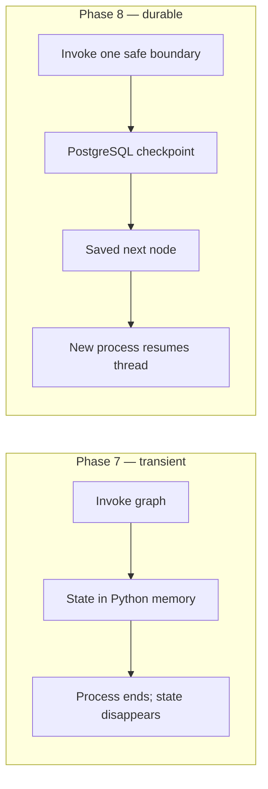
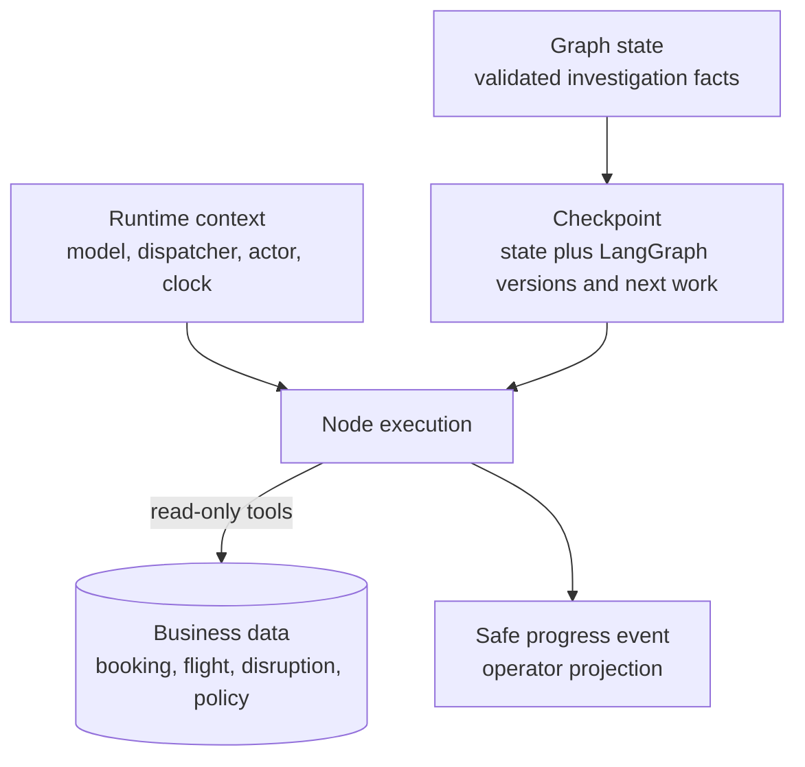
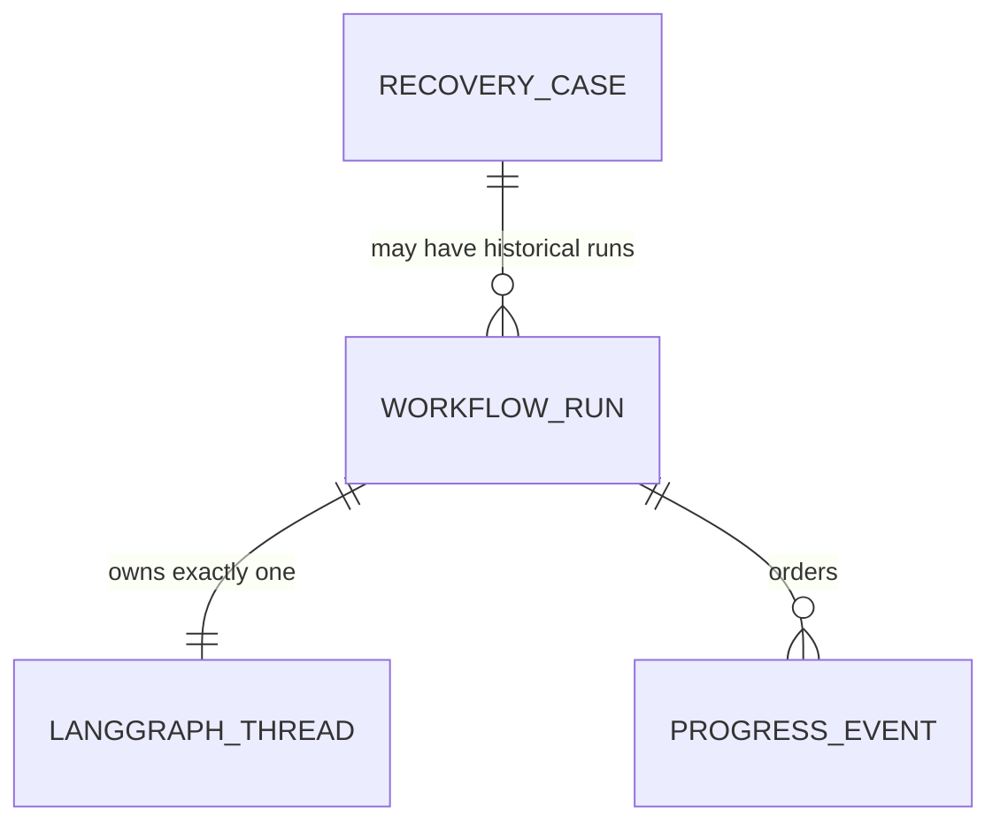
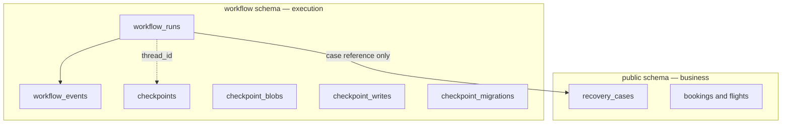
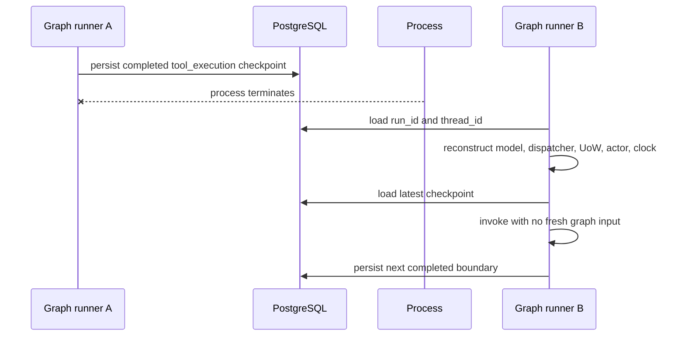
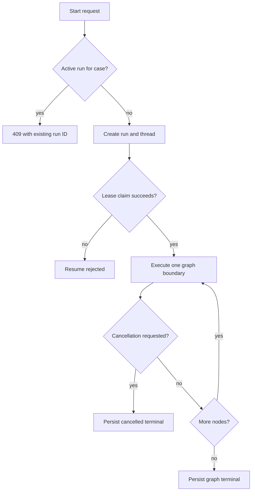
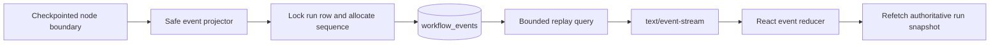
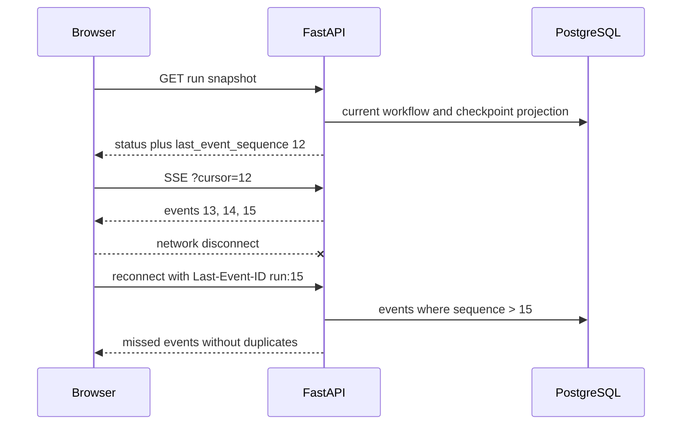
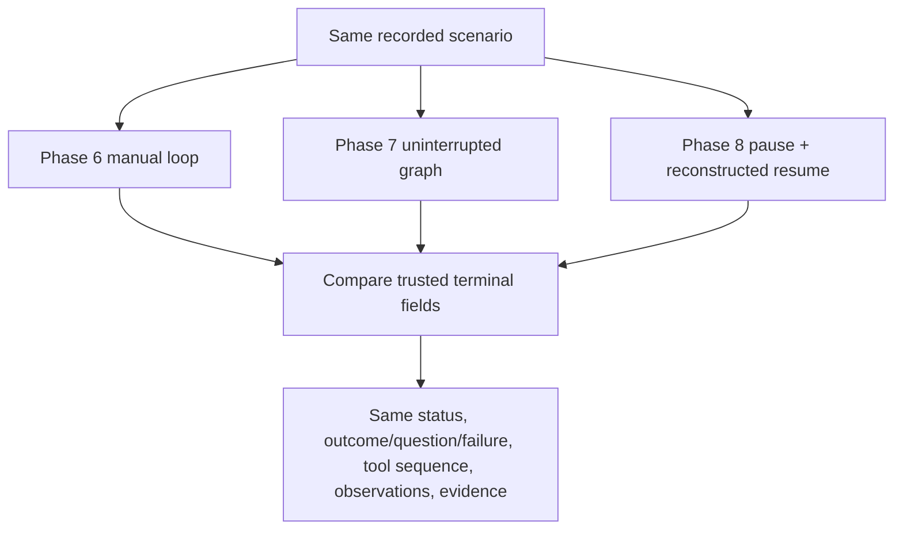
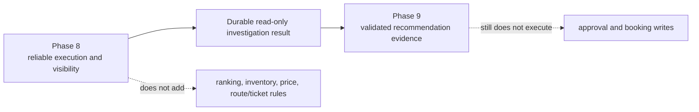

# Phase 8 notes — durable LangGraph checkpoints and live workflow progress

These notes explain how TravelOps makes the Phase 7 investigation survive a
Python-process restart and how the browser reconstructs safe live progress.
Phase 8 changes execution durability and observability; it does not add airline
recommendations, approval, or booking writes.

## What Phase 8 built

In plain English, the investigation now saves its place after each named graph
step. If the backend stops, a new backend can reopen the same run, rebuild its
tools and model adapter, and continue from the saved next step. The operator can
watch safe progress, refresh, reconnect, cancel at a safe boundary, or resume a
paused run.

In technical terms, the Phase 7 `StateGraph` is compiled with LangGraph's
`PostgresSaver`. Application-owned workflow metadata and ordered progress
events share a dedicated PostgreSQL `workflow` schema with the saver tables, but
remain separate tables and concepts. FastAPI exposes a small lifecycle API and
an SSE stream. React reloads the authoritative run snapshot and then subscribes
from its event cursor.

Phase 8 retains:

- the strict `AgentRunState` and `AgentGraphState` contracts;
- all eight Phase 7 nodes and their conditional routes;
- the Phase 4 read-only whitelist and least-privilege execution contexts;
- Phase 6 budgets, fingerprints, safe observations, and failure codes;
- deterministic application services as the authority for domain validation;
- optional Ollama with no configured default model.

## Transient execution versus durable execution



Durable execution does not mean that an operating-system kill can roll back an
arbitrary external call. It means the graph has a persisted record of every
completed super-step and can restart from its latest successful boundary.

## Graph state, checkpoints, business data, runtime context, and events



- **Graph state** is the typed investigation clipboard. It contains safe
  messages, decisions, observations, budgets, fingerprints, routing values, and
  terminal results.
- **A checkpoint** is LangGraph's serialized state plus channel versions,
  pending writes, and scheduling metadata. It answers “where can this thread
  continue?”
- **Business records** are airline-domain facts. A checkpoint never substitutes
  for a booking or recovery case.
- **Runtime context** is executable equipment rebuilt for each execution claim.
  It is never checkpointed.
- **Progress events** are versioned, ordered, safe UI projections. They are not
  the source of graph or business truth.

## Identity: case, run, and thread



The recovery case ID identifies domain work. The opaque workflow-run ID
identifies one application lifecycle and appears in APIs and URLs. The distinct
opaque thread ID is internal configuration for the LangGraph checkpointer. A
partial unique index permits only one active run per case while retaining
terminal history.

## Checkpoint storage boundary



Alembic revision `0002` creates the schema and application-owned run/event
tables. `PostgresSaver.setup()` owns its internal tables and migrations inside
the already-created schema. TravelOps does not copy or reinterpret the saver's
table design.

The saver uses a strict msgpack allowlist containing only reviewed TravelOps
state/decision classes. Database URLs remain `SecretStr` values and are never
included in checkpoint data, API responses, events, or object representations.

## Checkpoint, process termination, and reconstruction



The restart gate deliberately disposes the original checkpointer and graph
service after a tool checkpoint. A new store, service, context factory, model,
dispatcher, and database engine resume with stable identifiers. The completed
tool observation remains present once.

## Pause, interrupts, and resume

LangGraph persists a checkpoint after each super-step. TravelOps invokes with
`interrupt_after="*"`, so the outer lifecycle service regains control after
every named node. It can then continue automatically, record a deliberate
pause, or observe cancellation. This is a static safe-boundary interrupt, not a
model-selected control transfer.

Resume uses the same `thread_id` and `None` as graph input. Supplying the initial
state again would create new work and is forbidden on normal resume. A unique
database lease owner claims each execution attempt; another resume receives a
conflict while that lease remains valid.

## At-least-once execution and idempotency

Checkpointing provides durable progress, not a universal exactly-once
transaction across PostgreSQL and every external dependency. If a node finishes
and its checkpoint is committed, normal resume begins at the next node.
LangGraph pending writes also preserve completed work within a super-step.

If the operating system kills the process while a synchronous provider or
database call is still executing, that in-flight call cannot necessarily be
forcibly interrupted. It may be attempted again if no completed checkpoint
exists. Therefore:

- Phase 4 tools remain read-only;
- duplicate fingerprints prevent repeating an identical completed tool call in
  trusted state;
- workflow leases prevent two normal runners from executing one active run;
- no non-idempotent work exists in Phase 8;
- future writes must add their own effect-level idempotency keys before they are
  allowed inside resumable execution.

## Cancellation and duplicate routing



Cancellation is cooperative. The request timestamp is durable and repeated
requests do not add another cancellation event. The runner checks before every
node. A synchronous call already executing may return before cancellation is
observed; no API claims otherwise.

## Progress events and SSE delivery



Events cover workflow lifecycle, node start/completion, safe tool name and
success, evidence references, malformed-output retry counts, cancellation, and
terminal results. Event payload validation recursively rejects fields named
`prompt`, `chain_of_thought`, `arguments`, `passenger(s)`, `sql`, credentials,
raw values, exceptions, and tracebacks.

The event sequence is allocated under the workflow-run row lock. The event ID is
`<run_id>:<sequence>`. The SSE endpoint reads at most the configured batch size,
yields each event before reading more, sends idle comments as heartbeats, and
closes when the terminal event is delivered. This bounded generator is the
backpressure mechanism; it never creates an unbounded per-client queue.

## Browser disconnect, cursor replay, and refresh



The browser stores the run ID in `?run=` rather than passenger data or
credentials. A refresh reconstructs the run from the API, then opens SSE from
that snapshot's cursor. Native `EventSource` supplies `Last-Event-ID` on
automatic reconnect. The frontend also ignores event IDs already observed.

If retention removed events older than the cursor, the stream sends
`stream.replay_reset_required`. The browser refetches the authoritative run
snapshot rather than treating an incomplete event history as state.

## Retention

Progress events have bounded retention configured by
`TRAVELOPS_WORKFLOW_EVENT_RETENTION_HOURS` (seven days by default). Cleanup
removes expired progress rows but not the workflow run, business case, or graph
checkpoint. Saver checkpoint pruning is intentionally not conflated with event
retention; its lifecycle can be revised independently when operational volume
exists.

## Uninterrupted and resumed equivalence



The original Phase 6/7 equivalence suite remains unchanged. Phase 8 adds every
recorded scenario through the PostgreSQL checkpointer and a specific tool-node
restart test. The node-history reducer now normalizes JSON-decoded lists back to
tuples so durable serialization preserves the Phase 7 typed contract.

## API contract

| Method and path | Purpose |
| --- | --- |
| `POST /api/v1/recovery-cases/{case_id}/workflow-runs` | Create and schedule one run |
| `GET /api/v1/workflow-runs/{run_id}` | Read the authoritative safe run view |
| `GET /api/v1/workflow-runs/{run_id}/events` | Stream or replay safe events |
| `POST /api/v1/workflow-runs/{run_id}/cancel` | Request cooperative cancellation |
| `POST /api/v1/workflow-runs/{run_id}/resume` | Schedule one paused run |

The in-process `WorkflowExecutor` is only a bounded launcher. It does not own
workflow truth and is not a task queue or second orchestration framework.
PostgreSQL leases and LangGraph checkpoints remain authoritative after process
loss.

## What survives and what remains in memory

Survives restart:

- business records in the public schema;
- run ID, thread ID, case relationship, lifecycle, cancellation, and lease data;
- LangGraph checkpoints and pending writes;
- safe ordered progress events.

Reconstructed or lost:

- model/provider client objects;
- database engines, sessions, repositories, and units of work;
- dispatcher and tool adapter objects;
- clocks, Python threads, futures, locks, and SSE connections;
- browser component state not represented by the URL or server snapshot.

## Why chain-of-thought is not stored or streamed

The model returns one strict decision with a bounded summary. TravelOps needs to
show what safe action was proposed, which tool ran, and which evidence reference
supports the result. It does not need private reasoning tokens. Prompts, hidden
reasoning, unsafe arguments, internal exceptions, SQL, and credentials are
excluded from graph design, checkpoint allowlists, event schemas, APIs, and
logs.

## Phase 8 versus Phase 9



Phase 8 makes the existing behavior durable. It does not improve decision
quality or introduce missing airline facts. Those remain explicit Phase 9 work.

## Important decisions

- PostgreSQL `PostgresSaver` rather than memory, SQLite, or a hosted service.
- Dedicated `workflow` schema for checkpoints, run metadata, and events.
- One opaque run ID and one distinct opaque thread ID per execution.
- Resume only from the latest thread checkpoint with no fresh initial input.
- Partial unique index for one active run per recovery case.
- Cooperative boundary cancellation and explicit synchronous-call limitation.
- Monotonic per-run event sequences, seven-day default retention, and bounded
  replay batches.
- Snapshot-first UI reconstruction plus cursor/`Last-Event-ID` SSE replay.
- Runtime dependencies rebuilt through factories, never deserialized.
- Read-only tools and fingerprint state are the Phase 8 idempotency boundary.

The formal records are [D-036 through D-045](../decisions.md).

## Verification commands

```powershell
uv lock --check
uv sync --locked --all-groups
uv run --locked pytest tests/agent/test_graph.py
uv run --locked pytest tests/workflow tests/api
uv run --locked pytest -m integration
uv run --locked ruff check .
uv run --locked ruff format --check .
uv run --locked mypy
uv run --locked python -m build --no-isolation

Set-Location frontend
npm.cmd ci
npm.cmd run format:check
npm.cmd run typecheck
npm.cmd run lint
npm.cmd test
npm.cmd run build
npm.cmd run test:e2e
```

## Remaining limitations

- No model provider has earned a default; an unconfigured runtime fails safely.
- No external task queue, hosted LangGraph service, or production deployment is
  included.
- Synchronous provider and database calls cannot always be forcibly interrupted.
- Checkpoint pruning policy remains separate from bounded UI-event retention.
- No recommendation ranking, availability, price, connection, or ticket-rule
  evidence exists.
- No proposal, approval, booking write, rebooking, multi-agent behavior, MCP, or
  PydanticAI was introduced.

## Glossary

| Term | Meaning here |
| --- | --- |
| Checkpoint | Persisted graph state, versions, pending writes, and next work |
| Checkpointer | LangGraph saver implementing checkpoint persistence |
| Thread ID | Internal stable key joining a sequence of graph checkpoints |
| Run ID | Public application lifecycle identifier for one investigation |
| Resume | Continue the saved thread with no fresh initial graph input |
| Lease | Expiring database claim that prevents concurrent normal runners |
| Idempotency | Protection against repeating an external effect |
| Event cursor | Last sequence the client has safely received |
| SSE | One-way HTTP stream of ordered text events |
| Backpressure | Bounded production governed by client consumption |
