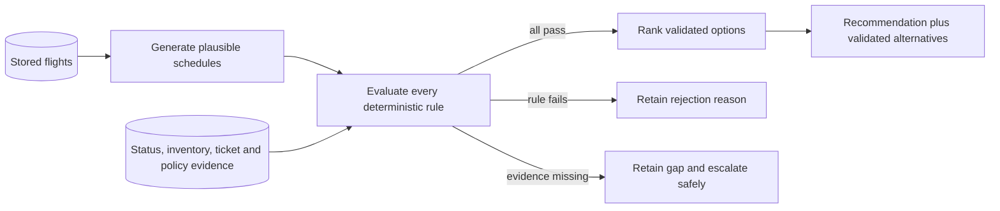
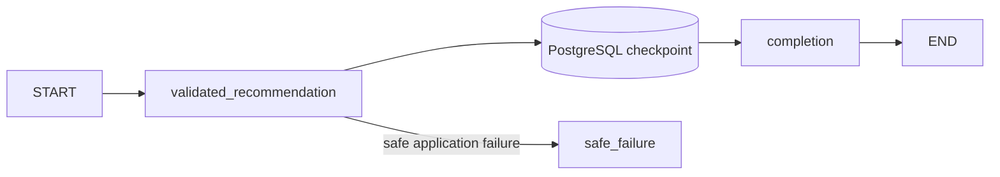

# Phase 9 notes — validated recommendations and evidence

Phase 9 turns plausible schedules into safe operator recommendations. It does
not book, reserve, approve, or change anything. Its completion gate is:

> The agent recommends only validated itineraries, cites the evidence used, and
> escalates cases with no safe answer.

## What Phase 9 built

- repository-backed synthetic seat evidence for every stored flight;
- repository-backed synthetic ticket and rebooking evidence for every booking;
- direct and connecting recovery schedules in the deterministic generator;
- seven application-owned validation rules;
- immutable recommendation, option, validation, evidence, ranking, tradeoff,
  rejection, confidence, and escalation contracts;
- stable lexicographic ranking with every ranking input visible;
- `recommended`, `no_safe_option`, and `insufficient_evidence` outcomes;
- a durable LangGraph path that checkpoints the complete safe result;
- structured recommendation progress events;
- purpose-built API responses and complete React workspace rendering;
- deterministic benchmarks, PostgreSQL tests, API/component tests, builds, and
  browser end-to-end coverage.

No hosted model or airline service is required. Validity and ranking are
complete even when the model adapter is unavailable.

## Candidate generation, validation, and recommendation



Candidate generation asks whether stored flights could form the requested route
inside the recovery window. A candidate is not safe merely because its schedule
looks plausible.

Validation asks whether every required application rule passed using named
evidence. A failed or unevaluated rule makes the option invalid. Missing evidence
has its own status and is never converted into a pass.

Recommendation considers only options for which every rule passed. It ranks
those options, exposes every input, and retains rejected candidates for review.
The manual schedule explorer remains useful for investigation, but it is not the
certified recommendation boundary.

## Why deterministic code owns validity

A model can produce a fluent explanation while overlooking a cancelled segment,
checking seats for only one traveler, or treating an unknown ticket rule as
permission. Language quality is not a safety proof.

Application code owns:

1. stored-flight existence;
2. route continuity;
3. scheduled and operational flight/connection chronology;
4. the synthetic 45-minute minimum connection time;
5. seats on every segment for the complete passenger group;
6. ticket carrier, connection, and rebooking constraints plus policy;
7. current stored flight status, including cancellation rejection.

An itinerary is valid only when all seven checks are `passed`.
`OptionValidation` recalculates that invariant during construction, so callers
cannot set `valid=true` alongside a failed or missing-evidence check.
`RecommendationResult` separately rejects an invalid recommended itinerary.

A future model may compare already validated options and improve the wording of
tradeoffs. It may not add an option to the valid set or override a failed rule.

## Evidence grounding and traceability

Every rule cites stable evidence identifiers:

- `flight:FLT-NV1003` — stored existence and route facts;
- `schedule:FLT-NV1003` — scheduled timestamps;
- `status:FLT-NV1003` — current status derived from flights and disruptions;
- `availability:FLT-NV1003` — repository-backed seat count;
- `ticket-rule:BKG-0001` — repository-backed ticket constraints;
- `policy:POL-STANDARD` — disruption policy and recovery deadline;
- `mct:QVB:45` — versioned synthetic minimum-connection rule.

Each reference includes its kind, source, concise summary, and observation time
when relevant. Option-level references show exactly what supported that option;
the result-wide collection is a deduplicated evidence index.

Alembic revision `0003` adds:

- `flight_availability_evidence`, keyed by flight, with nonnegative seats,
  observation time, and source;
- `ticket_rule_evidence`, keyed by booking, with rebooking permission, carrier,
  maximum connections, observation time, and source.

Normal deterministic seeding adds a row for every generated flight and booking.
Tests remove or omit evidence to prove that absence becomes `missing_evidence`,
not a permissive default.

## Time, connection, status, and group-seat handling

Stored `Flight` invariants guarantee that scheduled arrival follows departure.
Phase 9 derives operational times from current stored status. A delay shifts the
synthetic departure and arrival; connection chronology and minimum time use those
operational values. A scheduled 90-minute connection can therefore fail after a
delay.

A cancelled flight always fails. A missing flight fails existence and leaves
dependent rules not evaluated. Missing current status is missing evidence rather
than “scheduled.”

Availability is checked on every segment against the booking's complete group
size. One short segment rejects the whole itinerary. Ranking uses the minimum
seats across the itinerary and exposes the seat surplus. Phase 9 never reserves
those seats.

## Ticket and policy compatibility

The ticket rule controls rebooking permission, permitted carrier, and maximum
connections. The disruption policy controls the deadline and next-day
permission. Both references support one deterministic check.

An absent ticket row is insufficient evidence. A present row with
`rebooking_allowed=false` is complete evidence for a rejection. Those outcomes
are intentionally different.

## Explainable stable ranking

Only valid options enter ranking. The comparison key is:

1. earliest operational arrival;
2. fewest connections;
3. least total connection waiting time;
4. greatest seat surplus;
5. stable option identifier as the deterministic tie-breaker.

Policy and ticket compatibility must be true before ranking. They are not hidden
inside an opaque weighted score. Each option exposes arrival, connections,
waiting, minimum seats, group size, surplus, compatibility flags, and rank.

This order is an explicit operational preference, not universal truth. An
earlier one-stop arrival can outrank a later direct flight, so the UI shows
tradeoffs rather than presenting rank as certainty.

## Missing evidence and confidence

Evidence completeness is:

- `complete`: every considered option has all required evidence;
- `partial`: a safe recommendation exists, but another candidate has a gap;
- `insufficient`: no option can be recommended because evidence is missing.

Outcomes are:

- `recommended`: one or more complete validated options exist;
- `no_safe_option`: evidence is complete, but every option fails or no schedule
  exists in the permitted window;
- `insufficient_evidence`: no option can pass because required evidence is
  absent.

The latter two always contain a clear escalation reason and never a recommendation.

## Durable LangGraph integration

Phase 6/7 equivalence remains unchanged because the original graph is still the
default build. Phase 8 recorded scenarios use that unchanged path. The
application composition enables a Phase 9 entry node:



The node calls the deterministic repository service, stores the typed result in
`AgentRunState`, and transitions to completion. The PostgreSQL serializer
allowlist includes every reviewed recommendation contract and enum.

Normal boundary events are joined by one safe `recommendation.completed` or
`recommendation.escalated` event. It shows outcome, safe option identifier,
valid/rejected counts, and evidence completeness. Detailed evidence remains in
the authoritative snapshot.

The restart test pauses after this node, disposes the store and engine,
reconstructs runtime services, resumes with no fresh input, and verifies one
stored result and one recommendation event.

## API and React workspace

`GET /api/v1/recovery-cases/{case_id}` includes the recommendation so refresh is
authoritative. The same result is available at:

```text
GET /api/v1/recovery-cases/{case_id}/recommendation
```

The workflow-run view includes its checkpointed result. React shows the
recommended option, other valid options, evidence, operational times, seats,
tradeoffs, ranking method, rejected options/reasons, and prominent escalation.

## Read-only boundary and Phase 10

Phase 9 reads flights, disruptions, policies, availability, and ticket rules. It
does not mutate a booking, claim inventory, prepare an action, request approval,
or execute rebooking. Checkpoints and events are execution records, not booking
writes.

Phase 10 must add a typed proposal and human decision. Before an approved write,
it must recheck volatile evidence, enforce authorization, protect the effect with
an idempotency key, expire stale proposals, and create an immutable audit record.
A Phase 9 recommendation alone can never authorize a write.

## Verification commands

```powershell
uv lock --check
uv sync --locked --all-groups
uv run --locked pytest -m "not integration"
uv run --locked pytest -m integration
uv run --locked ruff check .
uv run --locked ruff format --check .
uv run --locked mypy
uv run --locked python -m build --no-isolation

Set-Location frontend
npm.cmd ci
npm.cmd run format:check
npm.cmd run typecheck
npm.cmd run lint
npm.cmd test -- --run
npm.cmd run build
npm.cmd run test:e2e
```

The final Phase 9 verification run passed 403 non-integration backend tests,
39 PostgreSQL integration tests, 10 Vitest tests, and 2 Playwright browser
tests. Ruff, Ruff formatting, mypy, the locked dependency check, package build,
Prettier, Oxlint, TypeScript, and the Vite production build also passed. A
manual browser run against the real seeded PostgreSQL application confirmed
the recommendation, supporting evidence, alternative rankings, read-only
boundary, durable completion, and restored evidence count.

## Known limitations

- Evidence is synthetic, not live airline inventory or fare-system data.
- Minimum connection time is one 45-minute rule; it does not vary by airport,
  terminal, carrier, or assistance need.
- Delay handling shifts departure and arrival equally.
- Ranking is a reviewed operational preference, not personalization.
- An optional model comparison layer is not enabled by default.
- Availability can change; Phase 10 must recheck it.
- No proposal, approval, reservation, or execution exists yet.
