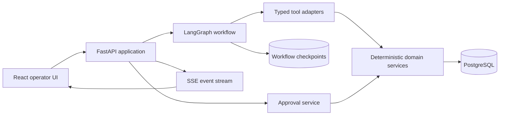

# Build plan

This is the core learning plan for a working TravelOps Recovery Agent, not a feature wishlist. Each phase introduces one system capability and ends with a runnable, verified, clearly documented slice. Phases 0–11 produce the first portfolio release. [The advanced roadmap](roadmap.md) continues with Phases 12–20.

## Learning contract

1. **A phase is not done merely because the code runs.** It is done when the acceptance checks pass and the introduced mechanisms are documented clearly.
2. **Work one small step at a time without quizzes.** Codex explains each mechanism before using it, implements one testable increment, and reports the result. Learner answers are never required as a gate, and Codex does not quiz the learner or ask learning-check questions.
3. **Build the mechanism before adding the abstraction.** Normal Python services and a small manual tool loop come before LangGraph.
4. **Every phase ships.** The main branch must remain installable, runnable, tested, and documented at each phase boundary.
5. **One main concept at a time.** Interesting extensions are recorded in `docs/decisions.md` or the parking lot instead of entering the active phase.
6. **No calendar pressure.** Progress is measured by demonstrated understanding and working evidence, not by dates.
7. **End every session with a handoff.** Update `docs/progress.md` with what works, what was verified, and what remains unclear.

## Completion evidence for every phase

- A focused commit with a descriptive message
- Commands that reproduce the result
- Automated tests appropriate to the phase
- A manual demonstration or screenshot when the UI is involved
- A phase note under `docs/notes/`
- An updated progress record
- Clear written explanations in the phase notes; learner questioning is not required

## Product boundary

The initial product supports a fictional airline and synthetic passenger data. An operator selects a disruption case, watches the agent gather evidence, reviews validated alternatives, and decides whether a prepared rebooking should execute.

### In scope

- Flight delays, cancellations, and missed connections
- Synthetic bookings, passengers, flights, policies, and availability
- One operator-facing web application
- One agent with typed operational tools
- Persistent case and workflow state
- Read-only investigation and one controlled write operation
- Approval, rejection, and edited-instruction paths
- Failure simulation, evaluation, tracing, and audit records

### Outside the first release

- Real airline or passenger data
- Payment processing
- Production global-distribution-system integration
- Autonomous rebooking without approval
- Multi-agent orchestration
- Voice interaction
- MCP exposure
- Hotel, meal-voucher, and ground-transport fulfillment

These can become later projects or measured extensions after the core release.

## Responsibility split

### The model may

- Interpret a disruption case and operator instructions
- Decide which permitted read tool to call next
- Compare already validated alternatives
- Explain a recommendation using collected evidence
- Recognize missing information and request help

### Deterministic application code must

- Authenticate the operator and enforce permissions
- Calculate times, connection validity, and fare values
- Check seats and ticket constraints
- Validate every tool input and output
- Store workflow and business state
- Prepare and expire action proposals
- Verify approval and idempotency before a write
- Execute the synthetic rebooking
- Create the audit record

## Planned architecture

The graph coordinates work. It does not replace domain services, authorization, or the database.

## Phase 0 — project foundation

### Ship

- Python package using a `src/` layout
- `pyproject.toml` and committed lockfile
- pytest, Ruff, formatting, and strict mypy configuration
- Minimal import test and standard development commands
- Initial documentation structure

### Learn to explain

- What a virtual environment and lockfile physically provide
- Why a `src/` layout catches packaging mistakes
- The difference between linting, formatting, typing, and tests
- What belongs in project configuration versus application code

### Gate

Fresh setup succeeds and import, test, lint, format-check, type-check, and package-build commands all pass.

## Phase 1 — API, configuration, and logging

### Ship

- FastAPI application factory
- `GET /health` and generated OpenAPI documentation
- Typed settings with secret-safe representation
- Structured application logging and request IDs
- API and configuration tests

### Learn to explain

- TCP, HTTP, ASGI, Uvicorn, and FastAPI's separate responsibilities
- Liveness versus readiness
- Dependency injection and application factories
- Configuration precedence and why secrets stay outside source code
- Why libraries do not configure global logging handlers

### Gate

The API runs over a real socket, tests run without a server, invalid configuration fails clearly, and logs correlate one request.

## Phase 2 — airline domain and synthetic cases

### Ship

- Typed models for passenger, booking, flight, segment, disruption, policy, and recovery case
- A deterministic synthetic-data generator with a fixed seed
- At least ten reviewed disruption scenarios
- A CLI command that generates and validates fixtures
- Domain-model and invariant tests

### Learn to explain

- Entity, value object, aggregate, and invariant
- Why synthetic data still needs provenance and versioning
- The difference between realistic data and random data
- Which rules belong to domain code rather than prompts

### Gate

The same seed produces the same valid dataset, and invalid itineraries are rejected with useful errors.

## Phase 3 — persistence and service boundaries

### Ship

- PostgreSQL development service
- SQLAlchemy models and Alembic migrations
- Repository interfaces and transactional application services
- Seed and reset commands for local synthetic data
- Integration tests against a real test database

### Learn to explain

- Domain models versus persistence models
- Transactions, foreign keys, indexes, and migrations
- Repository boundaries and dependency inversion
- Why workflow checkpoints and business records are different data

### Gate

A new database migrates from zero, seed data loads once, core queries use expected indexes, and integration tests clean up reliably.

## Phase 4 — typed operational tools

### Ship

- `get_booking`
- `get_flight_status`
- `get_disruption_policy`
- `search_alternative_itineraries`
- `validate_itinerary`
- Typed inputs, outputs, errors, timeouts, and audit metadata
- Contract and authorization tests

### Learn to explain

- Tool versus service versus API endpoint
- Why narrow tools are safer than generic database access
- Structured output, schema validation, and error taxonomy
- Read permissions, tenant boundaries, and least privilege

### Gate

Every tool works without an LLM, publishes a stable schema, rejects invalid or unauthorized input, and returns safe structured errors.

## Phase 5 — visual operator dashboard

### Ship

- React and TypeScript application
- Disruption queue and case detail view
- Passenger, itinerary, status, and policy evidence panels
- Alternative itinerary comparison using deterministic services
- URL-addressable case workspace with investigation, evidence, options, and activity regions
- A typed frontend API client and documented view models
- Loading, empty, and error states
- Frontend component and API integration tests

### Learn to explain

- Browser, frontend, API, and backend responsibilities
- Client state versus server state
- Why the UI consumes view models instead of database rows
- Accessibility and communicating uncertainty to an operator

### Gate

An operator can investigate one case manually through the UI without an LLM. Refreshing the browser does not lose business state.

## Phase 6 — first agent loop, written explicitly

### Ship

- Provider-independent model interface
- Structured model decisions: call a tool, ask for information, or finish
- A small bounded Python loop over read-only tools
- Maximum-turn, timeout, and repeated-call protection
- Recorded model fixtures for deterministic tests

### Learn to explain

- What an agent loop actually does between model calls
- How tool schemas reach the model
- Why conversation messages are not sufficient application state
- Stop conditions, context growth, and malformed output recovery

### Gate

The loop completes selected read-only cases, stops within its budget, and is testable without a live model.

## Phase 7 — LangGraph orchestration and minimal LangChain integration

### Ship

- Explicit typed graph state
- Nodes for intake, reasoning, tool execution, validation, recommendation, escalation, and completion
- Conditional edges and explicit terminal states
- The Phase 6 behaviour reproduced through LangGraph
- Minimal LangChain components for model, message, or tool adaptation only where
  they reduce boundary code without hiding the workflow
- Node and routing tests

### Learn to explain

- State, node, edge, reducer, command, and graph compilation
- Workflow versus agent behaviour
- What LangGraph adds compared with the manual loop
- LangChain's higher-level integration role versus LangGraph's orchestration role
- Why not every Python function should become a node

### Gate

Given the same recorded model decisions and tool results, the manual loop and graph reach equivalent outcomes. The graph state is inspectable after every step, and any LangChain dependency remains an adapter rather than a home for business rules.

## Phase 8 — durability and live progress

### Ship

- Persistent graph checkpointer
- Stable case and thread identifiers
- Resume after backend restart
- Server-Sent Event stream for status and tool activity
- UI plan, evidence timeline, and retry display
- Cancellation and duplicate-run protection

### Learn to explain

- Checkpoint versus business transaction
- At-least-once execution and idempotency
- Event ordering, reconnect behaviour, and backpressure basics
- Why raw chain-of-thought is not exposed in the UI

### Gate

A workflow can pause, survive a process restart, resume once, and reconnect to the UI without duplicating completed work.

## Phase 9 — validated recommendations

### Ship

- Deterministic connection, seat, route, and ticket validation
- Stored-flight existence/status, operational-time, and minimum-connection validation
- Repository-backed synthetic availability and ticket-rule evidence
- Ranking inputs and explicit tradeoff explanation
- Evidence references for every recommended option
- No-option and insufficient-evidence outcomes
- Recommendation benchmark cases
- Checkpointed read-only results and structured recommendation progress events

### Learn to explain

- Candidate generation versus deterministic validation versus model explanation
- Evidence grounding and traceability
- Ranking tradeoffs and false confidence
- Why the model cannot declare an itinerary valid

### Gate

The agent recommends only validated itineraries, cites the inputs used, and escalates cases with no safe answer.

## Phase 10 — human-approved rebooking

### Ship

- Versioned proposal API and approval screen showing the exact old and new itinerary
- Attributable approve, reject, version, and expiry paths
- Provider-independent synthetic execution behind authorization, stored approval, fresh evidence validation, and an idempotency key
- Transactional booking-change ledger and immutable minimized audit records
- Durable LangGraph pause/resume around authoritative human approval

### Learn to explain

- Two-phase actions and time-of-check/time-of-use risk
- Interrupt, checkpoint, and resume semantics
- Authentication versus authorization versus approval
- Idempotency keys and transaction boundaries

### Gate

No test path can execute without valid approval; repeated execution requests produce one result; stale availability returns safely to investigation.

## Phase 11 — break it, evaluate it, and release it

**Status: complete.** The frozen contract is dataset `phase-11.0.0`, seed `42`,
package `0.1.0`, and the thresholds below. Generated evidence lives under
`reports/`; implementation and limitations are in
[the Phase 11 notes](notes/phase-11.md).

### Ship

- Failure injection for timeouts, malformed results, rate limits, lost seats, and restarts
- Adversarial cases for prompt injection and unauthorized access
- Reviewed evaluation dataset with expected outcomes
- Metrics for completion, tool choice, arguments, validity, approvals, latency, tokens, and cost
- Tracing with sensitive-data controls
- Docker Compose, CI, architecture diagram, demo, and release notes

### Learn to explain

- Component evaluation versus end-to-end evaluation
- Recovery policy, bounded retries, and non-retryable failures
- Indirect prompt injection and tool-output trust boundaries
- How a benchmark supports a claim without hiding its limitations
- What production readiness would still require

### Gate

The full system starts from documented commands, CI passes, evaluation results are reproducible, zero benchmark writes bypass approval, and the README presents measured results and known limitations.

## After the first release

Phase 12 context engineering and tool governance is complete while Phase 11
remains the frozen first-release comparison. The project continues through
[Phases 13–20](roadmap.md): replanning, concurrency, memory, model routing,
advanced evaluation, policy RAG, a measured multi-agent experiment, and MCP
integration.

Voice interaction, multiple real-world tenants, hotel or ground-transport fulfillment, and production cloud deployment remain outside the committed learning track.
