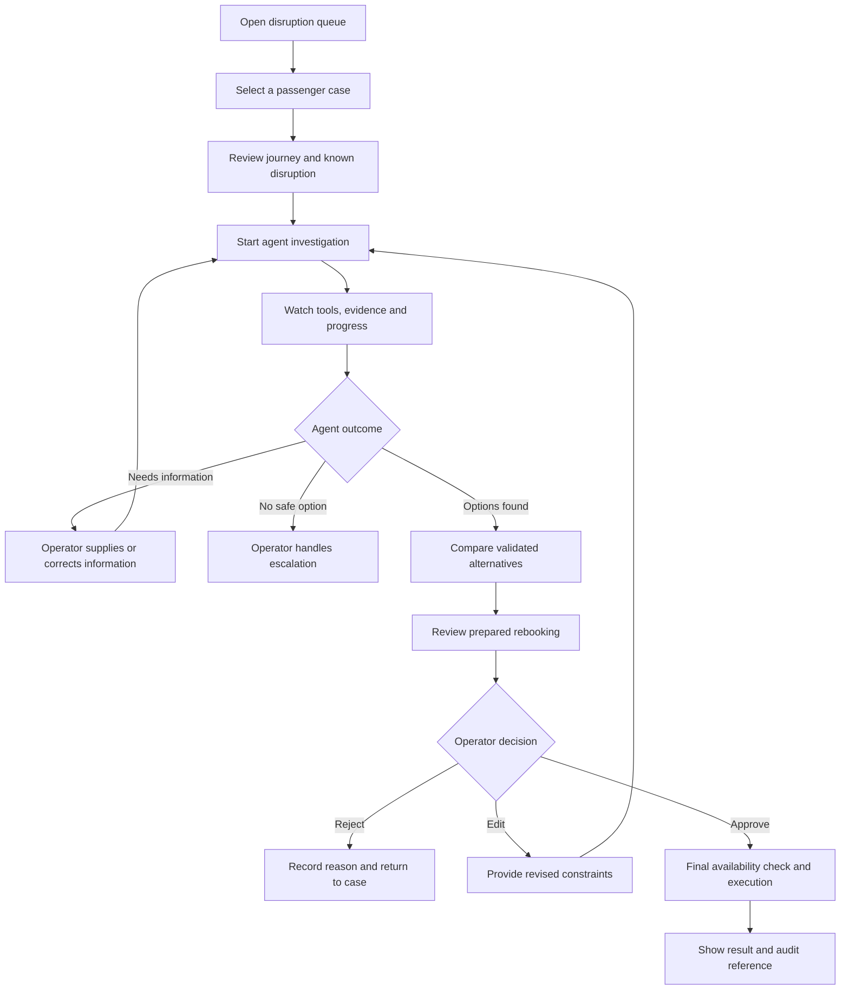
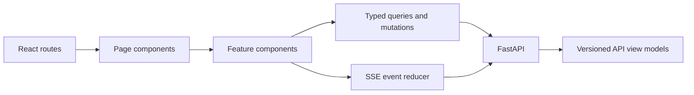

# Operator UI specification

The UI is a core part of the learning project. It makes the agent's state, evidence, actions, errors, and approval boundaries understandable. It is an operations console with optional conversational input, not a chat window that hides the workflow.

## UI goals

- Let an operator understand a disruption before starting automation.
- Show what the agent is doing without exposing private chain-of-thought.
- Connect recommendations to operational evidence and deterministic validation.
- Make errors, retries, uncertainty, and missing information visible.
- Require a deliberate review before any rebooking executes.
- Preserve the case after refresh, reconnect, or backend restart.
- Provide visual surfaces for evaluation and advanced agent experiments.

## Primary screens

| Route | Screen | Purpose |
| --- | --- | --- |
| `/cases` | Disruption queue | Find and prioritize unresolved cases |
| `/cases/:caseId` | Recovery workspace | Investigate one case and follow agent progress |
| `/cases/:caseId/approval/:proposalId` | Approval review | Compare the exact old and proposed itineraries |
| `/runs/:runId` | Run inspector | Review state transitions, tools, retries, budgets, and errors |
| `/evaluations` | Evaluation dashboard | Compare versions, slices, failures, cost, and latency |
| `/settings/memory` | Memory controls | Inspect, correct, expire, and delete retained preferences |
| `/integrations/mcp` | MCP diagnostics | Inspect exposed capabilities and protocol test results |

The first release needs only the first three screens and a compact run-activity panel. Later screens arrive with the phases that create a real need for them.

## Recovery workspace

```text
┌──────────────────────────────────────────────────────────────────────────┐
│ TravelOps Recovery Agent                  Case TR-1042      Investigating │
├───────────────────┬────────────────────────────┬─────────────────────────┤
│ Passenger journey │ Agent progress             │ Recovery options        │
│                   │                            │                         │
│ BRU → FRA → ATH   │ ✓ Booking loaded           │ 1  BRU → VIE → ATH      │
│ Connection missed │ ✓ Flight status checked    │    Arrives 18:20        │
│ Ticket: Flex      │ ● Searching alternatives   │    Validated · €0       │
│ Preferences       │ ○ Validate candidates      │                         │
│                   │ ○ Prepare recommendation   │ 2  BRU → MUC → ATH      │
├───────────────────┴────────────────────────────┴─────────────────────────┤
│ Evidence and activity                                                     │
│ 14:02  get_booking                     Success                            │
│ 14:03  get_flight_status               Delayed 180 minutes                │
│ 14:03  get_disruption_policy           Policy EU-DISRUPTION-04            │
├──────────────────────────────────────────────────────────────────────────┤
│ The agent can investigate and prepare a proposal. Rebooking needs approval.│
└──────────────────────────────────────────────────────────────────────────┘
```

The precise visual design can evolve. The information hierarchy must remain: case facts, agent progress, evidence, validated options, and action boundary.

## Operator journey



## What the UI shows about the agent

Show concise, structured execution information:

- Current workflow status and active step
- Completed and remaining plan steps
- Tool name, safe argument summary, status, duration, and retry count
- Evidence records and their source or timestamp
- Candidate and validated itinerary identifiers
- Recommendation, tradeoffs, and limitations
- Pending approval and proposal expiry
- Token, cost, and time budget summaries when introduced
- Errors, recovery attempts, and escalation reason

Do not show hidden chain-of-thought, secrets, raw credentials, unrestricted prompts, or sensitive trace payloads.

## Frontend architecture



### Boundary rules

1. The browser never contains airline business rules.
2. The UI displays server-calculated validation results; it does not recreate them.
3. Server state is loaded through typed queries and mutations.
4. Temporary presentation state—open panels, filters, draft text—stays local to the browser.
5. URLs identify the current case, run, proposal, or evaluation so refresh and sharing work.
6. SSE events update the visible run, but the API remains the authoritative recovery source after reconnect.
7. Approval is a server-side command, not a change to a frontend status variable.

## Planned frontend stack

| Concern | Choice | Learning purpose |
| --- | --- | --- |
| Language | TypeScript | Typed boundaries and safer refactoring |
| UI | React | Component composition and state-driven rendering |
| Build tool | Vite | Simple local development and production build |
| Server data | TanStack Query or equivalent | Cache, loading, invalidation, and mutation handling |
| Forms | Schema-backed form validation | Keep operator input aligned with API contracts |
| Live events | Native `EventSource` initially | Learn SSE before adding another abstraction |
| Component tests | React Testing Library | Verify behaviour from the operator's perspective |
| Browser tests | Playwright | Verify complete investigation and approval flows |

The final library selection is confirmed in Phase 5 and recorded in `decisions.md`; the responsibilities above matter more than the brand of library.

## Live event model

The backend should emit versioned, structured events rather than formatted log lines:

```json
{
  "event_id": "evt_01J...",
  "run_id": "run_01J...",
  "sequence": 17,
  "type": "tool.completed",
  "occurred_at": "2026-08-10T14:03:12Z",
  "payload": {
    "tool_call_id": "call_01J...",
    "tool_name": "get_flight_status",
    "duration_ms": 184,
    "result_summary": "Flight delayed by 180 minutes"
  }
}
```

The frontend event reducer must tolerate reconnects, duplicate delivery, missing optional event types, and events that arrive after the operator navigates away.

Phase 8 implements this contract in the recovery workspace. The run ID is a
`?run=` URL parameter, not local storage. The browser loads the safe run view,
opens native `EventSource` with that view's sequence as its initial cursor,
accepts automatic `Last-Event-ID` reconnects, ignores event IDs already seen,
and refetches the run after every accepted event. A retention-gap event requires
another snapshot load. The activity panel exposes checkpoints, safe tools,
evidence counts, retries, cancellation, resume, reconnection, completion, and
safe failure while leaving manual search and validation intact.

## Approval interface

The approval screen must show:

- Passenger and booking identifiers
- Current itinerary
- Proposed itinerary
- Changed flights, dates, cabin, and arrival time
- Fare difference and applicable policy evidence
- Validation timestamp and proposal expiry
- Known limitations or warnings
- Approve, edit, and reject actions

Approval should never be a generic “Continue” button. The operator approves one exact, versioned proposal.

## Accessibility and clear communication

- Support keyboard navigation and visible focus.
- Do not communicate status using colour alone.
- Use plain-language error messages with a technical detail expansion.
- Announce important live status changes appropriately to assistive technology.
- Keep approval buttons visually and verbally distinct.
- Show times with timezone and dates unambiguously.
- Use tables only when comparison benefits from aligned values.
- Test responsive layouts, while treating desktop operations use as the primary experience.

## UI security and privacy

- Render external and model-generated text as data, never executable markup.
- Apply content security policy and safe link handling.
- Do not store passenger data or tokens in browser local storage by default.
- Mask sensitive identifiers in shared screenshots and traces.
- Recheck authorization on every API request and SSE connection.
- Expire approval pages and prevent browser replay from executing an old proposal.
- Record the authenticated operator behind every approval decision.

## UI testing strategy

### Component tests

- Case status and priority rendering
- Loading, empty, unavailable, and permission-denied states
- Itinerary comparison and validation warnings
- Event reducer behaviour
- Approval form and expiry handling

### API contract tests

- Generated or shared schemas remain compatible with frontend types
- Unknown enum values degrade safely
- Error responses map to operator-facing messages
- Event payload versions are recognized

### End-to-end tests

- Open a case and investigate manually
- Start an agent run and reconnect during execution
- Supply missing information
- Review evidence and recommendation
- Reject and replan
- Edit constraints and replan
- Approve one proposal and verify one execution
- Attempt an expired or duplicate approval

### Visual tests

- Important desktop layouts at stable viewport sizes
- Long passenger names, routes, policy titles, and error messages
- Parallel activity, repeated retries, and multiple recommendations
- Accessible contrast and focus visibility

## UI delivery across phases

| Phase | UI increment |
| --- | --- |
| 1 | OpenAPI contract provides the future client boundary |
| 2 | Synthetic cases include presentation-ready but domain-owned data |
| 4 | Tool schemas define safe activity summaries |
| 5 | Disruption queue and manual recovery workspace |
| 6 | Agent run status and bounded tool-call timeline |
| 7 | Graph-step and structured state visualization |
| 8 | Live SSE progress, reconnect, cancellation, and retry states |
| 9 | Evidence viewer and validated option comparison |
| 10 | Exact proposal review, approve, edit, reject, and result views |
| 11 | Evaluation summary, error cases, accessibility, and portfolio screenshots |
| 12 | Context inspector showing selected evidence and available tools in developer mode |
| 13 | Plan history and replanning explanation |
| 14 | Parallel activity and partial-result visualization |
| 15 | Preference-memory inspection, correction, and deletion |
| 16 | Model-route, time, token, and cost budget summary |
| 17 | Evaluation dashboard with version and failure-slice comparison |
| 18 | Policy source viewer with citation and effective-date evidence |
| 19 | Per-agent activity, handoff, ownership, and comparison view |
| 20 | MCP capability and protocol-test diagnostics |

### Phase 11 evaluation implementation

`/evaluations` is the frozen baseline summary, not the Phase 17 trajectory
comparison dashboard. It identifies the deterministic report, version, dataset,
seed and timestamp; shows quality, approval/write safety, observed harness
latency, model/token/cost accounting, slices, safe failed-case diagnostics and
explicit unsupported claims. A missing report produces an actionable error
screen rather than requiring server-log access. React escapes all report text;
raw prompts, passenger details, credentials and trace payloads are never sent.

The status is announced with `role="status"`, tables use headings and a labelled
keyboard-scrollable region, focus remains visible, and critical zero-write
metrics are named rather than conveyed by colour alone. The existing workflow
SSE snapshot/cursor/reconnect behavior remains unchanged.

## UI definition of done

- The main workflow can be completed without reading server logs.
- Every consequential decision shows its supporting evidence.
- The operator can distinguish model suggestions from deterministic validation.
- Refresh and reconnect preserve durable case state.
- Errors explain what happened, what was retained, and what the operator can do next.
- Approval applies to one exact proposal and cannot be replayed.
- Core flows pass component, contract, browser, accessibility, and visual checks.
- The portfolio README contains current screenshots and a short recorded demonstration.
